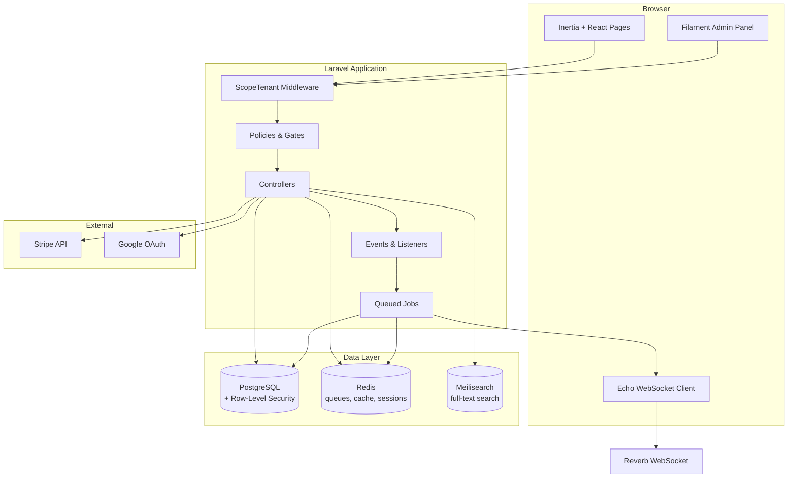
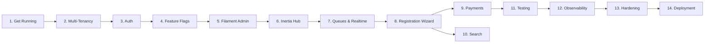

# Building Zendo

A hands-on tutorial for building a multi-tenant retreat center management platform.

## What You'll Build

Zendo is a multi-tenant retreat center management platform. It manages events, registrations, payments, lodging, meals, and memberships for three different retreat centers — each with different features enabled.

Think of it like an **apartment building**: each tenant (retreat center) lives in their own apartment with their own furniture (data), but the building shares common infrastructure (the app, the database, the queue system). No tenant can peek into another tenant's apartment.

### The three centers

| Center | Slug | Meals | Lodging | Memberships | Purpose |
|--------|------|-------|---------|-------------|---------|
| Ivy Retreat Center | `ivy` | ✅ | ✅ | ✅ | Full-featured. Exercises everything. |
| Nalanda Center | `nalanda` | ❌ | ✅ | ✅ | No meals module. Exercises feature gating. |
| Bodhi Tree House | `bodhi-tree` | ✅ | ❌ | ❌ | Urban center. No overnight stays. |

## Tech Stack

Every technology is exercised in production-like conditions, not toy examples.

| Layer | Technology | What it does in Zendo |
|-------|-----------|----------------------|
| **Backend** | Laravel 13 + Eloquent | Framework, ORM, all 25+ models |
| **Database** | PostgreSQL (Docker) | Primary DB, Row-Level Security for tenant isolation |
| **Cache/Queue** | Redis (Docker) | Queue driver, cache, sessions, rate limiting, broadcast |
| **Search** | Meilisearch (Docker) | Full-text search across events, centers, teachers |
| **Admin** | Filament | Admin panel with multi-tenancy, resources, widgets |
| **Frontend** | Inertia v3 + React | Public-facing pages, registration wizard |
| **UI Components** | shadcn/ui | Form components, cards, toasts |
| **State** | Zustand | Wizard step state, cart state |
| **Auth** | Fortify + Socialite | Login, registration, password reset, Google OAuth |
| **Feature Flags** | Pennant | Per-tenant flags to show/hide modules |
| **Realtime** | Reverb + Echo | WebSocket broadcasts for live updates |
| **Search** | Scout + Meilisearch | Full-text search across events, centers, teachers |
| **Payments** | Stripe Connect + Cashier | One-time payments, recurring memberships |
| **Testing** | Pest 4 + Cypress | Backend tests, E2E browser tests |
| **Observability** | Horizon, Telescope, Pulse, Sentry | Queue dashboard, debug bars, monitoring |
| **Infrastructure** | Docker Compose | PostgreSQL, Redis, Meilisearch, Mailpit — one command to start |

## Architecture Overview

## How This Tutorial Works

Each section:

- **Achieves something concrete** — you'll have a running feature at the end
- **Introduces 2-4 new concepts** — explained with analogies and diagrams
- **Declares prerequisites** — what you need before starting
- **Builds on previous sections** — sections are sequential

You can follow along from start to finish, or jump to a specific section if you already know the prerequisites.

!!! tip "Conventions"
    - 📦 **Commands** to run are in code blocks with `$` prefix
    - 📁 **File paths** reference the project root as `zendo/`
    - 🔑 **Key concepts** are highlighted with callout boxes
    - 🧪 **Try it** boxes suggest experiments to deepen understanding

---

**Ready?** Start with [Section 1: Get the Page Running](section-01-get-running.md).