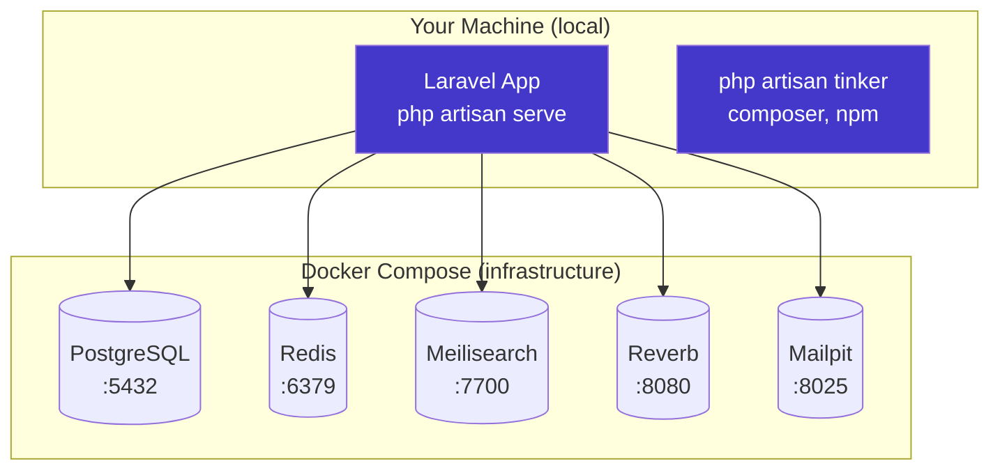

# 1. Get the Page Running

> **Milestone:** A running Laravel 13 app serving a homepage, connected to PostgreSQL and Redis via Docker. You can visit `http://localhost:8000` and see it working.

## Prerequisites

- PHP 8.3+
- Node.js 20+
- Composer
- npm
- Docker & Docker Compose

!!! note "No local PostgreSQL, Redis, or Meilisearch needed"
    All infrastructure services run in Docker containers. You just need PHP, Node, Composer, npm, and Docker installed locally. No more `brew install postgresql redis meilisearch` or fighting with `pg_hba.conf`.

## What You'll Learn

| Concept | What it is | Why it matters |
|---------|-----------|----------------|
| Laravel 13 | PHP web framework (latest) | The foundation everything runs on |
| Docker Compose | Infrastructure-as-code for local services | PostgreSQL, Redis, Meilisearch, Reverb, Mailpit — one command to start them all |
| Eloquent | Laravel's ORM | How we talk to the database |
| PostgreSQL | Relational database | Our primary data store, with row-level security |
| Redis | In-memory data store | Queue driver, cache, sessions, rate limiting |
| Modular Monolith | Single app, organized modules | How we keep code organized without microservices |

## The Big Picture

Every complex app needs a solid foundation. In this section, we create the Laravel project, spin up infrastructure services with Docker Compose, and organize the code as a **modular monolith**.

The key insight: **your app runs locally, only infrastructure runs in Docker.** This means all `php artisan`, `composer`, and `npm` commands work natively — no `docker compose exec` wrappers needed. Docker just handles the services that are painful to install locally: PostgreSQL, Redis, Meilisearch, Reverb, and Mailpit.

??? question "What's a modular monolith?"
    Imagine a house with clearly labeled rooms. The kitchen doesn't borrow equipment from the bathroom. Each room has a clear purpose, but they're all under one roof — no need to walk outside to get from the kitchen to the dining room.

    A **modular monolith** is like that house: one deployable unit (the monolith), but with internal boundaries (the modules). In Zendo, each module — `Events`, `Registration`, `Payments` — lives in its own namespace with its own models, policies, and controllers. They can communicate through well-defined interfaces but never reach into each other's internals.

    This gives you the organizational clarity of microservices without the operational nightmare of running 10 separate deployments.



---

## Step 1: Create the Laravel 13 Project

```bash
cd ~/Work/metaprovide/lotus
laravel new zendo --sql=pgsql
cd zendo
```

This creates a fresh Laravel 13 project configured for PostgreSQL.

!!! note "Laravel 13"
    This tutorial uses Laravel 13 (released March 2026). It requires PHP 8.3+ and uses Pest 4, PHPUnit 12, and Vite 8 by default. The project structure and `bootstrap/app.php` configuration style are the same as Laravel 11+.

!!! note "Why PostgreSQL and not MySQL?"
    PostgreSQL gives us **Row-Level Security (RLS)**, which we'll use in [Section 13](section-13-hardening.md) as a safety net for tenant isolation. MySQL doesn't support RLS. Think of RLS as a bouncer at the database level — even if your application code forgets to filter by tenant, the database itself will refuse to serve the wrong data.

## Step 2: Start Infrastructure Services with Docker Compose

Create `docker-compose.yml` in the project root:

```yaml
services:
  postgres:
    image: postgres:16
    ports:
      - "5432:5432"
    environment:
      POSTGRES_DB: zendo
      POSTGRES_USER: zendo
      POSTGRES_PASSWORD: secret
    volumes:
      - postgres_data:/var/lib/postgresql/data
    healthcheck:
      test: ["CMD-SHELL", "pg_isready -U zendo"]
      interval: 5s
      timeout: 5s
      retries: 5

  redis:
    image: redis:7-alpine
    ports:
      - "6379:6379"
    healthcheck:
      test: ["CMD", "redis-cli", "ping"]
      interval: 5s
      timeout: 5s
      retries: 5

  meilisearch:
    image: getmeili/meilisearch:v1.8
    ports:
      - "7700:7700"
    environment:
      MEILI_MASTER_KEY: masterKey
    volumes:
      - meilisearch_data:/meili_data

  mailpit:
    image: axllent/mailpit:latest
    ports:
      - "1025:1025"
      - "8025:8025"

volumes:
  postgres_data:
  meilisearch_data:
```

Start all services:

```bash
docker compose up -d
```

Verify everything is running:

```bash
docker compose ps
```

You should see all four services with status `Up` (or `healthy`).

??? tip "Docker Compose commands you'll use often"
    - `docker compose up -d` — Start all services in the background
    - `docker compose down` — Stop all services (data is preserved in volumes)
    - `docker compose down -v` — Stop and delete all data (fresh start)
    - `docker compose ps` — Check which services are running
    - `docker compose logs redis` — View logs for a specific service
    - `docker compose restart postgres` — Restart a single service

## Step 3: Configure the Database Connection

Edit `.env`:

```env
DB_HOST=127.0.0.1
DB_PORT=5432
DB_DATABASE=zendo
DB_USERNAME=zendo
DB_PASSWORD=secret
```

The database was created automatically by the Docker container (see `POSTGRES_DB`, `POSTGRES_USER`, `POSTGRES_PASSWORD` in `docker-compose.yml`).

Test the connection:

```bash
php artisan migrate
```

You should see Laravel's default migrations run successfully.

??? tip "If you get a connection error"
    Make sure the Docker services are healthy: `docker compose ps`. If PostgreSQL is still starting up, wait a few seconds and try again. The healthcheck in the compose file ensures Postgres is ready before you can connect.

## Step 4: Configure Redis

Add to `.env`:

```env
CACHE_DRIVER=redis
QUEUE_CONNECTION=redis
SESSION_DRIVER=redis

REDIS_HOST=127.0.0.1
REDIS_PASSWORD=null
REDIS_PORT=6379
```

Test the connection:

```bash
php artisan tinker
# >>> Cache::put('test', 'hello', 60);
# >>> Cache::get('test');
# => "hello"
```

??? question "Why Redis for everything?"
    Redis is like a fast **scratchpad** that lives in memory. We use it for:
    
    - **Queues**: When someone registers for an event, sending the confirmation email gets queued in Redis (not blocking the HTTP response)
    - **Cache**: Frequently accessed data like feature flags and tenant configs
    - **Sessions**: User login sessions (faster than database lookups)
    - **Rate limiting**: How many requests per second a user can make
    - **Broadcasting**: Real-time WebSocket message broker
    
    Running Redis in Docker means no local installation needed. It's always available at `127.0.0.1:6379`.

## Step 5: Configure Meilisearch and Mailpit

Add to `.env`:

```env
SCOUT_DRIVER=meilisearch
MEILISEARCH_HOST=http://127.0.0.1:7700
MEILISEARCH_KEY=masterKey

MAIL_MAILER=smtp
MAIL_HOST=127.0.0.1
MAIL_PORT=1025
MAIL_FROM_ADDRESS=noreply@zendo.test
MAIL_FROM_NAME="Zendo"
```

Meilisearch will be used for full-text search starting in [Section 10](section-10-search.md). Mailpit catches all outgoing emails during development — visit `http://localhost:8025` to see them.

## Step 6: Install Key Dependencies

```bash
# Frontend (for later sections)
npm install

# Laravel packages we'll need
composer require laravel/breeze --dev
composer require laravel/pennant
composer require laravel/cashier
composer require laravel/scout
composer require filament/filament:"^3.2"
```

!!! warning "Don't run Breeze install yet"
    We'll set up auth in [Section 3](section-03-auth.md). For now, we've just added it to composer.

## Step 7: Create the Module Structure

A modular monolith keeps code organized by domain, not by technical layer. Instead of putting all controllers in one folder and all models in another, we group everything related to "Events" together.

```bash
cd ~/Work/metaprovide/lotus/zendo
mkdir -p app/Modules/Tenancy/{Models,Policies,Middleware,Events}
mkdir -p app/Modules/Events/{Models,Policies,Controllers,Filament,Requests,Events}
mkdir -p app/Modules/Registration/{Models,Policies,Controllers,Filament,Requests,Services,Events}
mkdir -p app/Modules/Lodging/{Models,Policies,Filament,Services,Events}
mkdir -p app/Modules/Meals/{Models,Policies,Filament,Events}
mkdir -p app/Modules/Memberships/{Models,Policies,Filament,Controllers,Events}
mkdir -p app/Modules/Payments/{Models,Policies,Filament,Services,Jobs,Events}
mkdir -p app/Modules/People/{Models,Policies,Filament,Controllers}
mkdir -p app/Modules/Notifications/{Mailables,Notifications,Jobs,Events}
mkdir -p app/Modules/Hub/{Controllers,Api}
```

Your module structure should look like this:

```
zendo/app/Modules/
├── Tenancy/        # Multi-tenant scoping, organizations
├── Events/         # Event catalog, instances, teachers
├── Registration/   # Registration wizard, lifecycle
├── Lodging/        # Buildings, rooms, beds
├── Meals/          # Meal plans, dietary tags
├── Memberships/    # Membership plans, subscriptions
├── Payments/       # Invoices, Stripe, webhooks
├── People/          # Users, guest profiles, roles
├── Notifications/   # Email, outbox
└── Hub/            # Cross-tenant public discovery
```

??? info "Why modules and not just folders?"
    The Laravel convention is `app/Models/`, `app/Http/Controllers/`, etc. — organized by **layer**. This works for small apps, but as your app grows, a change to "how registration works" touches 6 different folders. 
    
    With modules, everything about registration lives in one place: `app/Modules/Registration/`. When you need to understand registration, you open one folder. When you need to change it, you work in one folder.
    
    We'll add architecture tests later that **enforce** module boundaries — the `Events` module cannot import from the `Payments` module. This prevents the spaghetti that killed the original codebase.

## Step 8: Add the Module Autoloader

Modules need to be autoloaded by Composer. Edit `composer.json`:

```json
{
    "autoload": {
        "psr-4": {
            "App\\": "app/",
            "App\\Modules\\": "app/Modules/"
        }
    }
}
```

Then run:

```bash
composer dump-autoload
```

## Step 9: Set Up the Base Tenancy Module

Create the foundational `Tenant` model — the anchor for everything else:

```bash
php artisan make:model Tenant -m
```

Edit the migration (`database/migrations/*_create_tenants_table.php`):

```php
Schema::create('tenants', function (Blueprint $table) {
    $table->uuid('id')->primary();
    $table->string('slug')->unique();
    $table->string('name');
    $table->string('description')->nullable();
    $table->string('logo')->nullable();
    $table->string('custom_domain')->nullable();
    $table->json('features')->default('{}');
    $table->enum('registration_mode', ['AUTO_CONFIRM', 'MANUAL_REVIEW', 'AUTO_IF_PAID'])
        ->default('MANUAL_REVIEW');
    $table->string('currency', 3)->default('EUR');
    $table->string('timezone')->default('Europe/Paris');
    $table->string('locale', 5)->default('en');
    $table->boolean('is_active')->default(true);
    $table->timestamps();
    $table->softDeletes();
});
```

Move the model to the Tenancy module:

```bash
mv app/Models/Tenant.php app/Modules/Tenancy/Models/Tenant.php
```

Edit `app/Modules/Tenancy/Models/Tenant.php`:

```php
<?php

namespace App\Modules\Tenancy\Models;

use Illuminate\Database\Eloquent\Model;
use Illuminate\Database\Eloquent\Concerns\HasUuids;

class Tenant extends Model
{
    use HasUuids;

    protected $fillable = [
        'slug',
        'name',
        'description',
        'logo',
        'custom_domain',
        'features',
        'registration_mode',
        'currency',
        'timezone',
        'locale',
        'is_active',
    ];

    protected $casts = [
        'features' => 'array',
        'is_active' => 'boolean',
    ];
}
```

Run the migration:

```bash
php artisan migrate
```

## Step 10: Test It Works

```bash
php artisan tinker
```

```php
use App\Modules\Tenancy\Models\Tenant;
Tenant::create(['slug' => 'ivy', 'name' => 'Ivy Retreat Center']);
Tenant::all();
// => [Tenant { id: "...", slug: "ivy", name: "Ivy Retreat Center", ... }]
```

You should see the tenant created and stored in PostgreSQL (running in Docker).

## Step 11: Set Up a Simple Homepage Route

Edit `routes/web.php` — add a `/hub` route alongside the existing home route:

```php
<?php

use Illuminate\Support\Facades\Route;

Route::inertia('/', 'welcome')->name('home');

Route::get('/hub', function () {
    return view('hub', [
        'centers' => \App\Modules\Tenancy\Models\Tenant::where('is_active', true)->get(),
    ]);
});
```

Create `resources/views/hub.blade.php`:

```html
<!DOCTYPE html>
<html lang="en">
<head>
    <meta charset="UTF-8">
    <meta name="viewport" content="width=device-width, initial-scale=1.0">
    <title>Zendo — Retreat Centers</title>
    <style>
        body { font-family: system-ui, sans-serif; max-width: 800px; margin: 2rem auto; padding: 0 1rem; }
        h1 { color: #4338ca; }
        .center { border: 1px solid #e5e7eb; border-radius: 8px; padding: 1rem; margin: 1rem 0; }
        .center h2 { margin: 0 0 0.5rem 0; }
        .features { display: flex; gap: 0.5rem; flex-wrap: wrap; }
        .badge { background: #f3f4f6; padding: 0.25rem 0.75rem; border-radius: 9999px; font-size: 0.875rem; }
        .badge.active { background: #dcfce7; color: #166534; }
        .badge.inactive { background: #f3f4f6; color: #9ca3af; }
    </style>
</head>
<body>
    <h1>Zendo</h1>
    <p>Find your retreat.</p>

    @foreach($centers as $center)
        <div class="center">
            <h2>{{ $center->name }}</h2>
            <p>{{ $center->description }}</p>
            <div class="features">
                @foreach(['meals', 'lodging', 'memberships'] as $feature)
                    @if(isset($center->features[$feature]) && $center->features[$feature])
                        <span class="badge active">{{ $feature }}</span>
                    @else
                        <span class="badge inactive">{{ $feature }}</span>
                    @endif
                @endforeach
            </div>
        </div>
    @endforeach
</body>
</html>
```

Now seed a couple of centers to see it in action:

```bash
php artisan tinker
```

```php
use App\Modules\Tenancy\Models\Tenant;
Tenant::create(['slug' => 'ivy', 'name' => 'Ivy Retreat Center', 'features' => ['meals' => true, 'lodging' => true, 'memberships' => true]]);
Tenant::create(['slug' => 'nalanda', 'name' => 'Nalanda Center', 'features' => ['meals' => false, 'lodging' => true, 'memberships' => true]]);
Tenant::create(['slug' => 'bodhi-tree', 'name' => 'Bodhi Tree House', 'features' => ['meals' => true, 'lodging' => false, 'memberships' => false]]);
```

Visit `http://localhost:8000/hub` — you should see all three centers with their feature badges.

## Step 12: Start the Services

Your infrastructure services run in Docker (already started with `docker compose up -d`). You just need the application services locally:

```bash
# Terminal 1: Laravel dev server
php artisan serve --host=0.0.0.0

# Terminal 2: Queue worker (processes async jobs)
php artisan queue:work

# Terminal 3: Vite (for frontend hot-reload — we'll use this later)
npm run dev
```

!!! note "Why `--host=0.0.0.0`?"
    This makes the dev server accessible from all network interfaces. We'll need this for multi-tenant subdomain routing in [Section 2](section-02-multi-tenancy.md) when we visit `ivy.zendo.test:8000`.

!!! success "Checkpoint"
    At this point you should have:
    
    - ✅ Laravel 13 app running at `http://localhost:8000`
    - ✅ PostgreSQL running in Docker, connected and migrated
    - ✅ Redis running in Docker, connected (cache, queue, session driver)
    - ✅ Meilisearch running in Docker, ready for search (Section 10)
    - ✅ Mailpit running in Docker, catching emails at `http://localhost:8025`
    - ✅ Three tenants in the database
    - ✅ A `/hub` page listing all active centers
    - ✅ Modular directory structure ready for growth
    - ✅ Tenant model with UUID primary keys and JSON features

---

## What's Next

In [Section 2: Multi-Tenancy from Day One](section-02-multi-tenancy.md), we'll build the middleware that automatically scopes every query to the current tenant, so Ivy can never see Nalanda's events.

We'll cover:

- **Eloquent Global Scopes** — automatic query filtering
- **Middleware** — resolving the tenant from the URL
- **Defensive architecture** — making it impossible to write a cross-tenant query
- **PostgreSQL RLS** (preview) — database-level safety net