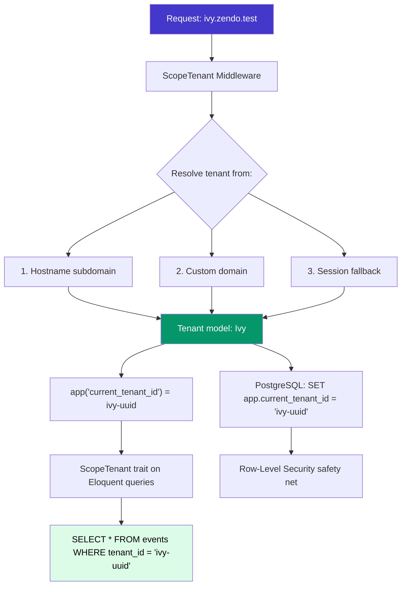
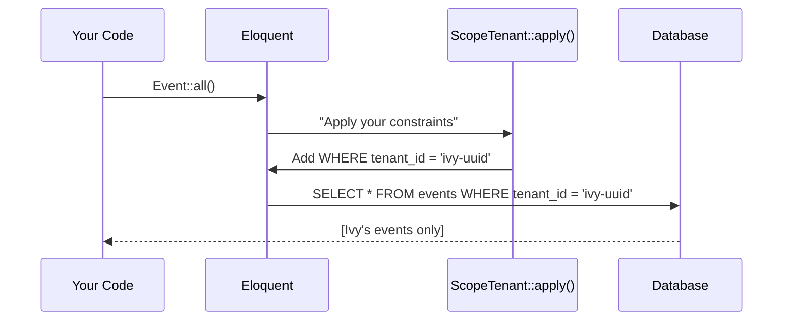
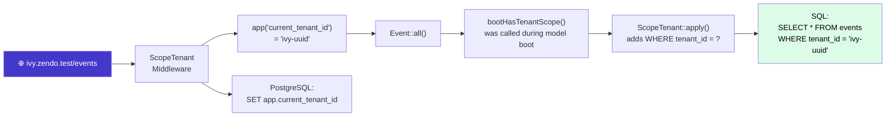

# 2. Multi-Tenancy from Day One

> **Milestone:** Tenant middleware that automatically scopes all queries. Visiting `ivy.zendo.test` only shows Ivy's data — Nalanda's events are invisible.

## Prerequisites

- [Section 1: Get the Page Running](section-01-get-running.md) completed
- Docker services running (`docker compose up -d`)
- Three tenants in your database (Ivy, Nalanda, Bodhi Tree)

## What You'll Learn

| Concept | What it is | Why it matters |
|---------|-----------|----------------|
| ScopeTenant middleware | Resolves tenant from hostname, sets app container + PostgreSQL session | The front door — every request knows which tenant it belongs to |
| Eloquent Global Scope | A Laravel mechanism that automatically adds conditions to every query | The engine that makes tenant scoping work — not manual `->where()` on every query |
| HasTenantScope trait | A PHP trait that registers the global scope on a model | One `use HasTenantScope` line makes a model tenant-safe forever |
| ScopeTenantThrough | Filters through relationship chains (Room → Building → Tenant) | Models without a direct `tenant_id` column still get scoped |
| Global models | Models that live across all tenants | Users, teachers, and categories are shared — not owned by one tenant |
| tenant() helper | Global function returning the current tenant | Clean accessor instead of `app('current_tenant')` everywhere |
| Architecture test | PHPUnit test that enforces scoping at build time | CI fails if you forget the trait on a new model |

## The Big Picture

Multi-tenancy is like an **apartment building**. Each tenant has their own apartment (their data) but shares the building infrastructure (the app, the database). The `ScopeTenant` trait is the **key card system** — it automatically restricts residents to their own floor.

Without this system, you'd have to remember to add `->where('tenant_id', ...)` to every single query. Miss one? Ivy just saw Nalanda's registrations. That's the kind of bug that makes the news.



??? question "Why not separate databases per tenant?"
    Separate databases give perfect isolation but create operational headaches: 50 tenants means 50 databases to migrate, 50 connection pools to manage, and cross-tenant features (like a teacher who teaches at multiple centers) become extremely complex.
    
    Shared database with `tenant_id` on every row is simpler, scales better, and — with the `ScopeTenant` trait and PostgreSQL RLS — is just as safe. We get the isolation of separate databases with the simplicity of one.

---

## Before We Begin: Key Concepts

This section uses three PHP/Laravel patterns that you need to understand before the code will make sense. If you're already comfortable with traits, Eloquent global scopes, and the `Concerns/` convention, skip ahead to Step 1.

### PHP Traits

A **trait** is a reusable group of methods you can drop into any class with `use`:

```php
trait HasTimestamps
{
    public function getCreatedAt(): Carbon
    {
        return $this->created_at;
    }
}

class Event extends Model
{
    use HasTimestamps; // Event now has getCreatedAt()
}
```

Think of a trait as a **copy-paste that stays in sync**. If you change the trait, every class that uses it gets the update. No inheritance chains, no overrides — just composition.

### The `Concerns/` Directory Convention

In Laravel, you'll often see traits organized in a `Concerns/` subdirectory:

```
Models/
  Event.php
  Concerns/
    HasTenantScope.php
    HasUuids.php
```

The name "Concerns" comes from Ruby on Rails — it means "a reusable behavior that a model is *concerned with*." It's just a folder. The traits inside it work exactly the same as traits anywhere else. The directory exists to keep the model folder tidy when you have many traits.

### Eloquent Global Scopes

Laravel's **Global Scopes** are constraints that are automatically added to every query for a model. Here's the lifecycle:

1. You write a class that implements the `Scope` interface
2. That class has an `apply()` method — Laravel calls it on every query
3. You register the scope in a `boot{TraitName}()` method on the model
4. From then on, `Event::all()` actually runs `SELECT * FROM events WHERE tenant_id = ?`



### The Scope Class + Trait Pattern

You'll notice that every scoping mechanism in this section is split across **two files**:

| File | Type | What it does |
|------|------|-------------|
| `ScopeTenant.php` | Class implementing `Scope` | Holds the actual query logic (`WHERE tenant_id = ?`) |
| `HasTenantScope.php` | Trait | Registers the scope on the model via `bootHasTenantScope()` |

!!! info "Why two files?"
    The **class** holds the behavior — the SQL logic. The **trait** wires it into Eloquent's boot system. We split them because:
    
    - The scope class can be tested in isolation
    - The trait adds convenience methods (like `getQualifiedTenantIdColumn()` and `tenant()`)
    - The same pattern is used by Laravel's own `SoftDeletingScope` + `SoftDeletes` trait — we're following a convention Laravel developers already know
    
    When you write `use HasTenantScope` on a model, Laravel finds the `bootHasTenantScope()` method (Eloquent auto-calls any `boot{TraitName}()` method), which calls `addGlobalScope(new ScopeTenant())`, which registers the scope to run on every query.

You'll see this exact two-file pattern twice in this section:

1. **ScopeTenant** + **HasTenantScope** — for models with a direct `tenant_id` column
2. **ScopeTenantThrough** + **HasTenantScopeThrough** — for models that reach the tenant through a relationship

Once you understand the first pair, the second is just "same idea, different query strategy."

---

## Step 1: Create the ScopeTenant Middleware

The middleware runs on every request. It looks at the hostname, finds the matching tenant, and stores it in two places: the Laravel app container and the PostgreSQL session.

Create `app/Modules/Tenancy/Middleware/ScopeTenant.php`:

```php
<?php

namespace App\Modules\Tenancy\Middleware;

use Closure;
use Illuminate\Http\Request;
use Illuminate\Support\Facades\DB;
use App\Modules\Tenancy\Models\Tenant;

class ScopeTenant
{
    public function handle(Request $request, Closure $next)
    {
        $tenant = $this->resolveTenant($request);

        if (! $tenant) {
            abort(404, 'Tenant not found.');
        }

        if (! $tenant->is_active) {
            abort(403, 'This center is currently unavailable.');
        }

        $this->bindTenant($tenant);

        return $next($request);
    }

    protected function resolveTenant(Request $request): ?Tenant
    {
        $host = $request->getHost();

        // Strategy 1: subdomain (ivy.zendo.test)
        $subdomain = $this->extractSubdomain($host);
        if ($subdomain) {
            $tenant = Tenant::where('slug', $subdomain)->first();
            if ($tenant) {
                return $tenant;
            }
        }

        // Strategy 2: custom domain (www.ivyretreat.com)
        $tenant = Tenant::where('custom_domain', $host)->first();
        if ($tenant) {
            return $tenant;
        }

        // Strategy 3: session (for headless/API flows)
        $tenantId = $request->session()->get('current_tenant_id');
        if ($tenantId) {
            return Tenant::find($tenantId);
        }

        return null;
    }

    protected function extractSubdomain(string $host): ?string
    {
        $parts = explode('.', $host);
        if (count($parts) >= 3) {
            return $parts[0];
        }
        return null;
    }

    protected function bindTenant(Tenant $tenant): void
    {
        // Laravel app container — available as app('current_tenant_id')
        app()->instance('current_tenant_id', $tenant->id);
        app()->instance(Tenant::class, $tenant);

        // PostgreSQL session — used by Row-Level Security (Section 13)
        DB::statement("SET app.current_tenant_id = '{$tenant->id}'");
    }
}
```

Register the middleware in `bootstrap/app.php`:

```php
use App\Modules\Tenancy\Middleware\ScopeTenant;

return Application::configure(basePath: dirname(__DIR__))
    ->withMiddleware(function (Middleware $middleware) {
        $middleware->web(append: [
            ScopeTenant::class,
        ]);

        $middleware->api(append: [
            ScopeTenant::class,
        ]);
    })
    ->create();
```

!!! warning "Exempt the hub route"
    The `/hub` page lists all centers — it's not tenant-scoped. We'll add an `except` later. For now, the hub route will 404. We'll fix that in Step 5.

??? question "Why both the app container AND PostgreSQL session?"
    The app container (`app('current_tenant_id')`) is used by Eloquent scopes — the application-level enforcement. The PostgreSQL session variable is used by Row-Level Security policies — the database-level safety net. Two layers, two mechanisms. If a developer forgets the Eloquent trait, RLS still blocks the query.

### The Full Request Lifecycle

Here's the complete path from a browser request to a filtered SQL query. Follow it left to right:



Every request follows this path. The middleware sets the context, the model boot registers the scope, and the scope applies the filter. No manual `->where()` needed.

---

## Step 2: Create the ScopeTenant Eloquent Scope and Trait

This is the heart of the system. When a model uses `HasTenantScope`, **every** query automatically adds `WHERE tenant_id = ?`. No exceptions.

### What happens when `Event::all()` runs on `ivy.zendo.test`?

Tracing through the code we're about to write:

1. The middleware has already set `app('current_tenant_id')` to Ivy's UUID
2. Eloquent starts building the query for `SELECT * FROM events`
3. Eloquent boots the `Event` model, calling `bootHasTenantScope()`
4. `bootHasTenantScope()` calls `addGlobalScope(new ScopeTenant())`
5. Eloquent calls `ScopeTenant::apply()`, which adds `WHERE events.tenant_id = 'ivy-uuid'`
6. The final SQL is `SELECT * FROM events WHERE events.tenant_id = 'ivy-uuid'`
7. Only Ivy's events are returned — Nalanda's are invisible

Now let's write the two files.

First, the **scope class** — this holds the query logic. Create `app/Modules/Tenancy/Models/Concerns/ScopeTenant.php`:

```php
<?php

namespace App\Modules\Tenancy\Models\Concerns;

use Illuminate\Database\Eloquent\Builder;
use Illuminate\Database\Eloquent\Model;
use Illuminate\Database\Eloquent\Scope;

// This class implements Laravel's Scope interface.
// Eloquent will call apply() on every query for models that register this scope.
class ScopeTenant implements Scope
{
    // Called automatically by Eloquent when building a query.
    // $builder is the query builder — we add our WHERE clause to it.
    // $model is the Eloquent model being queried (e.g., Event, Building).
    public function apply(Builder $builder, Model $model): void
    {
        // Grab the tenant ID that the middleware set in the app container.
        $tenantId = app('current_tenant_id');

        if ($tenantId) {
            // getQualifiedTenantIdColumn() comes from the HasTenantScope trait.
            // It returns something like "events.tenant_id" — table-qualified
            // to avoid ambiguity in JOINs.
            $builder->where($model->getQualifiedTenantIdColumn(), $tenantId);
        }
    }

    // Called once when the scope is registered.
    // This adds a ->withoutTenant() macro so you can bypass the scope
    // when you genuinely need cross-tenant reads.
    public function extend(Builder $builder): void
    {
        $builder->macro('withoutTenant', function (Builder $builder) {
            return $builder->withoutGlobalScope(static::class);
        });
    }
}
```

Second, the **trait** — this registers the scope and adds convenience methods. Create `app/Modules/Tenancy/Models/Concerns/HasTenantScope.php`:

```php
<?php

namespace App\Modules\Tenancy\Models\Concerns;

// This trait goes inside an Eloquent model:
//
//   class Event extends Model {
//       use HasTenantScope;   // ← adds automatic tenant filtering
//   }
//
// Eloquent auto-calls bootHasTenantScope() because it follows the
// boot{TraitName}() naming convention.
trait HasTenantScope
{
    // Eloquent calls this method automatically when the model boots.
    // It registers ScopeTenant as a global scope — meaning apply() will
    // run on every query for this model.
    public static function bootHasTenantScope(): void
    {
        static::addGlobalScope(new ScopeTenant());
    }

    // Returns the table-qualified column name, e.g. "events.tenant_id".
    // This avoids ambiguity when queries involve JOINs with other tables
    // that also have a tenant_id column.
    public function getQualifiedTenantIdColumn(): string
    {
        return $this->getTable() . '.tenant_id';
    }

    // Convenience relationship: $event->tenant gives you the Tenant model.
    public function tenant()
    {
        return $this->belongsTo(\App\Modules\Tenancy\Models\Tenant::class);
    }
}
```

??? tip "The `withoutTenant()` escape hatch"
    Occasionally you need a cross-tenant read — for example, showing a teacher who teaches at multiple centers. The `withoutTenant()` macro lets you opt out:
    
    ```php
    Event::withoutTenant()->where('is_featured', true)->get();
    ```
    
    Use this sparingly and always through the `CrossTenantReads` class (we'll build that in Step 9). Never scatter `withoutTenant()` calls around your codebase.

---

## Step 3: Create the ScopeTenantThrough Scope and Trait

Some models don't have a `tenant_id` column directly. Consider a **Room**:

- A `Room` belongs to a `Building`
- A `Building` has a `tenant_id`
- So to filter rooms by tenant, we need to go **through** the Building relationship

The query strategy is fundamentally different from Step 2. Instead of adding `WHERE tenant_id = ?`, we use Laravel's `whereHas` to filter through a relationship:

```sql
-- HasTenantScope adds this (direct column filter):
SELECT * FROM events WHERE events.tenant_id = 'ivy-uuid'

-- HasTenantScopeThrough adds this (subquery through a relationship):
SELECT * FROM rooms WHERE EXISTS (
    SELECT * FROM buildings
    WHERE rooms.building_id = buildings.id
    AND buildings.tenant_id = 'ivy-uuid'
)
```

Different strategy, different scope class. That's why we have two.

??? question "Why a separate scope class instead of reusing ScopeTenant?"
    Because the query strategy is fundamentally different. `ScopeTenant` adds `WHERE tenant_id = ?` — a simple column filter. `ScopeTenantThrough` adds `WHERE EXISTS (SELECT ... FROM buildings WHERE rooms.building_id = buildings.id AND buildings.tenant_id = ?)` — a subquery through a relationship. Different strategy, different scope.

??? info "What is `whereHas`?"
    Laravel's `whereHas` method filters a query by the existence of a relationship. For example:
    
    ```php
    // "Find all rooms where the room's building has tenant_id = ivy-uuid"
    Room::whereHas('building', function ($query) {
        $query->where('tenant_id', 'ivy-uuid');
    });
    ```
    
    This generates a `WHERE EXISTS` subquery in SQL. It's Laravel's way of saying "filter this model by a condition on a related model."

Create the scope class `app/Modules/Tenancy/Models/Concerns/ScopeTenantThrough.php`:

```php
<?php

namespace App\Modules\Tenancy\Models\Concerns;

use Illuminate\Database\Eloquent\Builder;
use Illuminate\Database\Eloquent\Model;
use Illuminate\Database\Eloquent\Scope;

// Like ScopeTenant, this implements the Scope interface.
// But instead of a direct column filter, it uses whereHas
// to filter through a relationship chain.
class ScopeTenantThrough implements Scope
{
    // The relationship name to traverse, e.g. "building".
    // Passed in via the constructor — set in HasTenantScopeThrough.
    protected string $throughRelation;

    public function __construct(string $throughRelation)
    {
        $this->throughRelation = $throughRelation;
    }

    public function apply(Builder $builder, Model $model): void
    {
        $tenantId = app('current_tenant_id');

        if ($tenantId) {
            // whereHas generates: WHERE EXISTS (SELECT ... FROM buildings WHERE ...)
            $builder->whereHas($this->throughRelation, function (Builder $query) use ($tenantId) {
                $query->where('tenant_id', $tenantId);
            });
        }
    }

    public function extend(Builder $builder): void
    {
        $builder->macro('withoutTenant', function (Builder $builder) {
            return $builder->withoutGlobalScope($this);
        });
    }
}
```

Create the trait `app/Modules/Tenancy/Models/Concerns/HasTenantScopeThrough.php`:

```php
<?php

namespace App\Modules\Tenancy\Models\Concerns;

// Use this trait in models that DON'T have their own tenant_id column,
// but reach the tenant through a relationship.
//
// Example: Room belongs to Building, Building has tenant_id.
// So Room uses HasTenantScopeThrough with tenantThroughRelation() = 'building'.
trait HasTenantScopeThrough
{
    public static function bootHasTenantScopeThrough(): void
    {
        // Pass the relationship name to the scope constructor.
        // tenantThroughRelation() returns 'building' by default —
        // override it in each model to specify the correct relationship.
        static::addGlobalScope(new ScopeTenantThrough(static::tenantThroughRelation()));
    }

    // Override this in each model to specify the relationship
    // that leads to the tenant. Default is 'building' since that's
    // the most common chain (Room → Building → Tenant).
    public static function tenantThroughRelation(): string
    {
        return 'building';
    }
}
```

---

## Step 4: Apply the Traits to Models

Models with a direct `tenant_id` column use `HasTenantScope`. Models that reach the tenant through another model use `HasTenantScopeThrough`. Some models are **global** — they don't belong to any tenant.

### Models with direct `tenant_id` (HasTenantScope)

These models have their own `tenant_id` column:

| Model | Module |
|-------|--------|
| Event | Events |
| EventInstance | Events |
| CenterTeacher | Events |
| PriceTier | Events |
| DiscountCode | Events |
| AddOn | Events |
| Building | Lodging |
| MealPlan | Meals |
| DietaryTag | Meals |
| MembershipPlan | Memberships |
| Membership | Memberships |
| TaxRate | Registration |
| Registration | Registration |
| Invoice | Payments |
| OutboxEntry | Notifications |

Example — the Event model:

```php
<?php

namespace App\Modules\Events\Models;

use App\Modules\Tenancy\Models\Concerns\HasTenantScope;
use Illuminate\Database\Eloquent\Model;
use Illuminate\Database\Eloquent\Concerns\HasUuids;

class Event extends Model
{
    use HasUuids;
    use HasTenantScope;    // ← One line. Every query on Event is now tenant-scoped.

    protected $fillable = [
        'tenant_id',
        'title',
        'description',
        'event_type',
        'start_date',
        'end_date',
        'is_published',
    ];

    protected $casts = [
        'start_date' => 'date',
        'end_date' => 'date',
        'is_published' => 'boolean',
    ];
}
```

That's it. One `use HasTenantScope` and every `Event::all()`, `Event::where(...)`, `Event::find(...)` automatically includes `WHERE tenant_id = ?`. No manual filtering required.

### Models with indirect tenancy (HasTenantScopeThrough)

These models reach the tenant through a parent relationship:

| Model | Through chain |
|-------|---------------|
| Room | `building.tenant` |
| Bed | `room.building.tenant` |
| Stay | `registration.tenant` |
| MealSelection | `registration.tenant` |
| AddOnSelection | `registration.tenant` |
| InvoiceLineItem | `invoice.tenant` |
| Payment | `invoice.tenant` |
| Refund | `payment.invoice.tenant` |
| MealServiceDay | `mealPlan.tenant` |
| MembershipPaymentOption | `membershipPlan.tenant` |

Example — the Room model. A Room doesn't have `tenant_id`. It belongs to a Building, and the Building has `tenant_id`. So we tell the trait to filter through the `building` relationship:

```php
<?php

namespace App\Modules\Lodging\Models;

use App\Modules\Tenancy\Models\Concerns\HasTenantScopeThrough;
use Illuminate\Database\Eloquent\Model;
use Illuminate\Database\Eloquent\Concerns\HasUuids;

class Room extends Model
{
    use HasUuids;
    use HasTenantScopeThrough;    // ← Filters through a relationship, not a direct column.

    // Override to specify which relationship leads to the tenant.
    // Default is 'building', which is correct for Room.
    public static function tenantThroughRelation(): string
    {
        return 'building';
    }

    public function building()
    {
        return $this->belongsTo(\App\Modules\Lodging\Models\Building::class);
    }

    protected $fillable = [
        'building_id',
        'name',
        'capacity',
        'room_type',
    ];
}
```

!!! info "Relationship chain depth"
    The `ScopeTenantThrough` scope handles one relationship hop (e.g., Room → Building). For deeper chains like Bed → Room → Building → Tenant, you'd need to either:
    
    - Add a `tenantThroughRelation` that returns the first step (e.g., `'room'`), and chain the scope through multiple `whereHas` calls, or
    - Add a denormalized `tenant_id` column to `Bed` for simplicity (often the better choice for deep chains)
    
    In practice, most models are only one or two hops from a tenant-owned model.

### Global models (no scoping)

These models are **not** tenant-scoped. They exist across all tenants:

| Model | Why it's global |
|-------|----------------|
| User | A person is a person, regardless of which center they're viewing |
| GuestProfile | Cross-tenant profile — same person registers at multiple centers |
| Teacher | A teacher may teach at multiple centers (linked via `CenterTeacher`) |
| Category | Shared taxonomy of retreat types (yoga, meditation, etc.) |
| StripeWebhook | Payment infrastructure, not tenant-owned |
| Organization | Organizational grouping above tenants |

??? tip "Why is GuestProfile global?"
    Imagine you attend a retreat at Ivy and then book another at Nalanda. Without a global profile, you'd have two separate records — two emergency contacts to update, two sets of dietary preferences. The `GuestProfile` is linked to your `User` and shared across tenants. When you register at Nalanda, your profile follows you.

Global models simply don't use `HasTenantScope` or `HasTenantScopeThrough`. That's it. No trait, no scoping.

#### Creating the Global Models

Create `app/Modules/People/Models/GuestProfile.php`:

```php
<?php

namespace App\Modules\People\Models;

use Illuminate\Database\Eloquent\Model;
use Illuminate\Database\Eloquent\Concerns\HasUuids;

class GuestProfile extends Model
{
    use HasUuids;

    protected $fillable = [
        'user_id',
        'first_name',
        'last_name',
        'email',
        'phone',
        'emergency_contact_name',
        'emergency_contact_phone',
        'dietary_preferences',
        'medical_notes',
    ];

    protected $casts = [
        'dietary_preferences' => 'array',
    ];

    public function user()
    {
        return $this->belongsTo(User::class);
    }
}
```

Create `app/Modules/Events/Models/Teacher.php`:

```php
<?php

namespace App\Modules\Events\Models;

use Illuminate\Database\Eloquent\Model;
use Illuminate\Database\Eloquent\Concerns\HasUuids;

class Teacher extends Model
{
    use HasUuids;

    protected $fillable = [
        'name',
        'bio',
        'photo',
        'specialties',
        'email',
    ];

    protected $casts = [
        'specialties' => 'array',
    ];
}
```

Create `app/Modules/Events/Models/Category.php`:

```php
<?php

namespace App\Modules\Events\Models;

use Illuminate\Database\Eloquent\Model;
use Illuminate\Database\Eloquent\Concerns\HasUuids;

class Category extends Model
{
    use HasUuids;

    protected $fillable = [
        'name',
        'slug',
        'description',
        'parent_id',
    ];

    public function parent()
    {
        return $this->belongsTo(self::class, 'parent_id');
    }

    public function children()
    {
        return $this->hasMany(self::class, 'parent_id');
    }
}
```

Now create the migrations for these global models:

```bash
php artisan make:migration create_guest_profiles_table
php artisan make:migration create_teachers_table
php artisan make:migration create_categories_table
```

Edit `database/migrations/*_create_guest_profiles_table.php`:

```php
Schema::create('guest_profiles', function (Blueprint $table) {
    $table->uuid('id')->primary();
    $table->uuid('user_id')->nullable();
    $table->string('first_name');
    $table->string('last_name');
    $table->string('email');
    $table->string('phone')->nullable();
    $table->string('emergency_contact_name')->nullable();
    $table->string('emergency_contact_phone')->nullable();
    $table->json('dietary_preferences')->nullable();
    $table->text('medical_notes')->nullable();
    $table->timestamps();

    $table->foreign('user_id')->references('id')->on('users')->nullOnDelete();
    $table->index('email');
});
```

Edit `database/migrations/*_create_teachers_table.php`:

```php
Schema::create('teachers', function (Blueprint $table) {
    $table->uuid('id')->primary();
    $table->string('name');
    $table->text('bio')->nullable();
    $table->string('photo')->nullable();
    $table->json('specialties')->nullable();
    $table->string('email')->nullable();
    $table->timestamps();
});
```

Edit `database/migrations/*_create_categories_table.php`:

```php
Schema::create('categories', function (Blueprint $table) {
    $table->uuid('id')->primary();
    $table->string('name');
    $table->string('slug')->unique();
    $table->text('description')->nullable();
    $table->uuid('parent_id')->nullable();
    $table->timestamps();

    $table->foreign('parent_id')->references('id')->on('categories')->nullOnDelete();
});
```

Run the migrations:

```bash
php artisan migrate
```

---

## Step 5: Exempt the Hub Route from Tenant Scoping

The `/hub` route lists all active centers — it's not scoped to a single tenant. Update `app/Modules/Tenancy/Middleware/ScopeTenant.php` to skip tenant resolution for the hub:

```php
protected function resolveTenant(Request $request): ?Tenant
{
    // The hub page lists all centers — no tenant scoping
    if ($request->is('hub') || $request->is('hub/*')) {
        return null;
    }

    $host = $request->getHost();

    // ... rest of the method stays the same
}
```

Then update `handle()` to allow null tenant on the hub:

```php
public function handle(Request $request, Closure $next)
{
    $tenant = $this->resolveTenant($request);

    if ($tenant === null && !$request->is('hub') && !$request->is('hub/*')) {
        abort(404, 'Tenant not found.');
    }

    if ($tenant && !$tenant->is_active) {
        abort(403, 'This center is currently unavailable.');
    }

    if ($tenant) {
        $this->bindTenant($tenant);
    }

    return $next($request);
}
```

---

## Step 6: Create the `tenant()` Helper

Create `app/helpers.php`:

```php
<?php

use App\Modules\Tenancy\Models\Tenant;

if (! function_exists('tenant')) {
    function tenant(): ?Tenant
    {
        return app(Tenant::class);
    }
}

if (! function_exists('tenant_id')) {
    function tenant_id(): ?string
    {
        if (! app()->bound('current_tenant_id')) {
            return null;
        }

        return app('current_tenant_id');
    }
}
```

!!! note "Why the `app()->bound()` check?"
    The `tenant_id()` helper is called from policies, gates, and middleware — places where no tenant context may exist yet (e.g., a GLOBAL_ADMIN acting outside any tenant, or unit tests). Without this guard, `app('current_tenant_id')` throws a `ContainerException` when the binding is absent. Returning `null` instead makes the helper safe to call anywhere.

Add it to `composer.json` autoloading:

```json
{
    "autoload": {
        "files": [
            "app/helpers.php"
        ],
        "psr-4": {
            "App\\": "app/",
            "App\\Modules\\": "app/Modules/"
        }
    }
}
```

Run:

```bash
composer dump-autoload
```

Now you can use `tenant()` and `tenant_id()` anywhere in your code:

```php
// In a controller:
$events = Event::where('is_published', true)->get();
// Automatically: WHERE tenant_id = tenant_id() AND is_published = true

// Getting the current tenant's name:
tenant()->name; // "Ivy Retreat Center"

// In a Blade template:
<h1>Welcome to {{ tenant()->name }}</h1>
```

---

## Step 7: Set Up Local Hosts for Multi-Tenant Testing

Each tenant needs its own hostname locally. Edit `/etc/hosts`:

```bash
sudo nano /etc/hosts
```

Add these lines:

```
127.0.0.1   ivy.zendo.test
127.0.0.1   nalanda.zendo.test
127.0.0.1   bodhi-tree.zendo.test
```

!!! warning "Using `.test` not `.localhost`"
    The `.test` TLD is the standard for local development (RFC 2606). Laravel's `serve` command handles it natively. Don't use `.local` — that conflicts with mDNS on macOS.

Now start the server (or restart it):

```bash
php artisan serve --host=0.0.0.0 --port=8000
```

The `--host=0.0.0.0` is important — without it, Laravel only listens on `localhost` and the `.test` domains won't resolve.

Test it:

```bash
curl -H "Host: ivy.zendo.test" http://127.0.0.1:8000/
# Should load successfully (404 if no tenant-specific routes yet, but no "Tenant not found" error)
```

??? tip "Testing with multiple subdomains in the browser"
    Open `http://ivy.zendo.test:8000` in your browser. If it doesn't resolve, make sure your `/etc/hosts` is correct and you started `php artisan serve` with `--host=0.0.0.0`.

---

## Step 8: Create a Second Tenant and Prove Isolation

Let's prove the system works. Create some data for Ivy and Nalanda, then confirm they can't see each other's data.

First, create migrations for a simple Event model:

```bash
php artisan make:migration create_events_table
```

Edit the migration:

```php
Schema::create('events', function (Blueprint $table) {
    $table->uuid('id')->primary();
    $table->uuid('tenant_id');
    $table->string('title');
    $table->text('description')->nullable();
    $table->boolean('is_published')->default(false);
    $table->timestamps();

    $table->foreign('tenant_id')->references('id')->on('tenants')->cascadeOnDelete();
    $table->index('tenant_id');
});
```

Run the migration:

```bash
php artisan migrate
```

Now seed events for each tenant:

```bash
php artisan tinker
```

```php
use App\Modules\Tenancy\Models\Tenant;
use App\Modules\Events\Models\Event;

$ivy = Tenant::where('slug', 'ivy')->first();
$nalanda = Tenant::where('slug', 'nalanda')->first();

Event::create(['tenant_id' => $ivy->id, 'title' => 'Morning Yoga', 'is_published' => true]);
Event::create(['tenant_id' => $ivy->id, 'title' => 'Silent Retreat', 'is_published' => true]);

Event::create(['tenant_id' => $nalanda->id, 'title' => 'Philosophy Lecture', 'is_published' => true]);
Event::create(['tenant_id' => $nalanda->id, 'title' => 'Breathwork Workshop', 'is_published' => true]);
```

Now test isolation. In tinker, simulate the tenant context:

```php
app()->instance('current_tenant_id', $ivy->id);

Event::count();
// => 2 (Ivy's events only)

Event::withoutTenant()->count();
// => 4 (all events)

app()->instance('current_tenant_id', $nalanda->id);

Event::count();
// => 2 (Nalanda's events only)
```

The `HasTenantScope` trait automatically filtered to only the current tenant's events. Ivy sees 2 events. Nalanda sees 2 different events. Total: 4.

### How does this work, step by step?

```
1. app()->instance('current_tenant_id', $ivy->id)
   → Stores Ivy's UUID in the app container

2. Event::count()
   → Eloquent boots the Event model
   → bootHasTenantScope() runs
   → addGlobalScope(new ScopeTenant()) registers the scope

3. Eloquent builds the query: SELECT COUNT(*) FROM events
   → ScopeTenant::apply() is called
   → It reads app('current_tenant_id') → 'ivy-uuid'
   → It adds WHERE events.tenant_id = 'ivy-uuid'

4. Final SQL: SELECT COUNT(*) FROM events WHERE events.tenant_id = 'ivy-uuid'
   → Returns 2
```

---

## Step 9: Create the CrossTenantReads Class

Sometimes you genuinely need to read across tenants — like showing a teacher who teaches at multiple centers. Never use `withoutTenant()` directly. Always go through a centralized class.

Create `app/Modules/Tenancy/CrossTenantReads.php`:

```php
<?php

namespace App\Modules\Tenancy;

use Illuminate\Database\Eloquent\Model;
use Illuminate\Support\Facades\Log;

class CrossTenantReads
{
    // Returns a query builder with tenant scoping removed.
    // Optionally filters to a specific tenant.
    public static function query(string $modelClass, ?string $tenantId = null)
    {
        // Every cross-tenant read is logged for audit purposes.
        Log::info('Cross-tenant read', [
            'model' => $modelClass,
            'tenant_id' => $tenantId ?? 'all',
            'called_by' => debug_backtrace(DEBUG_BACKTRACE_IGNORE_ARGS, 3)[1]['function'] ?? 'unknown',
        ]);

        if ($tenantId) {
            return $modelClass::withoutTenant()->where('tenant_id', $tenantId);
        }

        return $modelClass::withoutTenant();
    }

    public static function find(string $modelClass, string $id): ?Model
    {
        return static::query($modelClass)->find($id);
    }
}
```

??? tip "Why log every cross-tenant read?"
    Cross-tenant reads are the exception, not the rule. By logging every one, you can audit them in production. If you see hundreds of cross-tenant reads per minute, something is wrong — a developer is bypassing the scope when they shouldn't be.

---

## Step 10: Architecture Test — Enforce Scoping at Build Time

The best safety net is one that fails CI before buggy code ships. This test scans all models with a `tenant_id` column and verifies they use the `HasTenantScope` trait.

Create `tests/Feature/TenantScopingTest.php`:

```php
<?php

namespace Tests\Feature;

use Tests\TestCase;
use Illuminate\Support\Facades\Schema;
use Illuminate\Filesystem\Filesystem;
use Illuminate\Database\Eloquent\Model;
use App\Modules\Tenancy\Models\Concerns\HasTenantScope;
use App\Modules\Tenancy\Models\Concerns\HasTenantScopeThrough;

class TenantScopingTest extends TestCase
{
    protected array $globalModels = [
        \App\Models\User::class,
        \App\Modules\People\Models\GuestProfile::class,
        \App\Modules\Events\Models\Teacher::class,
        \App\Modules\Events\Models\Category::class,
    ];

    public function test_all_models_with_tenant_id_have_scoping(): void
    {
        $modelsUsingScope = $this->getModelsUsingTrait(HasTenantScope::class);
        $modelsUsingScopeThrough = $this->getModelsUsingTrait(HasTenantScopeThrough::class);

        $modelFiles = (new Filesystem())->allFiles(app_path('Modules'));
        $violations = [];

        foreach ($modelFiles as $file) {
            if (str_contains($file->getPathname(), 'Concerns')) {
                continue;
            }

            if (str_contains($file->getPathname(), 'Middleware')) {
                continue;
            }

            $class = $this->getClassFromFile($file);
            if (!$class || !class_exists($class)) {
                continue;
            }

            // Skip non-Model classes (e.g., utility classes like CrossTenantReads)
            if (!is_subclass_of($class, Model::class)) {
                continue;
            }

            // Skip global models
            if (in_array($class, $this->globalModels)) {
                continue;
            }

            $model = new $class;
            $tableName = $model->getTable();

            // Skip if the table doesn't exist yet (migrations haven't run)
            if (!Schema::hasTable($tableName)) {
                continue;
            }

            // If the table has a tenant_id column, the model MUST use a scope trait
            if (Schema::hasColumn($tableName, 'tenant_id')) {
                if (!in_array($class, $modelsUsingScope) && !in_array($class, $modelsUsingScopeThrough)) {
                    $violations[] = $class;
                }
            }
        }

        $this->assertEmpty(
            $violations,
            "The following models have a tenant_id column but are missing a tenant scope trait:\n" .
            collect($violations)->map(fn($v) => "  - {$v}")->join("\n") .
            "\n\nAdd HasTenantScope or HasTenantScopeThrough to each model."
        );
    }

    public function test_global_models_do_not_have_tenant_scoping(): void
    {
        foreach ($this->globalModels as $modelClass) {
            if (!class_exists($modelClass)) {
                continue;
            }

            $traits = class_uses_recursive($modelClass);

            $this->assertArrayNotHasKey(
                HasTenantScope::class,
                $traits,
                "{$modelClass} is a global model but uses HasTenantScope."
            );
        }
    }

    protected function getModelsUsingTrait(string $trait): array
    {
        $models = [];
        $modelFiles = (new Filesystem())->allFiles(app_path('Modules'));

        foreach ($modelFiles as $file) {
            $class = $this->getClassFromFile($file);
            if ($class && class_exists($class) && is_subclass_of($class, Model::class) && in_array($trait, class_uses_recursive($class))) {
                $models[] = $class;
            }
        }

        return $models;
    }

    protected function getClassFromFile($file): ?string
    {
        $contents = $file->getContents();

        if (!preg_match('/namespace\s+([^;]+);/', $contents, $namespace)) {
            return null;
        }

        if (!preg_match('/class\s+(\w+)/', $contents, $className)) {
            return null;
        }

        return $namespace[1] . '\\' . $className[1];
    }
}
```

Run the architecture test:

```bash
php artisan test --filter=TenantScopingTest
```

This test will **fail CI** if anyone adds a model with a `tenant_id` column but forgets the `HasTenantScope` trait. That's the kind of bug that causes a data leak.

!!! success "Checkpoint"
    At this point you should have:
    
    - ✅ `ScopeTenant` middleware resolving tenant from hostname
    - ✅ `ScopeTenant` scope class + `HasTenantScope` trait adding `WHERE tenant_id = ?` automatically
    - ✅ `ScopeTenantThrough` scope class + `HasTenantScopeThrough` trait for indirect tenant relationships
    - ✅ GuestProfile and Teacher as global (non-tenant-scoped) models
    - ✅ `tenant()` and `tenant_id()` helpers available everywhere
    - ✅ `/etc/hosts` entries for `ivy.zendo.test`, `nalanda.zendo.test`, `bodhi-tree.zendo.test`
    - ✅ Proven isolation: Ivy sees only Ivy's events, Nalanda sees only Nalanda's
    - ✅ `CrossTenantReads` class for auditable cross-tenant access
    - ✅ Architecture test that fails CI if a model with `tenant_id` is missing the scope trait

---

## What's Next

In [Section 3: Users, Roles & Auth](section-03-auth.md), we'll add user accounts with role-based permissions — so an ADMIN at Ivy can manage events while a VIEWER can only look.

We'll cover:

- **User model** — global accounts with a `global_role` column
- **UserTenantRole** — per-tenant roles (ADMIN, EDITOR, VIEWER)
- **Fortify** — login, registration, password reset, email verification
- **Socialite** — Google OAuth for one-click login
- **Policies** — role-based authorization with Gate::before for GLOBAL_ADMIN bypass