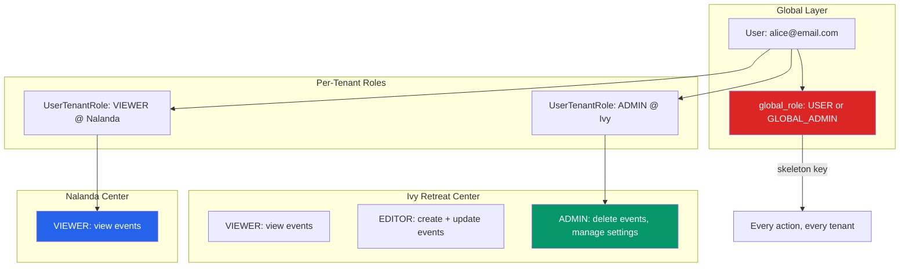

# 3. Users, Roles & Auth

> **Milestone:** Users can register, log in with email or Google, and authorization policies enforce who can do what per tenant.

## Prerequisites

- [Section 2: Multi-Tenancy](section-02-multi-tenancy.md) completed
- Docker services running (`docker compose up -d`)
- `ivy.zendo.test` resolving correctly
- `ScopeTenant` middleware and traits in place
- A Google OAuth client ID (optional — for Socialite setup in Step 6)

## What You'll Learn

| Concept | What it is | Why it matters |
|---------|-----------|----------------|
| User model | Global account with email + password | Same person across all tenants |
| UserTenantRole | Per-tenant role assignment | You're an ADMIN at Ivy but a VIEWER at Nalanda |
| GuestProfile | Cross-tenant personal details | Phone, emergency contact, dietary preferences follow you |
| Fortify | Laravel's backend auth system | Login, registration, password reset, email verification |
| Socialite | Laravel's OAuth client | Sign in with Google instead of creating a new password |
| Policies | Per-model authorization rules | VIEWER can view, EDITOR can edit, ADMIN can delete |
| Gates | Global authorization checks | GLOBAL_ADMIN bypasses all checks |

## The Big Picture

Think of roles like **hotel key cards**. A VIEWER key card opens the lobby (view-only access). An EDITOR key card opens the lobby and conference rooms (create and update). An ADMIN master key opens everything — including the staff-only areas (delete, manage). And the GLOBAL_ADMIN has the **skeleton key** that works on every floor of every hotel in the chain.



??? question "Why separate global_role and per-tenant role?"
    Because a person is one entity (global `User`), but their permissions change depending on which center they're in. Alice is an ADMIN at Ivy (her own center) and a VIEWER at Nalanda (a center she's visiting). The `global_role` handles platform-wide concerns like "can this person access the super admin dashboard?" The `UserTenantRole` handles per-center permissions.

---

## Step 1: Modify the User Model and Migration

Users are **global** — they don't belong to a single tenant. They exist across the entire platform.

Laravel's starter kit already created a `users` migration and a `User` model. We need to modify both: change the primary key to UUID, add multi-tenancy columns, and move the model to the People module.

!!! warning "Dropping and recreating the users table"
    The default Laravel migration creates `users` with an auto-increment `id`. We're replacing it with a UUID `id`. Since this is a fresh project with no real user data, the simplest approach is to modify the **original** migration file. If you already have user data you need to preserve, you'd write a separate alter migration instead.

Edit `database/migrations/0001_01_01_000000_create_users_table.php` — replace the `Schema::create('users', ...)` block with:

```php
Schema::create('users', function (Blueprint $table) {
    $table->uuid('id')->primary();
    $table->string('name');
    $table->string('email')->unique();
    $table->timestamp('email_verified_at')->nullable();
    $table->string('password');
    $table->string('global_role')->default('USER');
    $table->string('preferred_locale', 5)->default('en');
    $table->string('google_id')->nullable();
    $table->string('avatar')->nullable();
    $table->rememberToken();
    $table->timestamps();
    $table->softDeletes();
});
```

Also update the `sessions` table in the same file to use UUID `user_id`:

```php
Schema::create('sessions', function (Blueprint $table) {
    $table->string('id')->primary();
    $table->uuid('user_id')->nullable()->index();
    $table->string('ip_address', 45)->nullable();
    $table->text('user_agent')->nullable();
    $table->longText('payload');
    $table->integer('last_activity')->index();

    $table->foreign('user_id')->references('id')->on('users')->nullOnDelete();
});
```

!!! danger "Delete any duplicate create_users_table migration"
    If you ran `php artisan make:migration create_users_table` earlier, you'll have a **second** migration that tries to create the `users` table. Delete it — we're modifying the original Laravel scaffold migration instead. Running two migrations that both create `users` will cause a "relation already exists" error.

Now move and update the User model. Laravel creates `app/Models/User.php` by default — we need to move it to the People module:

```bash
mkdir -p app/Modules/People/Models
mv app/Models/User.php app/Modules/People/Models/User.php
```

Edit `app/Modules/People/Models/User.php`:

```php
<?php

namespace App\Modules\People\Models;

use Illuminate\Database\Eloquent\Concerns\HasUuids;
use Illuminate\Foundation\Auth\User as Authenticatable;
use Illuminate\Notifications\Notifiable;

class User extends Authenticatable
{
    use HasUuids;
    use Notifiable;

    protected $fillable = [
        'name',
        'email',
        'password',
        'global_role',
        'preferred_locale',
        'google_id',
        'avatar',
    ];

    protected $hidden = [
        'password',
        'remember_token',
    ];

    protected $casts = [
        'email_verified_at' => 'datetime',
        'password' => 'hashed',
    ];

    public function isGlobalAdmin(): bool
    {
        return $this->global_role === 'GLOBAL_ADMIN';
    }

    public function tenantRoles()
    {
        return $this->hasMany(UserTenantRole::class);
    }

    public function roleInTenant(?string $tenantId = null): ?string
    {
        $tenantId = $tenantId ?? tenant_id();

        return $this->tenantRoles()
            ->where('tenant_id', $tenantId)
            ->value('role');
    }

    public function isAdminInCurrentTenant(): bool
    {
        return $this->roleInTenant() === 'ADMIN';
    }

    public function isEditorInCurrentTenant(): bool
    {
        return in_array($this->roleInCurrentTenant(), ['ADMIN', 'EDITOR']);
    }

    public function roleInCurrentTenant(): ?string
    {
        return $this->roleInTenant();
    }
}
```

!!! warning "Update auth config and User factory"
    After moving the User model, Laravel still references `App\Models\User` in two places. Update them both:

    1. Edit `config/auth.php` — change `use App\Models\User;` to `use App\Modules\People\Models\User;`
    2. Edit `database/factories/UserFactory.php` — change `use App\Models\User;` to `use App\Modules\People\Models\User;`

    Then run `composer dump-autoload` and `php artisan config:clear`.

## Step 2: Create the UserTenantRole Model

This pivot model stores which user has which role in which tenant. It's the bridge between the global User and the per-tenant permission system.

```bash
php artisan make:model UserTenantRole -m
```

Edit the migration (`database/migrations/*_create_user_tenant_roles_table.php`):

```php
Schema::create('user_tenant_roles', function (Blueprint $table) {
    $table->uuid('id')->primary();
    $table->uuid('user_id');
    $table->uuid('tenant_id');
    $table->string('role'); // ADMIN, EDITOR, VIEWER
    $table->timestamps();

    $table->foreign('user_id')->references('id')->on('users')->cascadeOnDelete();
    $table->foreign('tenant_id')->references('id')->on('tenants')->cascadeOnDelete();
    $table->unique(['user_id', 'tenant_id']); // One role per user per tenant
});
```

Move and edit the model:

```bash
mv app/Models/UserTenantRole.php app/Modules/People/Models/UserTenantRole.php
```

```php
<?php

namespace App\Modules\People\Models;

use App\Modules\Tenancy\Models\Concerns\HasTenantScope;
use Illuminate\Database\Eloquent\Concerns\HasUuids;
use Illuminate\Database\Eloquent\Model;

class UserTenantRole extends Model
{
    use HasUuids;
    use HasTenantScope;

    protected $fillable = [
        'tenant_id',
        'user_id',
        'role',
    ];

    public function user()
    {
        return $this->belongsTo(User::class);
    }

    public function tenant()
    {
        return $this->belongsTo(\App\Modules\Tenancy\Models\Tenant::class);
    }
}
```

??? tip "Why not just a role column on users?"
    Because roles are per-tenant, not per-user. If you put a `role` column on `users`, Alice would have one role for the entire platform. But Alice is an ADMIN at Ivy and a VIEWER at Nalanda. The `user_tenant_roles` table captures this many-to-many relationship correctly.

## Step 3: Update the GuestProfile Model

We created the `GuestProfile` model and migration in Section 2. Since we've now changed the `users` table to use UUIDs, we need to update the GuestProfile to add the `first_name`, `last_name`, and `email` fields from the User model, and ensure the `user()` relationship uses the correct namespace.

If you haven't already created GuestProfile in Section 2, create it now:

```bash
php artisan make:model GuestProfile -m
```

!!! warning "If you already created GuestProfile in Section 2"
    Skip the `make:model` command above — just update the migration and model code to match below. If you get a "table already exists" error when running `migrate:refresh`, make sure there's only **one** `create_guest_profiles_table` migration file.

Edit the migration (`database/migrations/*_create_guest_profiles_table.php`):

```php
Schema::create('guest_profiles', function (Blueprint $table) {
    $table->uuid('id')->primary();
    $table->uuid('user_id')->nullable();
    $table->string('first_name');
    $table->string('last_name');
    $table->string('email');
    $table->string('phone')->nullable();
    $table->string('emergency_contact_name')->nullable();
    $table->string('emergency_contact_phone')->nullable();
    $table->json('dietary_preferences')->nullable();
    $table->text('medical_notes')->nullable();
    $table->timestamps();

    $table->foreign('user_id')->references('id')->on('users')->nullOnDelete();
    $table->index('email');
});
```

The model is already in `app/Modules/People/Models/GuestProfile.php` from Section 2. Verify it looks like this:

```php

namespace App\Modules\People\Models;

use Illuminate\Database\Eloquent\Concerns\HasUuids;
use Illuminate\Database\Eloquent\Model;

class GuestProfile extends Model
{
    use HasUuids;

    protected $fillable = [
        'user_id',
        'first_name',
        'last_name',
        'email',
        'phone',
        'emergency_contact_name',
        'emergency_contact_phone',
        'dietary_preferences',
        'medical_notes',
    ];

    protected $casts = [
        'dietary_preferences' => 'array',
    ];

    public function user()
    {
        return $this->belongsTo(User::class);
    }
}
```

??? question "Why is GuestProfile global but registrations are tenant-scoped?"
    Your dietary preferences and emergency contact don't change based on which retreat center you're visiting. But your *registration* for a specific event at a specific center is absolutely tenant-scoped. The global profile feeds into the tenant-scoped registration — your preferences are copied, not shared live.

## Step 4: Run the Migrations

Since we modified the original `users` table migration (changed from auto-increment `id` to UUID), we need to rebuild the database from scratch:

```bash
php artisan migrate:refresh
```

Seed a user with a role:

```bash
php artisan tinker
```

```php
use App\Modules\People\Models\User;
use App\Modules\People\Models\UserTenantRole;
use App\Modules\Tenancy\Models\Tenant;

$ivy = Tenant::where('slug', 'ivy')->first();
$nalanda = Tenant::where('slug', 'nalanda')->first();

$alice = User::create([
    'name' => 'Alice Chen',
    'email' => 'alice@example.com',
    'password' => bcrypt('password'),
]);

// Alice is ADMIN at Ivy, VIEWER at Nalanda
UserTenantRole::create(['user_id' => $alice->id, 'tenant_id' => $ivy->id, 'role' => 'ADMIN']);
UserTenantRole::create(['user_id' => $alice->id, 'tenant_id' => $nalanda->id, 'role' => 'VIEWER']);

// Create a global admin
$superadmin = User::create([
    'name' => 'System Admin',
    'email' => 'admin@zendo.test',
    'password' => bcrypt('secret'),
    'global_role' => 'GLOBAL_ADMIN',
]);
```

## Step 5: Set Up Fortify for Authentication

Fortify handles login, registration, password reset, and email verification — all the backend auth plumbing.

```bash
composer require laravel/fortify
php artisan vendor:publish --provider="Laravel\Fortify\FortifyServiceProvider"
```

Edit `config/fortify.php`:

```php
return [
    'guard' => 'web',
    'views' => true,

    'home' => '/dashboard',

    'features' => [
        Features::registration(),
        Features::resetPasswords(),
        Features::emailVerification(),
        Features::updateProfileInformation(),
        Features::updatePasswords(),
        Features::twoFactorAuthentication([
            'confirmPassword' => true,
        ]),
    ],
];
```

Install Fortify (this creates the auth routes and controllers):

```bash
php artisan fortify:install
```

Update `app/Providers/FortifyServiceProvider.php` to wire up Blade views and redirect users to their tenant-specific dashboard after login:

```php
<?php

namespace App\Providers;

use App\Actions\Fortify\CreateNewUser;
use App\Actions\Fortify\ResetUserPassword;
use App\Actions\Fortify\UpdateUserPassword;
use App\Actions\Fortify\UpdateUserProfileInformation;
use App\Modules\People\Models\User;
use App\Modules\People\Models\UserTenantRole;
use Illuminate\Http\Request;
use Illuminate\Support\Facades\Auth;
use Illuminate\Support\Facades\Hash;
use Illuminate\Support\Facades\RateLimiter;
use Illuminate\Support\ServiceProvider;
use Illuminate\Support\Str;
use Laravel\Fortify\Actions\RedirectIfTwoFactorAuthenticatable;
use Laravel\Fortify\Fortify;

class FortifyServiceProvider extends ServiceProvider
{
    public function register(): void
    {
        //
    }

    public function boot(): void
    {
        // Blade views for auth pages (we'll replace these with Inertia later)
        Fortify::loginView(fn () => view('auth.login'));
        Fortify::registerView(fn () => view('auth.register'));
        Fortify::requestPasswordResetLinkView(fn () => view('auth.forgot-password'));
        Fortify::resetPasswordView(fn ($request) => view('auth.reset-password', [
            'token' => $request->route('token'),
            'email' => $request->email,
        ]));

        Fortify::authenticateUsing(function (Request $request) {
            $user = User::where('email', $request->email)->first();

            if ($user && Hash::check($request->password, $user->password)) {
                return $user;
            }
        });

        Fortify::redirects('login', function () {
            $user = Auth::user();

            if ($user->isGlobalAdmin()) {
                return '/admin';
            }

            // Redirect to the user's first tenant
            $firstRole = $user->tenantRoles()->first();

            if ($firstRole) {
                $tenant = $firstRole->tenant;
                return "http://{$tenant->slug}.zendo.test:8000/dashboard";
            }

            return '/hub';
        });

        RateLimiter::for('login', function (Request $request) {
            $throttleKey = Str::transliterate(Str::lower($request->input(Fortify::username())).'|'.$request->ip());

            return Limit::perMinute(5)->by($throttleKey);
        });

        RateLimiter::for('two-factor', function (Request $request) {
            return Limit::perMinute(5)->by($request->session()->get('login.id'));
        });
    }
}
```

!!! info "Why Blade views instead of Inertia?"
    We're using simple Blade views for auth pages now. In a later section, we'll replace these with Inertia React components. Blade is simpler to get working first — no build step required, no React component scaffolding. The Fortify view registrations are the only thing that changes when we switch.

### Create the Auth Blade Views

Create `resources/views/auth/login.blade.php`:

```html
<!DOCTYPE html>
<html lang="en">
<head>
    <meta charset="UTF-8">
    <meta name="viewport" content="width=device-width, initial-scale=1.0">
    <title>Login — {{ config('app.name') }}</title>
    <style>
        body { font-family: system-ui, sans-serif; max-width: 400px; margin: 4rem auto; padding: 0 1rem; }
        h1 { color: #4338ca; }
        label { display: block; margin-top: 1rem; font-weight: 500; }
        input[type="email"], input[type="password"] { width: 100%; padding: 0.5rem; margin-top: 0.25rem; border: 1px solid #d1d5db; border-radius: 0.375rem; }
        button { margin-top: 1.5rem; width: 100%; padding: 0.75rem; background: #4338ca; color: white; border: none; border-radius: 0.375rem; font-size: 1rem; cursor: pointer; }
        button:hover { background: #3730a3; }
        .error { color: #dc2626; font-size: 0.875rem; margin-top: 0.25rem; }
        .links { margin-top: 1rem; font-size: 0.875rem; }
        .links a { color: #4338ca; }
    </style>
</head>
<body>
    <h1>Sign in to {{ tenant()?->name ?? config('app.name') }}</h1>

    <form method="POST" action="{{ route('login') }}">
        @csrf

        <label for="email">Email</label>
        <input id="email" type="email" name="email" value="{{ old('email') }}" required autofocus>
        @error('email') <div class="error">{{ $message }}</div> @enderror

        <label for="password">Password</label>
        <input id="password" type="password" name="password" required>
        @error('password') <div class="error">{{ $message }}</div> @enderror

        <button type="submit">Sign In</button>
    </form>

    <div class="links">
        <a href="{{ route('register') }}">Create an account</a>
        @if(Route::has('password.request'))
            &middot; <a href="{{ route('password.request') }}">Forgot password?</a>
        @endif
    </div>
</body>
</html>
```

Create `resources/views/auth/register.blade.php`:

```html
<!DOCTYPE html>
<html lang="en">
<head>
    <meta charset="UTF-8">
    <meta name="viewport" content="width=device-width, initial-scale=1.0">
    <title>Register — {{ config('app.name') }}</title>
    <style>
        body { font-family: system-ui, sans-serif; max-width: 400px; margin: 4rem auto; padding: 0 1rem; }
        h1 { color: #4338ca; }
        label { display: block; margin-top: 1rem; font-weight: 500; }
        input { width: 100%; padding: 0.5rem; margin-top: 0.25rem; border: 1px solid #d1d5db; border-radius: 0.375rem; }
        button { margin-top: 1.5rem; width: 100%; padding: 0.75rem; background: #4338ca; color: white; border: none; border-radius: 0.375rem; font-size: 1rem; cursor: pointer; }
        button:hover { background: #3730a3; }
        .error { color: #dc2626; font-size: 0.875rem; margin-top: 0.25rem; }
        .links { margin-top: 1rem; font-size: 0.875rem; }
        .links a { color: #4338ca; }
    </style>
</head>
<body>
    <h1>Create your account</h1>

    <form method="POST" action="{{ route('register') }}">
        @csrf

        <label for="name">Name</label>
        <input id="name" type="text" name="name" value="{{ old('name') }}" required autofocus>
        @error('name') <div class="error">{{ $message }}</div> @enderror

        <label for="email">Email</label>
        <input id="email" type="email" name="email" value="{{ old('email') }}" required>
        @error('email') <div class="error">{{ $message }}</div> @enderror

        <label for="password">Password</label>
        <input id="password" type="password" name="password" required>
        @error('password') <div class="error">{{ $message }}</div> @enderror

        <label for="password_confirmation">Confirm Password</label>
        <input id="password_confirmation" type="password" name="password_confirmation" required>

        <button type="submit">Register</button>
    </form>

    <div class="links">
        Already have an account? <a href="{{ route('login') }}">Sign in</a>
    </div>
</body>
</html>
```

Create `resources/views/auth/forgot-password.blade.php`:

```html
<!DOCTYPE html>
<html lang="en">
<head>
    <meta charset="UTF-8">
    <meta name="viewport" content="width=device-width, initial-scale=1.0">
    <title>Forgot Password — {{ config('app.name') }}</title>
    <style>
        body { font-family: system-ui, sans-serif; max-width: 400px; margin: 4rem auto; padding: 0 1rem; }
        h1 { color: #4338ca; }
        label { display: block; margin-top: 1rem; font-weight: 500; }
        input { width: 100%; padding: 0.5rem; margin-top: 0.25rem; border: 1px solid #d1d5db; border-radius: 0.375rem; }
        button { margin-top: 1.5rem; width: 100%; padding: 0.75rem; background: #4338ca; color: white; border: none; border-radius: 0.375rem; font-size: 1rem; cursor: pointer; }
        button:hover { background: #3730a3; }
        .error { color: #dc2626; font-size: 0.875rem; margin-top: 0.25rem; }
        .links { margin-top: 1rem; font-size: 0.875rem; }
        .links a { color: #4338ca; }
    </style>
</head>
<body>
    <h1>Forgot Password</h1>

    <form method="POST" action="{{ route('password.email') }}">
        @csrf

        <label for="email">Email</label>
        <input id="email" type="email" name="email" value="{{ old('email') }}" required autofocus>
        @error('email') <div class="error">{{ $message }}</div> @enderror

        <button type="submit">Send Reset Link</button>
    </form>

    <div class="links">
        <a href="{{ route('login') }}">Back to sign in</a>
    </div>
</body>
</html>
```

Create `resources/views/auth/reset-password.blade.php`:

```html
<!DOCTYPE html>
<html lang="en">
<head>
    <meta charset="UTF-8">
    <meta name="viewport" content="width=device-width, initial-scale=1.0">
    <title>Reset Password — {{ config('app.name') }}</title>
    <style>
        body { font-family: system-ui, sans-serif; max-width: 400px; margin: 4rem auto; padding: 0 1rem; }
        h1 { color: #4338ca; }
        label { display: block; margin-top: 1rem; font-weight: 500; }
        input { width: 100%; padding: 0.5rem; margin-top: 0.25rem; border: 1px solid #d1d5db; border-radius: 0.375rem; }
        button { margin-top: 1.5rem; width: 100%; padding: 0.75rem; background: #4338ca; color: white; border: none; border-radius: 0.375rem; font-size: 1rem; cursor: pointer; }
        button:hover { background: #3730a3; }
        .error { color: #dc2626; font-size: 0.875rem; margin-top: 0.25rem; }
        .links { margin-top: 1rem; font-size: 0.875rem; }
        .links a { color: #4338ca; }
    </style>
</head>
<body>
    <h1>Reset Password</h1>

    <form method="POST" action="{{ route('password.update') }}">
        @csrf
        <input type="hidden" name="token" value="{{ $token }}">

        <label for="email">Email</label>
        <input id="email" type="email" name="email" value="{{ old('email', $email ?? '') }}" required>
        @error('email') <div class="error">{{ $message }}</div> @enderror

        <label for="password">New Password</label>
        <input id="password" type="password" name="password" required>
        @error('password') <div class="error">{{ $message }}</div> @enderror

        <label for="password_confirmation">Confirm Password</label>
        <input id="password_confirmation" type="password" name="password_confirmation" required>

        <button type="submit">Reset Password</button>
    </form>

    <div class="links">
        <a href="{{ route('login') }}">Back to sign in</a>
    </div>
</body>
</html>
```

Now create the dashboard view. Create `resources/views/dashboard.blade.php`:

Test it:

1. Visit `http://ivy.zendo.test:8000/login`
2. Log in as `alice@example.com` / `password`
3. You should see "Ivy Retreat Center Dashboard" with the ADMIN role badge

## Step 6: Set Up Socialite for Google OAuth

Socialite lets users sign in with their Google account — no new passwords to remember.

```bash
composer require laravel/socialite
```

Add your Google OAuth credentials to `.env`:

```env
GOOGLE_CLIENT_ID=your-client-id-here
GOOGLE_CLIENT_SECRET=your-client-secret-here
GOOGLE_REDIRECT=http://ivy.zendo.test:8000/auth/google/callback
```

!!! note "Getting Google OAuth credentials"
    1. Go to [Google Cloud Console](https://console.cloud.google.com/)
    2. Create a project → APIs & Services → Credentials → OAuth 2.0 Client ID
    3. Set authorized redirect URI to `http://ivy.zendo.test:8000/auth/google/callback`
    4. Copy the Client ID and Client Secret into `.env`

Add the Google routes in `routes/web.php`:

```php
use Laravel\Socialite\Facades\Socialite;

Route::get('/auth/google', function () {
    return Socialite::driver('google')->redirect();
})->name('auth.google');

Route::get('/auth/google/callback', function () {
    $googleUser = Socialite::driver('google')->user();

    $user = User::updateOrCreate([
        'google_id' => $googleUser->id,
    ], [
        'name' => $googleUser->name,
        'email' => $googleUser->email,
        'avatar' => $googleUser->avatar,
        'password' => bcrypt(str()->random(32)), // Random since they use Google
    ]);

    Auth::login($user);

    return redirect('/dashboard');
});
```

Update your login view to include the Google button. In `resources/views/auth/login.blade.php`, add:

```html
<div class="flex items-center justify-center mt-4">
    <a href="{{ route('auth.google') }}"
       class="inline-flex items-center px-4 py-2 border border-gray-300 rounded-md shadow-sm text-sm font-medium text-gray-700 bg-white hover:bg-gray-50">
        <svg class="w-5 h-5 mr-2" viewBox="0 0 24 24"><path d="M22.56 12.25c0-.78-.07-1.53-.2-2.25H12v4.26h5.92a5.06 5.06 0 0 1-2.2 3.3v2.77h3.57c2.08-1.92 3.28-4.74 3.28-8.08z" fill="#4285F4"/><path d="M12 23c2.97 0 5.46-.98 7.28-2.66l-3.57-2.77c-.98.66-2.23 1.06-3.71 1.06-2.86 0-5.29-1.93-6.16-4.53H2.18v2.84C3.99 20.53 7.7 23 12 23z" fill="#34A853"/><path d="M5.84 14.09c-.22-.66-.35-1.36-.35-2.09s.13-1.43.35-2.09V7.07H2.18C1.43 8.55 1 10.22 1 12s.43 3.45 1.18 4.93l2.85-2.22.81-.62z" fill="#FBBC05"/><path d="M12 5.38c1.62 0 3.06.56 4.21 1.64l3.15-3.15C17.45 2.09 14.97 1 12 1 7.7 1 3.99 3.47 2.18 7.07l3.66 2.84c.87-2.6 3.3-4.53 6.16-4.53z" fill="#EA4335"/></svg>
        Sign in with Google
    </a>
</div>
```

??? tip "Multi-tenant OAuth redirect URLs"
    In production, each tenant's domain needs its own Google redirect URL. The simplest approach is to use the hub domain (`zendo.com/auth/google/callback`) for all tenants, then redirect to the tenant-specific dashboard after authentication. For development, the single `.test` redirect works fine.

## Step 7: Create Authorization Policies

Policies define who can do what within a tenant. The role hierarchy is:

| Role | Can do |
|------|--------|
| VIEWER | View events, registrations (read-only) |
| EDITOR | Create and update events, registrations |
| ADMIN | Everything, including delete and manage settings |
| GLOBAL_ADMIN | Everything across all tenants (skeleton key) |

Create `app/Modules/Events/Policies/EventPolicy.php`:

```php
<?php

namespace App\Modules\Events\Policies;

use App\Modules\People\Models\User;
use App\Modules\Events\Models\Event;

class EventPolicy
{
    public function viewAny(User $user): bool
    {
        return $user->roleInCurrentTenant() !== null
            || $user->isGlobalAdmin();
    }

    public function view(User $user, Event $event): bool
    {
        if ($user->isGlobalAdmin()) {
            return true;
        }

        $role = $user->roleInCurrentTenant();

        return $role === 'ADMIN'
            || $role === 'EDITOR'
            || $role === 'VIEWER';
    }

    public function create(User $user): bool
    {
        if ($user->isGlobalAdmin()) {
            return true;
        }

        $role = $user->roleInCurrentTenant();

        return $role === 'ADMIN' || $role === 'EDITOR';
    }

    public function update(User $user, Event $event): bool
    {
        if ($user->isGlobalAdmin()) {
            return true;
        }

        $role = $user->roleInCurrentTenant();

        return $role === 'ADMIN' || $role === 'EDITOR';
    }

    public function delete(User $user, Event $event): bool
    {
        if ($user->isGlobalAdmin()) {
            return true;
        }

        return $user->roleInCurrentTenant() === 'ADMIN';
    }
}
```

Register the policy in `app/Providers/AuthServiceProvider.php`:

```php
use App\Modules\Events\Models\Event;
use App\Modules\Events\Policies\EventPolicy;

protected $policies = [
    Event::class => EventPolicy::class,
];
```

Create `app/Modules/Tenancy/Policies/TenantPolicy.php` for tenant management:

```php
<?php

namespace App\Modules\Tenancy\Policies;

use App\Modules\People\Models\User;
use App\Modules\Tenancy\Models\Tenant;

class TenantPolicy
{
    public function update(User $user, Tenant $tenant): bool
    {
        if ($user->isGlobalAdmin()) {
            return true;
        }

        return $user->roleInTenant($tenant->id) === 'ADMIN';
    }

    public function manageUsers(User $user, Tenant $tenant): bool
    {
        if ($user->isGlobalAdmin()) {
            return true;
        }

        return $user->roleInTenant($tenant->id) === 'ADMIN';
    }
}
```

Register it:

```php
use App\Modules\Tenancy\Models\Tenant;
use App\Modules\Tenancy\Policies\TenantPolicy;

protected $policies = [
    Event::class => EventPolicy::class,
    Tenant::class => TenantPolicy::class,
];
```

## Step 8: Add the GLOBAL_ADMIN Skeleton Key

The `Gate::before()` method is the skeleton key — it lets GLOBAL_ADMIN bypass every policy check. This is critical for platform operations like customer support.

Edit `app/Providers/AuthServiceProvider.php`:

```php
use Illuminate\Support\Facades\Gate;
use Illuminate\Support\Facades\Log;

public function boot(): void
{
    $this->registerPolicies();

    Gate::before(function ($user, $ability) {
        if ($user->isGlobalAdmin()) {
            Log::info('GLOBAL_ADMIN policy bypass', [
                'user_id' => $user->id,
                'ability' => $ability,
                'tenant_id' => tenant_id(),
            ]);

            return true;
        }

        return null;
    });
}
```

??? warning "Why log every GLOBAL_ADMIN bypass?"
    The skeleton key is powerful. Every time it's used should be auditable. If the GLOBAL_ADMIN bypass fires 500 times in an hour, something is wrong — either someone is using the super admin for routine work, or there's a bug in the role assignment logic.

??? question "Why return `null` instead of `false`?"
    `Gate::before()` returning `true` means "allow, no further checks needed." Returning `false` means "deny, no further checks needed." Returning `null` means "I don't have an opinion, check the next gate/policy." We return `null` for non-GLOBAL_ADMIN users so the regular policy checks still run.

## Step 9: Test That Roles Work

Create `tests/Feature/RoleAuthorizationTest.php`:

```php
<?php

namespace Tests\Feature;

use Tests\TestCase;
use App\Modules\People\Models\User;
use App\Modules\People\Models\UserTenantRole;
use App\Modules\Tenancy\Models\Tenant;
use App\Modules\Events\Models\Event;
use Illuminate\Foundation\Testing\RefreshDatabase;

class RoleAuthorizationTest extends TestCase
{
    use RefreshDatabase;

    protected Tenant $ivy;
    protected Tenant $nalanda;

    protected function setUp(): void
    {
        parent::setUp();

        $this->ivy = Tenant::create([
            'slug' => 'ivy',
            'name' => 'Ivy Retreat Center',
        ]);

        $this->nalanda = Tenant::create([
            'slug' => 'nalanda',
            'name' => 'Nalanda Center',
        ]);
    }

    private function actingAsRole(string $role, ?string $tenantId = null): User
    {
        $tenantId = $tenantId ?? $this->ivy->id;

        $user = User::create([
            'name' => "Test {$role}",
            'email' => "{$role}@test.com",
            'password' => bcrypt('password'),
        ]);

        if ($role !== 'NONE') {
            UserTenantRole::create([
                'user_id' => $user->id,
                'tenant_id' => $tenantId,
                'role' => $role,
            ]);
        }

        return $user;
    }

    public function test_viewer_cannot_create_events(): void
    {
        $viewer = $this->actingAsRole('VIEWER');

        $this->actingAs($viewer);
        app()->instance('current_tenant_id', $this->ivy->id);

        $this->assertFalse(
            $viewer->can('create', Event::class)
        );
    }

    public function test_editor_can_create_events(): void
    {
        $editor = $this->actingAsRole('EDITOR');

        $this->actingAs($editor);
        app()->instance('current_tenant_id', $this->ivy->id);

        $this->assertTrue(
            $editor->can('create', Event::class)
        );
    }

    public function test_admin_can_delete_events(): void
    {
        $admin = $this->actingAsRole('ADMIN');

        $this->actingAs($admin);
        app()->instance('current_tenant_id', $this->ivy->id);

        $event = Event::create([
            'tenant_id' => $this->ivy->id,
            'title' => 'Test Event',
        ]);

        $this->assertTrue(
            $admin->can('delete', $event)
        );
    }

    public function test_editor_cannot_delete_events(): void
    {
        $editor = $this->actingAsRole('EDITOR');

        $this->actingAs($editor);
        app()->instance('current_tenant_id', $this->ivy->id);

        $event = Event::create([
            'tenant_id' => $this->ivy->id,
            'title' => 'Test Event',
        ]);

        $this->assertFalse(
            $editor->can('delete', $event)
        );
    }

    public function test_global_admin_bypasses_all_checks(): void
    {
        $superAdmin = User::create([
            'name' => 'Super Admin',
            'email' => 'super@test.com',
            'password' => bcrypt('password'),
            'global_role' => 'GLOBAL_ADMIN',
        ]);

        $this->actingAs($superAdmin);

        // GLOBAL_ADMIN can do anything, even without a tenant role
        $this->assertTrue($superAdmin->can('create', Event::class));
        $this->assertTrue($superAdmin->can('update', new Event()));
        $this->assertTrue($superAdmin->can('delete', new Event()));
    }

    public function test_user_without_role_cannot_create_events(): void
    {
        $outsider = $this->actingAsRole('NONE');

        $this->actingAs($outsider);
        app()->instance('current_tenant_id', $this->ivy->id);

        $this->assertFalse(
            $outsider->can('create', Event::class)
        );
    }

    public function test_role_is_tenant_specific(): void
    {
        $user = User::create([
            'name' => 'Cross-Tenant User',
            'email' => 'cross@test.com',
            'password' => bcrypt('password'),
        ]);

        // ADMIN at Ivy, VIEWER at Nalanda
        UserTenantRole::create([
            'user_id' => $user->id,
            'tenant_id' => $this->ivy->id,
            'role' => 'ADMIN',
        ]);

        UserTenantRole::create([
            'user_id' => $user->id,
            'tenant_id' => $this->nalanda->id,
            'role' => 'VIEWER',
        ]);

        // At Ivy — ADMIN can create
        app()->instance('current_tenant_id', $this->ivy->id);
        $this->assertTrue($user->can('create', Event::class));

        // At Nalanda — VIEWER cannot create
        app()->instance('current_tenant_id', $this->nalanda->id);
        $this->assertFalse($user->can('create', Event::class));
    }
}
```

Run the tests:

```bash
php artisan test --filter=RoleAuthorizationTest
```

All tests should pass:
- VIEWER cannot create events
- EDITOR can create but cannot delete
- ADMIN can delete
- GLOBAL_ADMIN bypasses everything
- A user with no role is denied
- Roles are tenant-specific (ADMIN at Ivy, VIEWER at Nalanda)

## Step 10: Wire Up the Forgot Password Flow

Fortify already handles password resets out of the box. Make sure your `.env` has mail configured:

```env
MAIL_MAILER=log
MAIL_FROM_ADDRESS="noreply@zendo.test"
MAIL_FROM_NAME="Zendo"
```

!!! note "Mail setup for production"
    In production, use a service like Resend, Postmark, or Amazon SES. The `log` driver writes emails to `storage/logs/laravel.log` — perfect for development.

Test it: visit `/forgot-password`, enter an email, and check `storage/logs/laravel.log` for the reset link.

!!! success "Checkpoint"
    At this point you should have:
    
    - ✅ User model with UUID, global_role, and tenant role relationships
    - ✅ UserTenantRole pivot model with unique constraint on user_id + tenant_id
    - ✅ GuestProfile model for cross-tenant personal details
    - ✅ Fortify handling login, registration, password reset, email verification
    - ✅ Google OAuth via Socialite
    - ✅ EventPolicy with role-based checks (VIEWER/EDITOR/ADMIN)
    - ✅ TenantPolicy managing tenant settings and users
    - ✅ Gate::before for GLOBAL_ADMIN skeleton key with audit logging
    - ✅ Tests proving VIEWER can't create, EDITOR can create, ADMIN can delete, GLOBAL_ADMIN bypasses all
    - ✅ Tests proving roles are tenant-specific (same user, different permissions per center)

---

## What's Next

In [Section 4: Feature Flags with Pennant](section-04-feature-flags.md), we'll make the platform adaptive — turning off "meals" for Nalanda hides all meal-related code, UI, and API endpoints.

We'll cover:

- **Pennant** — Laravel's feature flag package
- **Per-tenant features** — Ivy has meals, Nalanda doesn't
- **Feature-driven architecture** — the same codebase serves different center configurations
- **Feature gates in policies** — backend enforcement, not just UI hiding