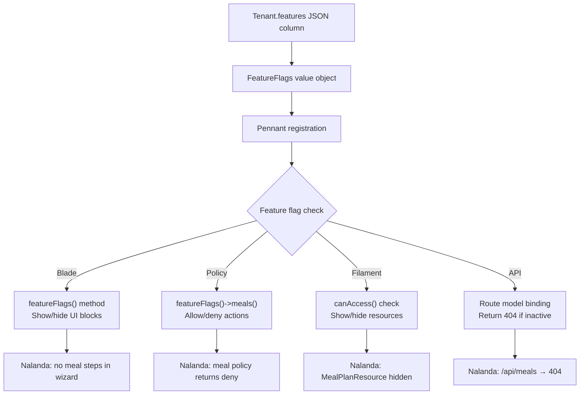
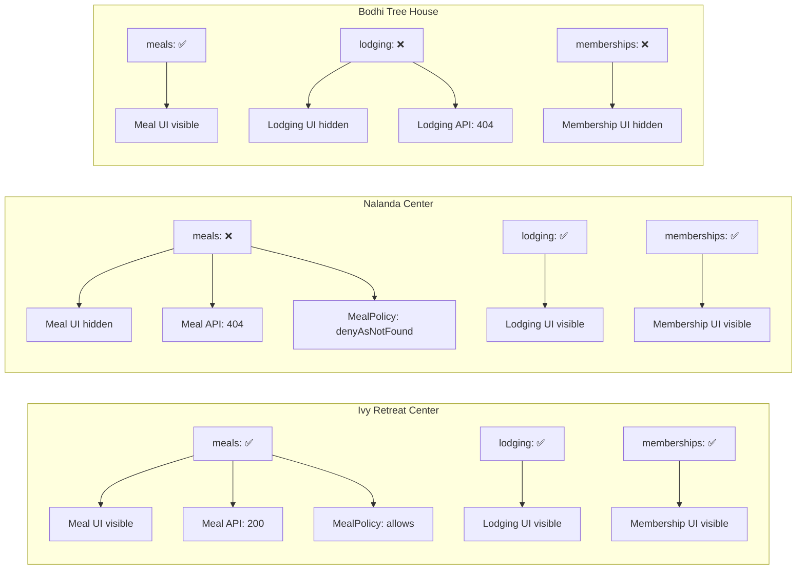

# 4. Feature Flags with Pennant

> **Milestone:** Turning off "meals" for Nalanda hides all meal-related UI, API endpoints, and Filament resources — without deploying new code.

## Prerequisites

- [Section 3: Users, Roles & Auth](section-03-auth.md) completed
- Docker services running (`docker compose up -d`)
- Your three tenants exist in the database (Ivy, Nalanda, Bodhi Tree)

## What You'll Learn

| Concept | What it is | Why it matters |
|---------|-----------|----------------|
| Pennant | Laravel's feature flag package | Toggle features per-tenant, per-user, per-role |
| Feature-driven architecture | Building UI conditionally on flags | Same codebase serves different center configurations |
| Flag gates in policies | `Feature::for($tenant)->active()` in authorization | Backend enforcement, not just UI hiding |
| FeatureFlags value object | Typed wrapper around the JSON column | Clean access to feature state on the Tenant model |
| Seeded feature matrix | Different features enabled per tenant | Realistic multi-tenant configuration |

---

## The Big Picture

Every retreat center operates differently. Ivy offers meals, lodging, and memberships. Nalanda offers lodging and memberships but not meals. Bodhi Tree offers meals but not lodging or memberships. If we had to deploy a different codebase for each configuration, we'd go insane.

**Feature flags** solve this. A feature flag is a boolean switch that says "is this feature turned on for this tenant?" When the flag is off, the feature disappears — from the UI, from the API, from the admin panel — but the code still exists. It's not deleted; it's hidden.

??? question "How is this different from just checking a database column?"
    You *could* check `$tenant->features['meals']` everywhere, and in Section 1 we did exactly that on the hub page. But the `FeatureFlags` value object + Pennant give you four things a raw JSON column doesn't:

    1. **Type safety** — `$tenant->featureFlags()->meals()` won't silently succeed on a typo like `$tenant->features['mealz']` would
    2. **Caching** — Pennant caches feature values in memory. No JSON decode on every request
    3. **Rich feature types** — Per-tenant (meals), per-role (can-issue-refunds), per-user (ai-navigator) — all from one system
    4. **Policy integration** — Use `$tenant->featureFlags()->meals()` directly for simple checks, or `Feature::for($tenant)->active('meals')` for Pennant's caching and scope resolution

    For most cases, calling `$tenant->featureFlags()->meals()` directly is the simplest approach. Use `Feature::for($tenant)->active('meals')` when you need Pennant's caching across multiple checks in the same request.

    Think of it this way: a JSON column is the raw ingredients. The `FeatureFlags` value object is the clean API. Pennant is the caching layer on top.

??? question "What's the restaurant menu analogy?"
    Feature flags are like **restaurant menu sections**. A steakhouse doesn't show the vegetarian menu section — but the kitchen (code) still knows how to cook vegetarian food. Similarly, `meals` being off for Nalanda doesn't delete the Meals module — it just hides it from their menu.

    This is powerful because you can turn features on/off without deploying new code. Nalanda decides to add meals next quarter? Flip the flag. No code change, no deploy, no risk.

Here's how feature flags flow through the system:



---

## Step 1: Install Pennant

Pennant was already added to `composer.json` in Section 1, but let's make sure it's installed and published:

```bash
composer require laravel/pennant
php artisan vendor:publish --provider="Laravel\Pennant\PennantServiceProvider"
```

This creates `config/pennant.php`. The defaults are fine — Pennant uses your database to store feature flag values, and that's exactly what we want.

??? tip "How Pennant stores features"
    Pennant creates a `features` table by default with columns for the feature name, scope type, and scope ID. But we're taking a different approach: we're using the `features` JSON column on the `tenants` table as the **source of truth**, and we'll tell Pennant to read from there. This keeps all tenant configuration in one place.

## Step 2: Create the FeatureFlags Value Object

Currently the `Tenant` model casts `features` to a plain `array`. That works, but it has a problem: there's no type safety. You can set `$tenant->features['mealz']` (typo!) and it'll silently save. We need a value object that knows which features exist and can answer questions cleanly.

Create `app/Modules/Tenancy/Models/FeatureFlags.php`:

```php
<?php

namespace App\Modules\Tenancy\Models;

class FeatureFlags
{
    private const VALID_FLAGS = [
        'meals',
        'lodging',
        'memberships',
        'recurring-events',
        'stripe-connect',
    ];

    private array $flags;

    public function __construct(array $flags = [])
    {
        $this->flags = [];

        foreach (self::VALID_FLAGS as $flag) {
            $this->flags[$flag] = $flags[$flag] ?? false;
        }
    }

    public function meals(): bool
    {
        return $this->flags['meals'];
    }

    public function lodging(): bool
    {
        return $this->flags['lodging'];
    }

    public function memberships(): bool
    {
        return $this->flags['memberships'];
    }

    public function recurringEvents(): bool
    {
        return $this->flags['recurring-events'];
    }

    public function stripeConnect(): bool
    {
        return $this->flags['stripe-connect'];
    }

    public function has(string $flag): bool
    {
        if (! in_array($flag, self::VALID_FLAGS, true)) {
            return false;
        }

        return $this->flags[$flag] ?? false;
    }

    public function toArray(): array
    {
        return $this->flags;
    }

    public static function default(): self
    {
        return new self([
            'meals' => true,
            'lodging' => true,
            'memberships' => true,
        ]);
    }
}
```

??? question "Why a value object instead of just using the array?"
    Three reasons:

    1. **Typos are caught at development time.** `$flags->meals()` won't compile if you type `$flags->mealz()`, but `$features['mealz']` silently returns `null`.
    2. **Centralized flag list.** The `VALID_FLAGS` constant is the single source of truth for what flags exist. No more "is it `recurring_events` or `recurring-events`?".
    3. **Default values.** `FeatureFlags::default()` gives every new tenant a sensible starting configuration. When a new flag is added, it defaults to `false` for existing tenants — no migration needed to add a column.

## Step 3: Update the Tenant Model

Now update `app/Modules/Tenancy/Models/Tenant.php` to use the value object:

```php
<?php

namespace App\Modules\Tenancy\Models;

use Illuminate\Database\Eloquent\Model;
use Illuminate\Database\Eloquent\Concerns\HasUuids;

class Tenant extends Model
{
    use HasUuids;

    protected $fillable = [
        'slug',
        'name',
        'description',
        'logo',
        'custom_domain',
        'features',
        'registration_mode',
        'currency',
        'timezone',
        'locale',
        'is_active',
    ];

    protected $casts = [
        'features' => FeatureFlagsCaster::class,
        'is_active' => 'boolean',
    ];

    public function featureFlags(): FeatureFlags
    {
        return $this->features;
    }
}
```

Notice we changed the cast from `'array'` to `FeatureFlagsCaster::class`. Create that caster:

Create `app/Modules/Tenancy/Models/FeatureFlagsCaster.php`:

```php
<?php

namespace App\Modules\Tenancy\Models;

use Illuminate\Contracts\Database\Eloquent\CastsAttributes;

class FeatureFlagsCaster implements CastsAttributes
{
    public function get($model, string $key, $value, array $attributes): FeatureFlags
    {
        $decoded = json_decode($value ?? '{}', true);

        return new FeatureFlags($decoded ?? []);
    }

    public function set($model, string $key, $value, array $attributes): ?string
    {
        if ($value instanceof FeatureFlags) {
            return json_encode($value->toArray());
        }

        if (is_array($value)) {
            return json_encode((new FeatureFlags($value))->toArray());
        }

        return '{}';
    }
}
```

!!! note "Why a custom caster?"
    Laravel's built-in `AsArrayObject` and `AsCollection` casts work, but they don't give us type safety. Our custom caster ensures that `$tenant->features` always returns a `FeatureFlags` object — never `null`, never a plain array. The `set()` method also normalizes incoming data, so `$tenant->features = ['meals' => true]` works the same as `$tenant->features = new FeatureFlags(['meals' => true])`.

## Step 4: Register Pennant Feature Definitions

Pennant needs to know which features exist and how to resolve their values. Create a service provider:

```bash
php artisan make:provider FeatureServiceProvider
```

Move it to the Tenancy module:

```bash
mv app/Providers/FeatureServiceProvider.php app/Modules/Tenancy/Providers/FeatureServiceProvider.php
```

Edit `app/Modules/Tenancy/Providers/FeatureServiceProvider.php`:

```php
<?php

namespace App\Modules\Tenancy\Providers;

use Illuminate\Support\ServiceProvider;
use Laravel\Pennant\Feature;
use App\Modules\Tenancy\Models\Tenant;

class FeatureServiceProvider extends ServiceProvider
{
    public function register(): void
    {
        //
    }

    public function boot(): void
    {
        $tenantFeatures = [
            'meals',
            'lodging',
            'memberships',
            'recurring-events',
            'stripe-connect',
        ];

        foreach ($tenantFeatures as $feature) {
            Feature::define($feature, fn (Tenant $tenant) => $tenant->featureFlags()->has($feature));
        }
    }
}
```

Register the provider in `bootstrap/providers.php`:

```php
<?php

return [
    App\Providers\AppServiceProvider::class,
    App\Modules\Tenancy\Providers\FeatureServiceProvider::class,
    App\Providers\FortifyServiceProvider::class,
];
```

??? tip "Two ways to check feature flags"
    There are two complementary ways to check feature flags:

    **Direct access** (simpler, preferred for most cases):
    ```php
    $tenant->featureFlags()->meals()  // true or false
    ```
    This reads from the `FeatureFlags` value object, which is already parsed from the JSON column. No Pennant involved.

    **Pennant access** (when you need caching across multiple checks):
    ```php
    Feature::for($tenant)->active('meals')  // true or false
    ```
    Pennant caches the result in memory for the duration of the request. Use this when you're checking the same flag many times in one request (e.g., in middleware that runs before every controller).

    ??? warning "Important: use Feature::for() to scope"
        The API `Feature::active('meals', $tenant)` **ignores the second argument** in Pennant v1. The second parameter is not a scope — it's compared as a value. Always use `Feature::for($tenant)->active('meals')` to scope feature checks to a tenant.

## Step 5: Use Feature Flags in Blade

Since the `Tenant` model already casts its `features` column to a `FeatureFlags` value object, we can check flags directly on the model — no Pennant facade needed in Blade. This is simpler and more readable.

First, make sure the current tenant is available in views. The tenant middleware we built in Section 2 should already set this up. Add a view composer in `app/Providers/AppServiceProvider.php`:

```php
use Illuminate\Support\Facades\View;
use App\Modules\Tenancy\Models\Tenant;

public function boot(): void
{
    // ... existing code: $this->configureDefaults(), Gate policies, Gate::before(), etc.

    View::composer('*', function ($view) {
        $view->with('currentTenant', tenant());
    });
}
```

Now update `resources/views/hub.blade.php` to use `featureFlags()`:

```html
@foreach($centers as $center)
    <div class="center">
        <h2>{{ $center->name }}</h2>
        <p>{{ $center->description }}</p>
        <div class="features">
            @php($flags = $center->featureFlags())
            @if($flags->meals())
                <span class="badge active">meals</span>
            @else
                <span class="badge inactive">meals</span>
            @endif

            @if($flags->lodging())
                <span class="badge active">lodging</span>
            @else
                <span class="badge inactive">lodging</span>
            @endif

            @if($flags->memberships())
                <span class="badge active">memberships</span>
            @else
                <span class="badge inactive">memberships</span>
            @endif
        </div>
    </div>
@endforeach
```

??? question "Why show inactive features at all?"
    On the hub page, we show inactive features as greyed-out badges so visitors can see what a center *could* offer. But inside the admin panel, inactive features disappear entirely — no menu items, no resources, no API endpoints. Different context, different visibility rules.

## Step 6: Use Feature Flags in Policies

Feature flags should gate **authorization**, not just UI. If meals are disabled for a tenant, the `MealPolicy` should deny access regardless of what the UI shows.

Create `app/Modules/Meals/Policies/MealPolicy.php`:

```php
<?php

namespace App\Modules\Meals\Policies;

use App\Modules\People\Models\User;
use Illuminate\Auth\Access\HandlesRequests;
use Illuminate\Auth\Access\Response;

class MealPolicy
{
    use HandlesRequests;

    public function before(User $user, string $ability): ?Response
    {
        if (! $user->tenant->featureFlags()->meals()) {
            return Response::denyAsNotFound('Meals are not available for this center.');
        }

        return null;
    }

    public function viewAny(User $user): bool
    {
        return $user->can('view_meals');
    }

    public function view(User $user): bool
    {
        return $user->can('view_meals');
    }

    public function create(User $user): bool
    {
        return $user->can('create_meals');
    }

    public function update(User $user): bool
    {
        return $user->can('update_meals');
    }

    public function delete(User $user): bool
    {
        return $user->can('delete_meals');
    }
}
```

The key is the `before()` method. It runs **before** any other policy check. If the `meals` feature is inactive for the tenant, it returns `denyAsNotFound` — which produces a 404 response, not a 403. This is important: we don't want to reveal that a feature *exists but is disabled*. We want it to look like it doesn't exist at all.

??? tip "denyAsNotFound vs deny"
    - `deny('You cannot access meals')` → returns 403 Forbidden. The user knows meals exist but they're not allowed.
    - `denyAsNotFound('Not found')` → returns 404 Not Found. The user thinks meals don't exist at all.

    For feature flags, 404 is the right choice. It's the same principle as not showing a "vegetarian menu" section on a steakhouse's website — you don't tell people "we have vegetarian food but won't serve it to you", you just don't show it.

Here's the full feature flag matrix we're building:

| Feature | Ivy | Nalanda | Bodhi Tree |
|---------|-----|---------|------------|
| meals | ✅ Yes | ❌ No | ✅ Yes |
| lodging | ✅ Yes | ✅ Yes | ❌ No |
| memberships | ✅ Yes | ✅ Yes | ❌ No |
| recurring-events | ❌ No | ❌ No | ❌ No |
| stripe-connect | ❌ No | ❌ No | ❌ No |

??? info "What about recurring-events and stripe-connect?"
    Those flags exist but default to `false` for all three tenants. This lets you turn them on in the future without any code changes. Think of them as "on the menu but not yet available" — the kitchen is ready, the ingredients are stocked, but the chef hasn't announced the special yet.

## Step 7: Use Feature Flags in Filament Resources

In the next section, we'll build the Filament admin panel. But let's preview how feature flags gate resources. In `app/Modules/Meals/Filament/MealPlanResource.php`:

```php
<?php

namespace App\Modules\Meals\Filament;

use Filament\Facades\Filament;
use Filament\Resources\Resource;

class MealPlanResource extends Resource
{
    public static function canAccess(): bool
    {
        $tenant = Filament::getTenant();

        return $tenant->featureFlags()->meals();
    }
}
```

When `canAccess()` returns `false`, Filament completely hides the resource from navigation, and any direct URL access returns 404. This is the "kitchen" parallel — the MealPlanResource code still exists, but it's invisible to Nalanda's admin.

## Step 8: Use Feature Flags in API Endpoints

!!! note
    You don't have a `routes/api.php` yet — that's fine. This step shows the pattern you'll use when you build the API in a later section. Just read through it to understand the approach; you'll implement it when the API routes exist.

For the public API, feature flags control whether an endpoint even exists. In `routes/api.php` (to be created later):

```php
use Illuminate\Support\Facades\Route;

Route::middleware(['tenant.resolve'])->group(function () {
    Route::prefix('api')->group(function () {
        Route::get('/events', [EventController::class, 'index']);

        Route::middleware(function ($request, $next) {
            if (! tenant()->featureFlags()->meals()) {
                abort(404);
            }
            return $next($request);
        })->group(function () {
            Route::get('/meals', [MealController::class, 'index']);
            Route::get('/meals/{meal}', [MealController::class, 'show']);
        });

        Route::middleware(function ($request, $next) {
            if (! tenant()->featureFlags()->lodging()) {
                abort(404);
            }
            return $next($request);
        })->group(function () {
            Route::get('/lodging', [LodgingController::class, 'index']);
            Route::get('/lodging/{building}', [LodgingController::class, 'show']);
        });

        Route::middleware(function ($request, $next) {
            if (! tenant()->featureFlags()->memberships()) {
                abort(404);
            }
            return $next($request);
        })->group(function () {
            Route::get('/memberships', [MembershipController::class, 'index']);
            Route::get('/memberships/{plan}', [MembershipController::class, 'show']);
        });
    });
});
```

When a Nalanda admin visits `/api/meals`, they get a 404. Not a 403. Not an empty list. A 404 — as if the endpoint doesn't exist. Because for them, it doesn't.

## Step 9: Seed the Three Tenants with Feature Configurations

Now let's create a proper database seeder. We already created tenants manually in Section 1, but we need to set their feature flags properly.

Create `database/seeders/TenantFeatureSeeder.php`:

```php
<?php

namespace Database\Seeders;

use Illuminate\Database\Seeder;
use App\Modules\Tenancy\Models\Tenant;
use App\Modules\Tenancy\Models\FeatureFlags;

class TenantFeatureSeeder extends Seeder
{
    public function run(): void
    {
        $ivy = Tenant::where('slug', 'ivy')->firstOrFail();
        $ivy->update([
            'features' => new FeatureFlags([
                'meals' => true,
                'lodging' => true,
                'memberships' => true,
            ]),
        ]);

        $nalanda = Tenant::where('slug', 'nalanda')->firstOrFail();
        $nalanda->update([
            'features' => new FeatureFlags([
                'meals' => false,
                'lodging' => true,
                'memberships' => true,
            ]),
        ]);

        $bodhi = Tenant::where('slug', 'bodhi-tree')->firstOrFail();
        $bodhi->update([
            'features' => new FeatureFlags([
                'meals' => true,
                'lodging' => false,
                'memberships' => false,
            ]),
        ]);
    }
}
```

Add it to `database/seeders/DatabaseSeeder.php`:

```php
public function run(): void
{
    // ... existing seeders ...
    $this->call(TenantFeatureSeeder::class);
}
```

Run the seeder:

```bash
php artisan db:seed --class=TenantFeatureSeeder
```

Verify it worked:

```bash
php artisan tinker
```

```php
use App\Modules\Tenancy\Models\Tenant;
Tenant::where('slug', 'ivy')->first()->featureFlags()->meals();
// => true
Tenant::where('slug', 'nalanda')->first()->featureFlags()->meals();
// => false
Tenant::where('slug', 'bodhi-tree')->first()->featureFlags()->lodging();
// => false
```

## Step 10: Verify the Feature Flag Decision Flow

Let's trace what happens when different tenants interact with the system.



First, verify the FeatureFlags value object works:

```bash
php artisan tinker
```

```php
use App\Modules\Tenancy\Models\Tenant;
Tenant::where('slug', 'ivy')->first()->featureFlags()->meals();
// => true
Tenant::where('slug', 'nalanda')->first()->featureFlags()->meals();
// => false
Tenant::where('slug', 'bodhi-tree')->first()->featureFlags()->lodging();
// => false
```

Then visit the hub page in your browser. You should see:
- **Ivy**: meals (green), lodging (green), memberships (green)
- **Nalanda**: meals (grey), lodging (green), memberships (green)
- **Bodhi Tree**: meals (green), lodging (grey), memberships (grey)

??? info "What about the API tests?"
    The curl tests for `/api/meals`, `/api/lodging`, etc. will be covered when we build the API routes in a later section. For now, we've verified the feature flags work at the model level and in Blade.

??? warning "Clear the Pennant cache after changing features"
    Pennant caches feature values. If you change a tenant's features directly in the database, you need to clear the cache:

    ```bash
    php artisan pennant:purge
    ```

    In production, you'd typically add a model observer on `Tenant` that calls `Feature::purge()` whenever features are updated.

!!! success "Checkpoint"
    At this point you should have:

    - ✅ Pennant installed and configured
    - ✅ `FeatureFlags` value object with typed access to all flags
    - ✅ `FeatureFlagsCaster` on the `Tenant` model
    - ✅ `FeatureServiceProvider` registering all feature definitions
    - ✅ `featureFlags()` method working in Blade views
    - ✅ `featureFlags()` method working in policies (with `denyAsNotFound`)
    - ✅ `canAccess()` method on Filament resources
    - ✅ API middleware pattern for returning 404 for inactive features (to be implemented)
    - ✅ Three tenants seeded with different feature configurations
    - ✅ Verified feature flags in tinker and on the hub page

---

## What's Next

In [Section 5: Admin Panel with Filament](section-05-filament.md), we'll build the admin panel where center staff manage their events, registrations, and more. Each admin will see only their center's data, and the feature flags we just built will control which resources appear.

We'll cover:

- **Filament Resources** — CRUD generators for events, registrations, buildings, rooms, and meal plans
- **Relation Managers** — editing event instances inline on the event page
- **Multi-tenancy** — `TenancyMode::Tenant` for automatic data scoping
- **Policies** — VIEWER, EDITOR, and ADMIN role-based access on every resource
- **Feature-gated resources** — MealPlanResource and BuildingResource hidden when their features are off