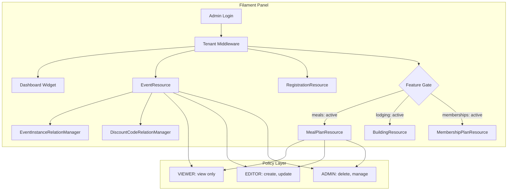
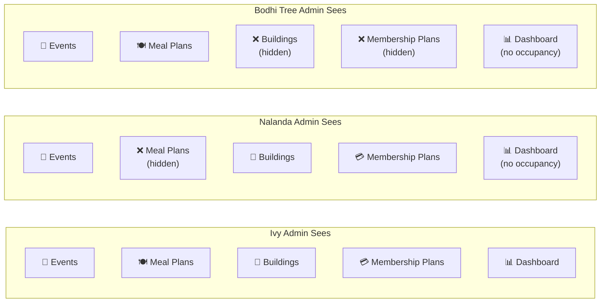
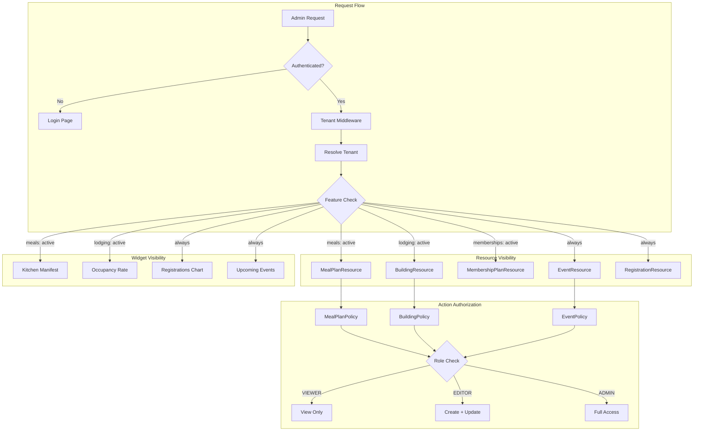

# 5. Admin Panel with Filament

> **Milestone:** Center admins can log in, see only their center's data, and CRUD events, registrations, and more — with resources hidden when features are disabled.

## Prerequisites

- [Section 4: Feature Flags with Pennant](section-04-feature-flags.md) completed
- Docker services running (`docker compose up -d`)
- Three tenants with feature flags configured (Ivy, Nalanda, Bodhi Tree)
- Pennant feature checks working in policies and Blade

## What You'll Learn

| Concept | What it is | Why it matters |
|---------|-----------|----------------|
| Filament Resources | Admin CRUD generators | Build a full admin panel in minutes, not days |
| Relation Managers | Manage related models inline | Edit event instances without leaving the event page |
| Multi-tenancy panel | Tenant-scoped admin | Each center admin sees only their data |
| Filament Policies | Role-based resource access | VIEWER vs EDITOR vs ADMIN power levels |
| Feature-gated resources | Hide resources when features are off | Nalanda never sees the Meals menu item |

---

## The Big Picture

Filament is like a **factory control panel**. Each operator (admin) sees only the machines (data) on their production line (tenant). The control panel has buttons (actions) that differ based on the operator's role — a trainee can monitor, an operator can adjust, and a supervisor can shut down.

In Zendo, every retreat center gets the same control panel, but it adapts:

- **Tenant scoping**: An Ivy admin never sees Nalanda's events
- **Feature gating**: If meals are off, the entire Meals section disappears
- **Role gating**: VIEWERs can look but not touch; ADMINs can delete



---

## Step 1: Install Filament

Filament was added to `composer.json` in Section 1, but let's make sure it's installed and configured:

```bash
composer require filament/filament:"^5.6"
php artisan filament:install --panels
```

This creates the default panel configuration. We'll customize it heavily for multi-tenancy.

## Step 2: Create the Admin Panel

Generate a dedicated Filament panel for center admins:

```bash
php artisan filament:panel zendo
```

When prompted, accept the defaults. This creates `app/Providers/Filament/ZendoPanelProvider.php`. Let's configure it:

```php
<?php

namespace App\Providers\Filament;

use Filament\Http\Middleware\Authenticate;
use Filament\Http\Middleware\DisableBladeDirectives;
use Filament\Http\Middleware\DispatchServingNotificationView;
use Filament\Panel;
use Filament\PanelProvider;
use Filament\Support\Colors\Color;
use Illuminate\Cookie\Middleware\EncryptCookies;
use Illuminate\Cookie\Middleware\AddQueuedCookiesToResponse;
use Illuminate\Session\Middleware\StartSession;
use Illuminate\View\Middleware\ShareErrorsToSession;
use App\Modules\Tenancy\Models\Tenant;

class ZendoPanelProvider extends PanelProvider
{
    public function panel(Panel $panel): Panel
    {
        return $panel
            ->id('zendo')
            ->path('zendo')
            ->colors(['primary' => Color::Indigo])
            ->discoverResources(
                in: app_path('Modules/*/Filament'),
                for: 'App\\Modules\\*\\Filament'
            )
            ->discoverPages(
                in: app_path('Modules/*/Filament/Pages'),
                for: 'App\\Modules\\*\\Filament\\Pages'
            )
            ->discoverWidgets(
                in: app_path('Modules/*/Filament/Widgets'),
                for: 'App\\Modules\\*\\Filament\\Widgets'
            )
            ->authGuard('web')
            ->tenant(Tenant::class, 'slug')
            ->middleware([
                EncryptCookies::class,
                AddQueuedCookiesToResponse::class,
                StartSession::class,
                ShareErrorsToSession::class,
                Authenticate::class,
                DispatchServingNotificationView::class,
                DisableBladeDirectives::class,
            ]);
    }
}
```

??? question "Why tenant('slug')?"
    Filament v5 supports multi-tenancy via `->tenant(Tenant::class, 'slug')`. The second argument tells Filament which column on the Tenant model to use for URL slugs. The URL becomes `/zendo/ivy/events` — clean and SEO-friendly.

    In Filament v3, this used `TenancyMode::Tenant` as the second argument, but v5 simplified the API. Filament resolves the tenant from the URL automatically — there's no "all tenants" view for center admins.

    ??? warning "User model must implement HasTenants"
        For multi-tenancy to work, your `User` model must implement `Filament\Models\Contracts\HasTenants`. Add the interface and its two methods:

        ```php
        use Filament\Models\Contracts\HasTenants;
        use Illuminate\Database\Eloquent\Relations\BelongsToMany;

        class User extends Authenticatable implements HasTenants
        {
            public function getTenants(): \Illuminate\Database\Eloquent\Collection
            {
                return $this->tenants;
            }

            public function canAccessTenant(Model $tenant): bool
            {
                return $this->tenants()->where('tenants.id', $tenant->id)->exists();
            }
        }
        ```

        Without this, Filament won't know which tenants a user belongs to or be able to resolve the current tenant from the URL.

## Step 3: Create the EventResource

Events are the heart of Zendo. Let's build the Filament resource for managing them.

```bash
php artisan make:filament-resource Event --panel=zendo
```

Move it to the Events module:

```bash
mv app/Filament/Resources/EventResource.php app/Modules/Events/Filament/EventResource.php
```

Edit `app/Modules/Events/Filament/EventResource.php`:

```php
<?php

namespace App\Modules\Events\Filament;

use App\Modules\Events\Filament\EventResource\Pages;
use App\Modules\Events\Models\Event;
use Filament\Forms;
use Filament\Schemas\Schema;
use Filament\Resources\Resource;
use Filament\Tables;
use Filament\Tables\Table;
use Filament\Tables\Filters\SelectFilter;
use Filament\Tables\Filters\TernaryFilter;

class EventResource extends Resource
{
    protected static ?string $model = Event::class;

    protected static string|\BackedEnum|null $navigationIcon = 'heroicon-o-calendar';

    protected static ?int $navigationSort = 1;

    public static function canAccess(): bool
    {
        return true;
    }

    public static function form(Schema $schema): Schema
    {
        return $schema
            ->schema([
                Forms\Components\Section::make('Event Details')
                    ->schema([
                        Forms\Components\TextInput::make('title')
                            ->required()
                            ->maxLength(255),

                        Forms\Components\Textarea::make('description')
                            ->maxLength(65535)
                            ->columnSpanFull(),

                        Forms\Components\Select::make('status')
                            ->options([
                                'draft' => 'Draft',
                                'published' => 'Published',
                                'archived' => 'Archived',
                            ])
                            ->required()
                            ->default('draft'),

                        Forms\Components\DatePicker::make('starts_at')
                            ->required(),

                        Forms\Components\DatePicker::make('ends_at')
                            ->required()
                            ->afterOrEqual('starts_at'),

                        Forms\Components\TextInput::make('capacity')
                            ->numeric()
                            ->minValue(1),

                        Forms\Components\TextInput::make('price_cents')
                            ->numeric()
                            ->label('Price (cents)')
                            ->helperText('Base price in cents. E.g., 50000 = €500'),
                    ]),

                Forms\Components\Section::make('Teachers & Categories')
                    ->schema([
                        Forms\Components\Select::make('teachers')
                            ->relationship('teachers', 'name')
                            ->multiple()
                            ->searchable()
                            ->preload(),

                        Forms\Components\Select::make('categories')
                            ->relationship('categories', 'name')
                            ->multiple()
                            ->searchable()
                            ->preload(),
                    ]),
            ]);
    }

    public static function table(Table $table): Table
    {
        return $table
            ->columns([
                Tables\Columns\TextColumn::make('title')
                    ->searchable()
                    ->sortable()
                    ->weight('bold'),

                Tables\Columns\TextColumn::make('status')
                    ->badge()
                    ->color(fn (string $state): string => match ($state) {
                        'draft' => 'gray',
                        'published' => 'success',
                        'archived' => 'danger',
                        default => 'gray',
                    }),

                Tables\Columns\TextColumn::make('starts_at')
                    ->date()
                    ->sortable(),

                Tables\Columns\TextColumn::make('ends_at')
                    ->date()
                    ->sortable(),

                Tables\Columns\TextColumn::make('capacity')
                    ->numeric()
                    ->sortable(),

                Tables\Columns\TextColumn::make('registrations_count')
                    ->label('Registrations')
                    ->counts('registrations')
                    ->sortable(),
            ])
            ->filters([
                SelectFilter::make('status')
                    ->options([
                        'draft' => 'Draft',
                        'published' => 'Published',
                        'archived' => 'Archived',
                    ]),

                TernaryFilter::make('has_capacity')
                    ->label('Has capacity')
                    ->placeholder('All events')
                    ->trueLabel('Has capacity')
                    ->falseLabel('Full')
                    ->queries(
                        true: fn ($query) => $query->whereColumn('registrations_count', '<', 'capacity'),
                        false: fn ($query) => $query->whereColumn('registrations_count', '>=', 'capacity'),
                    ),
            ])
            ->actions([
                Tables\Actions\ViewAction::make(),
                Tables\Actions\EditAction::make(),
            ])
            ->bulkActions([
                Tables\Actions\BulkDeleteAction::make(),
            ])
            ->defaultSort('starts_at', 'desc');
    }

    public static function getRelations(): array
    {
        return [
            RelationManagers\EventInstancesRelationManager::class,
            RelationManagers\DiscountCodesRelationManager::class,
        ];
    }

    public static function getPages(): array
    {
        return [
            'index' => Pages\ListEvents::route('/'),
            'create' => Pages\CreateEvent::route('/create'),
            'view' => Pages\ViewEvent::route('/{record}'),
            'edit' => Pages\EditEvent::route('/{record}/edit'),
        ];
    }
}
```

??? tip "Why separate sections in the form?"
    Forms with many fields get overwhelming. Grouping them into sections (`Event Details`, `Teachers & Categories`) creates visual rhythm. Users scan sections; they don't read every field label. This is the same pattern good registration forms use — break it into steps, not walls of text.

## Step 4: Create the EventInstanceRelationManager

Event instances represent specific dates of an event (e.g., "Yoga Retreat — March 2025", "Yoga Retreat — June 2025"). They belong to an event, so they're managed inline on the event page.

```bash
php artisan make:filament-relation-manager EventResource eventInstances title --panel=zendo
```

Move it:

```bash
mkdir -p app/Modules/Events/Filament/EventResource/RelationManagers
mv app/Filament/Resources/EventResource/RelationManagers/EventInstancesRelationManager.php \
   app/Modules/Events/Filament/EventResource/RelationManagers/EventInstancesRelationManager.php
```

Edit `app/Modules/Events/Filament/EventResource/RelationManagers/EventInstancesRelationManager.php`:

```php
<?php

namespace App\Modules\Events\Filament\EventResource\RelationManagers;

use Filament\Forms;
use Filament\Schemas\Schema;
use Filament\Resources\RelationManagers\RelationManager;
use Filament\Tables;
use Filament\Tables\Table;

class EventInstancesRelationManager extends RelationManager
{
    protected static string $relationship = 'eventInstances';

    protected static ?string $title = 'Instances';

    protected static string|\BackedEnum|null $icon = 'heroicon-o-calendar-days';

    public function form(Schema $schema): Schema
    {
        return $schema
            ->schema([
                Forms\Components\TextInput::make('title')
                    ->required()
                    ->maxLength(255),

                Forms\Components\DatePicker::make('starts_at')
                    ->required(),

                Forms\Components\DatePicker::make('ends_at')
                    ->required()
                    ->afterOrEqual('starts_at'),

                Forms\Components\TextInput::make('capacity')
                    ->numeric()
                    ->minValue(1)
                    ->helperText('Leave empty to use the event default capacity.'),

                Forms\Components\TextInput::make('price_override_cents')
                    ->numeric()
                    ->label('Price override (cents)')
                    ->helperText('Leave empty to use the event base price.'),
            ]);
    }

    public function table(Table $table): Table
    {
        return $table
            ->columns([
                Tables\Columns\TextColumn::make('title')
                    ->searchable()
                    ->sortable(),

                Tables\Columns\TextColumn::make('starts_at')
                    ->date()
                    ->sortable(),

                Tables\Columns\TextColumn::make('ends_at')
                    ->date()
                    ->sortable(),

                Tables\Columns\TextColumn::make('capacity')
                    ->numeric()
                    ->sortable()
                    ->default('Inherited'),

                Tables\Columns\TextColumn::make('registrations_count')
                    ->label('Registrations')
                    ->counts('registrations'),
            ])
            ->headerActions([
                Tables\Actions\CreateAction::make(),
            ])
            ->actions([
                Tables\Actions\EditAction::make(),
                Tables\Actions\DeleteAction::make(),
            ])
            ->bulkActions([
                Tables\Actions\BulkDeleteAction::make(),
            ])
            ->defaultSort('starts_at', 'desc');
    }
}
```

??? question "Why a RelationManager instead of a separate resource?"
    Event instances don't make sense on their own. You'd never navigate to "Instances" in the sidebar — you'd always access them through a specific event. The RelationManager lets admins manage instances *in context*, right on the event edit page, without leaving or losing their place.

    This is a general principle: if a model only makes sense in the context of its parent, it should be a RelationManager, not a standalone resource.

## Step 5: Set Up Policies for the Event Resource

Filament respects Laravel Policies. When a Policy method returns `false`, Filament hides the corresponding action. Let's create the `EventPolicy`:

Create `app/Modules/Events/Policies/EventPolicy.php`:

```php
<?php

namespace App\Modules\Events\Policies;

use App\Modules\People\Models\User;
use App\Modules\Events\Models\Event;

class EventPolicy
{
    public function viewAny(User $user): bool
    {
        return true;
    }

    public function view(User $user, Event $event): bool
    {
        return true;
    }

    public function create(User $user): bool
    {
        return in_array($user->roleInCurrentTenant(), ['admin', 'editor']);
    }

    public function update(User $user, Event $event): bool
    {
        return in_array($user->roleInCurrentTenant(), ['admin', 'editor']);
    }

    public function delete(User $user, Event $event): bool
    {
        return $user->roleInCurrentTenant() === 'admin' || $user->isGlobalAdmin();
    }

    public function restore(User $user, Event $event): bool
    {
        return $user->roleInCurrentTenant() === 'admin' || $user->isGlobalAdmin();
    }

    public function forceDelete(User $user, Event $event): bool
    {
        return $user->roleInCurrentTenant() === 'admin' || $user->isGlobalAdmin();
    }
}
```

Register the policy in `app/Providers/AuthServiceProvider.php`:

```php
protected $policies = [
    \App\Modules\Events\Models\Event::class => \App\Modules\Events\Policies\EventPolicy::class,
];
```

??? info "How roles map to permissions"
    From Section 3, our role hierarchy works like this:

    | Role | View Events | Create/Update Events | Delete Events |
    |------|-------------|---------------------|---------------|
    | VIEWER | ✅ | ❌ | ❌ |
    | EDITOR | ✅ | ✅ | ❌ |
    | ADMIN | ✅ | ✅ | ✅ |

    When a VIEWER opens the admin panel, they'll see the Events list, but the "Create" button will be hidden and the "Edit" action won't appear. Filament reads the Policy and automatically adjusts the UI.

## Step 6: Create the Feature-Gated Resources

Now for the key pattern: resources that disappear when a feature is off. We'll create the MealPlanResource and BuildingResource as examples.

```bash
php artisan make:filament-resource MealPlan --panel=zendo
php artisan make:filament-resource Building --panel=zendo
php artisan make:filament-resource MembershipPlan --panel=zendo
```

Move them into their modules:

```bash
mv app/Filament/Resources/MealPlanResource.php app/Modules/Meals/Filament/MealPlanResource.php
mv app/Filament/Resources/BuildingResource.php app/Modules/Lodging/Filament/BuildingResource.php
mv app/Filament/Resources/MembershipPlanResource.php app/Modules/Memberships/Filament/MembershipPlanResource.php
```

Edit `app/Modules/Meals/Filament/MealPlanResource.php`:

```php
<?php

namespace App\Modules\Meals\Filament;

use App\Modules\Meals\Models\MealPlan;
use Filament\Forms;
use Filament\Schemas\Schema;
use Filament\Resources\Resource;
use Filament\Tables;
use Filament\Tables\Table;
use Laravel\Pennant\Feature;
use Filament\Facades\Filament;

class MealPlanResource extends Resource
{
    protected static ?string $model = MealPlan::class;

    protected static string|\BackedEnum|null $navigationIcon = 'heroicon-o-cake';

    protected static ?int $navigationSort = 5;

    public static function canAccess(): bool
    {
        return Feature::active('meals', Filament::getTenant());
    }

    public static function form(Schema $schema): Schema
    {
        return $schema
            ->schema([
                Forms\Components\TextInput::make('name')
                    ->required()
                    ->maxLength(255),

                Forms\Components\Textarea::make('description')
                    ->maxLength(65535)
                    ->columnSpanFull(),

                Forms\Components\TextInput::make('price_cents')
                    ->numeric()
                    ->required()
                    ->label('Price (cents)'),

                Forms\Components\Select::make('dietary_tags')
                    ->relationship('dietaryTags', 'name')
                    ->multiple()
                    ->searchable()
                    ->preload(),

                Forms\Components\Toggle::make('is_available')
                    ->default(true),
            ]);
    }

    public static function table(Table $table): Table
    {
        return $table
            ->columns([
                Tables\Columns\TextColumn::make('name')
                    ->searchable()
                    ->sortable(),

                Tables\Columns\TextColumn::make('price_cents')
                    ->money(fn () => Filament::getTenant()->currency)
                    ->sortable(),

                Tables\Columns\IconColumn::make('is_available')
                    ->boolean(),

                Tables\Columns\TextColumn::make('dietary_tags.name')
                    ->badge(),
            ])
            ->filters([
                Tables\Filters\TernaryFilter::make('is_available'),
            ])
            ->actions([
                Tables\Actions\EditAction::make(),
            ])
            ->bulkActions([
                Tables\Actions\BulkDeleteAction::make(),
            ]);
    }

    public static function getPages(): array
    {
        return [
            'index' => Pages\ListMealPlans::route('/'),
            'create' => Pages\CreateMealPlan::route('/create'),
            'edit' => Pages\EditMealPlan::route('/{record}/edit'),
        ];
    }
}
```

The **critical method** is `canAccess()`. When Nalanda's admin logs in, `Feature::active('meals', Filament::getTenant())` returns `false`. Filament completely removes `MealPlanResource` from the sidebar, and any direct URL access returns 403.

Edit `app/Modules/Lodging/Filament/BuildingResource.php`:

```php
<?php

namespace App\Modules\Lodging\Filament;

use App\Modules\Lodging\Models\Building;
use Filament\Forms;
use Filament\Schemas\Schema;
use Filament\Resources\Resource;
use Filament\Tables;
use Filament\Tables\Table;
use Laravel\Pennant\Feature;
use Filament\Facades\Filament;

class BuildingResource extends Resource
{
    protected static ?string $model = Building::class;

    protected static string|\BackedEnum|null $navigationIcon = 'heroicon-o-building-office';

    protected static ?int $navigationSort = 6;

    public static function canAccess(): bool
    {
        return Feature::active('lodging', Filament::getTenant());
    }

    public static function form(Schema $schema): Schema
    {
        return $schema
            ->schema([
                Forms\Components\TextInput::make('name')
                    ->required()
                    ->maxLength(255),

                Forms\Components\Textarea::make('description')
                    ->maxLength(65535)
                    ->columnSpanFull(),

                Forms\Components\TextInput::make('address')
                    ->required()
                    ->maxLength(255),

                Forms\Components\Repeater::make('rooms')
                    ->relationship('rooms')
                    ->schema([
                        Forms\Components\TextInput::make('name')
                            ->required()
                            ->maxLength(255),

                        Forms\Components\TextInput::make('capacity')
                            ->numeric()
                            ->required()
                            ->minValue(1),

                        Forms\Components\Select::make('room_type')
                            ->options([
                                'single' => 'Single',
                                'double' => 'Double',
                                'dorm' => 'Dormitory',
                                'suite' => 'Suite',
                            ])
                            ->required(),
                    ])
                    ->columns(2),
            ]);
    }

    public static function table(Table $table): Table
    {
        return $table
            ->columns([
                Tables\Columns\TextColumn::make('name')
                    ->searchable()
                    ->sortable(),

                Tables\Columns\TextColumn::make('rooms_count')
                    ->label('Rooms')
                    ->counts('rooms'),

                Tables\Columns\TextColumn::make('total_capacity')
                    ->label('Total Capacity'),
            ])
            ->actions([
                Tables\Actions\EditAction::make(),
            ])
            ->bulkActions([
                Tables\Actions\BulkDeleteAction::make(),
            ]);
    }

    public static function getPages(): array
    {
        return [
            'index' => Pages\ListBuildings::route('/'),
            'create' => Pages\CreateBuilding::route('/create'),
            'edit' => Pages\EditBuilding::route('/{record}/edit'),
        ];
    }
}
```

Edit `app/Modules/Memberships/Filament/MembershipPlanResource.php`:

```php
<?php

namespace App\Modules\Memberships\Filament;

use App\Modules\Memberships\Models\MembershipPlan;
use Filament\Forms;
use Filament\Schemas\Schema;
use Filament\Resources\Resource;
use Filament\Tables;
use Filament\Tables\Table;
use Laravel\Pennant\Feature;
use Filament\Facades\Filament;

class MembershipPlanResource extends Resource
{
    protected static ?string $model = MembershipPlan::class;

    protected static string|\BackedEnum|null $navigationIcon = 'heroicon-o-credit-card';

    protected static ?int $navigationSort = 7;

    public static function canAccess(): bool
    {
        return Feature::active('memberships', Filament::getTenant());
    }

    public static function form(Schema $schema): Schema
    {
        return $schema
            ->schema([
                Forms\Components\TextInput::make('name')
                    ->required()
                    ->maxLength(255),

                Forms\Components\Textarea::make('description')
                    ->maxLength(65535)
                    ->columnSpanFull(),

                Forms\Components\TextInput::make('price_cents')
                    ->numeric()
                    ->required()
                    ->label('Monthly price (cents)'),

                Forms\Components\Select::make('billing_cycle')
                    ->options([
                        'monthly' => 'Monthly',
                        'quarterly' => 'Quarterly',
                        'annual' => 'Annual',
                    ])
                    ->required()
                    ->default('monthly'),

                Forms\Components\Toggle::make('is_active')
                    ->default(true),
            ]);
    }

    public static function table(Table $table): Table
    {
        return $table
            ->columns([
                Tables\Columns\TextColumn::make('name')
                    ->searchable()
                    ->sortable(),

                Tables\Columns\TextColumn::make('price_cents')
                    ->money(fn () => Filament::getTenant()->currency)
                    ->sortable(),

                Tables\Columns\TextColumn::make('billing_cycle')
                    ->badge()
                    ->color(fn (string $state): string => match ($state) {
                        'monthly' => 'info',
                        'quarterly' => 'warning',
                        'annual' => 'success',
                        default => 'gray',
                    }),

                Tables\Columns\IconColumn::make('is_active')
                    ->boolean(),
            ])
            ->filters([
                Tables\Filters\TernaryFilter::make('is_active'),
                Tables\Filters\SelectFilter::make('billing_cycle'),
            ])
            ->actions([
                Tables\Actions\EditAction::make(),
            ])
            ->bulkActions([
                Tables\Actions\BulkDeleteAction::make(),
            ]);
    }

    public static function getPages(): array
    {
        return [
            'index' => Pages\ListMembershipPlans::route('/'),
            'create' => Pages\CreateMembershipPlan::route('/create'),
            'edit' => Pages\EditMembershipPlan::route('/{record}/edit'),
        ];
    }
}
```

??? tip "The canAccess() pattern"
    Every feature-gated resource follows the same pattern:

    ```php
    use Filament\Facades\Filament;
    use Laravel\Pennant\Feature;

    public static function canAccess(): bool
    {
        return Feature::active('<feature-name>', Filament::getTenant());
    }
    ```

    **Important:** The `canAccess()` method requires the `Filament\Facades\Filament` import to call `Filament::getTenant()`. Without it, you'll get a "Call to undefined method" error.

    This is the single gate that controls everything. When it returns `false`:

    - The resource disappears from the sidebar navigation
    - The resource URL returns 403 (not 404, because Filament's auth system handles it)
    - Any links to the resource from other pages are hidden
    - The filament icon, badge count, and search results all omit the resource

    One method. Total control. That's why we built the feature flags first — they make the admin panel adaptable without code changes.

## Step 7: Add Policies for Meal, Lodging, and Membership Resources

Just like we did for Events, each feature-gated resource needs a Policy that enforces both role-based and feature-based access.

Create `app/Modules/Meals/Policies/MealPlanPolicy.php`:

```php
<?php

namespace App\Modules\Meals\Policies;

use App\Modules\People\Models\User;
use App\Modules\Meals\Models\MealPlan;
use Laravel\Pennant\Feature;
use Illuminate\Auth\Access\Response;

class MealPlanPolicy
{
    public function before(User $user): ?Response
    {
        if (! Feature::active('meals', $user->tenant)) {
            return Response::denyAsNotFound('Meals are not available for this center.');
        }

        return null;
    }

    public function viewAny(User $user): bool
    {
        return true;
    }

    public function view(User $user, MealPlan $mealPlan): bool
    {
        return true;
    }

    public function create(User $user): bool
    {
        return in_array($user->roleInCurrentTenant(), ['admin', 'editor']);
    }

    public function update(User $user, MealPlan $mealPlan): bool
    {
        return in_array($user->roleInCurrentTenant(), ['admin', 'editor']);
    }

    public function delete(User $user, MealPlan $mealPlan): bool
    {
        return $user->roleInCurrentTenant() === 'admin' || $user->isGlobalAdmin();
    }
}
```

Create `app/Modules/Lodging/Policies/BuildingPolicy.php`:

```php
<?php

namespace App\Modules\Lodging\Policies;

use App\Modules\People\Models\User;
use App\Modules\Lodging\Models\Building;
use Laravel\Pennant\Feature;
use Illuminate\Auth\Access\Response;

class BuildingPolicy
{
    public function before(User $user): ?Response
    {
        if (! Feature::active('lodging', $user->tenant)) {
            return Response::denyAsNotFound('Lodging is not available for this center.');
        }

        return null;
    }

    public function viewAny(User $user): bool
    {
        return true;
    }

    public function view(User $user, Building $building): bool
    {
        return true;
    }

    public function create(User $user): bool
    {
        return in_array($user->roleInCurrentTenant(), ['admin', 'editor']);
    }

    public function update(User $user, Building $building): bool
    {
        return in_array($user->roleInCurrentTenant(), ['admin', 'editor']);
    }

    public function delete(User $user, Building $building): bool
    {
        return $user->roleInCurrentTenant() === 'admin' || $user->isGlobalAdmin();
    }
}
```

Create `app/Modules/Memberships/Policies/MembershipPlanPolicy.php`:

```php
<?php

namespace App\Modules\Memberships\Policies;

use App\Modules\People\Models\User;
use App\Modules\Memberships\Models\MembershipPlan;
use Laravel\Pennant\Feature;
use Illuminate\Auth\Access\Response;

class MembershipPlanPolicy
{
    public function before(User $user): ?Response
    {
        if (! Feature::active('memberships', $user->tenant)) {
            return Response::denyAsNotFound('Memberships are not available for this center.');
        }

        return null;
    }

    public function viewAny(User $user): bool
    {
        return true;
    }

    public function view(User $user, MembershipPlan $plan): bool
    {
        return true;
    }

    public function create(User $user): bool
    {
        return in_array($user->roleInCurrentTenant(), ['admin', 'editor']);
    }

    public function update(User $user, MembershipPlan $plan): bool
    {
        return in_array($user->roleInCurrentTenant(), ['admin', 'editor']);
    }

    public function delete(User $user, MembershipPlan $plan): bool
    {
        return $user->roleInCurrentTenant() === 'admin' || $user->isGlobalAdmin();
    }
}
```

Register all three in `app/Providers/AuthServiceProvider.php`:

```php
protected $policies = [
    \App\Modules\Events\Models\Event::class => \App\Modules\Events\Policies\EventPolicy::class,
    \App\Modules\Meals\Models\MealPlan::class => \App\Modules\Meals\Policies\MealPlanPolicy::class,
    \App\Modules\Lodging\Models\Building::class => \App\Modules\Lodging\Policies\BuildingPolicy::class,
    \App\Modules\Memberships\Models\MembershipPlan::class => \App\Modules\Memberships\Policies\MembershipPlanPolicy::class,
];
```

??? warning "Two layers of defense"
    You might wonder: "Why check features in both `canAccess()` AND the Policy? Isn't that redundant?"

    It's **defense in depth**. Filament's `canAccess()` hides the resource from the UI. But what if someone navigates directly to `/zendo/nalanda/meal-plans`? Without the Policy, they'd get a 403 from Filament's auth layer. With the Policy's `before()` returning `denyAsNotFound`, they get a 404 — as if the resource doesn't exist.

    The two layers work together:
    - `canAccess()` — prevents the UI from showing the resource
    - `Policy::before()` — prevents API-level access from succeeding

## Step 8: Add Dashboard Widgets

The admin dashboard gives center staff a quick overview. Let's add widgets for registrations, occupancy, and revenue.

Create `app/Modules/Events/Filament/Widgets/RegistrationsThisWeekChart.php`:

```php
<?php

namespace App\Modules\Events\Filament\Widgets;

use App\Modules\Registration\Models\Registration;
use Filament\Widgets\ChartWidget;
use Filament\Facades\Filament;

class RegistrationsThisWeekChart extends ChartWidget
{
    protected ?string $heading = 'Registrations This Week';

    protected static ?int $sort = 1;

    protected function getData(): array
    {
        $tenant = Filament::getTenant();

        $data = Registration::where('tenant_id', $tenant->id)
            ->whereBetween('created_at', [now()->startOfWeek(), now()->endOfWeek()])
            ->selectRaw('DATE(created_at) as date, COUNT(*) as count')
            ->groupBy('date')
            ->orderBy('date')
            ->pluck('count', 'date')
            ->toArray();

        $labels = [];
        $values = [];

        for ($i = 0; $i < 7; $i++) {
            $date = now()->startOfWeek()->addDays($i)->format('Y-m-d');
            $labels[] = now()->startOfWeek()->addDays($i)->format('D');
            $values[] = $data[$date] ?? 0;
        }

        return [
            'datasets' => [
                [
                    'label' => 'Registrations',
                    'data' => $values,
                    'borderColor' => '#4f46e5',
                    'backgroundColor' => 'rgba(79, 70, 229, 0.1)',
                ],
            ],
            'labels' => $labels,
        ];
    }

    protected function getType(): string
    {
        return 'line';
    }
}
```

Create `app/Modules/Lodging/Filament/Widgets/OccupancyRateStat.php`:

```php
<?php

namespace App\Modules\Lodging\Filament\Widgets;

use Filament\Widgets\StatsOverviewWidget;
use Filament\Facades\Filament;
use Laravel\Pennant\Feature;

class OccupancyRateStat extends StatsOverviewWidget
{
    protected static ?int $sort = 2;

    public static function canView(): bool
    {
        return Feature::active('lodging', Filament::getTenant());
    }

    protected function getStats(): array
    {
        $tenant = Filament::getTenant();

        $totalCapacity = \App\Modules\Lodging\Models\Room::whereHas('building', function ($query) use ($tenant) {
            $query->where('tenant_id', $tenant->id);
        })->sum('capacity');

        $occupied = \App\Modules\Registration\Models\Registration::where('tenant_id', $tenant->id)
            ->where('status', 'confirmed')
            ->whereHas('roomAssignment')
            ->count();

        $rate = $totalCapacity > 0 ? round(($occupied / $totalCapacity) * 100, 1) : 0;

        return [
            StatsOverviewWidget\Stat::make('Occupancy Rate', $rate . '%')
                ->description($occupied . ' of ' . $totalCapacity . ' beds filled')
                ->descriptionIcon('heroicon-m-home-modern')
                ->color($rate > 80 ? 'danger' : ($rate > 50 ? 'warning' : 'success')),
        ];
    }
}
```

??? note "Feature flags on widgets too"
    Notice that `OccupancyRateStat` has a `canView()` method that checks `Feature::active('lodging')`. When lodging is disabled for a tenant, this widget simply doesn't render. There's no empty space, no "Upgrade to enable" message — it's as if the widget never existed.

Create `app/Modules\Events/Filament/Widgets/UpcomingEventsTable.php`:

```php
<?php

namespace App\Modules\Events\Filament\Widgets;

use App\Modules\Events\Models\Event;
use Filament\Widgets\TableWidget;
use Filament\Tables;
use Filament\Facades\Filament;

class UpcomingEventsTable extends TableWidget
{
    protected static ?string $heading = 'Upcoming Events';

    protected static ?int $sort = 3;

    protected function getTableQuery(): \Illuminate\Database\Eloquent\Builder
    {
        return Event::where('tenant_id', Filament::getTenant()->id)
            ->where('starts_at', '>=', now())
            ->where('status', 'published')
            ->orderBy('starts_at')
            ->limit(5);
    }

    protected function getTableColumns(): array
    {
        return [
            Tables\Columns\TextColumn::make('title')
                ->searchable(),
            Tables\Columns\TextColumn::make('starts_at')
                ->date(),
            Tables\Columns\TextColumn::make('registrations_count')
                ->label('Registrations')
                ->counts('registrations'),
        ];
    }
}
```

The widget discovery we configured in the panel provider will automatically find these in their module directories.

## Step 9: Add Custom Pages

Zendo needs two custom pages that go beyond standard CRUD: a **Check-in Board** for front-desk staff and a **Kitchen Manifest** for the kitchen team.

Create `app/Modules/Events/Filament/Pages/CheckInBoard.php`:

```php
<?php

namespace App\Modules\Events\Filament\Pages;

use Filament\Pages\Page;
use Filament\Facades\Filament;

class CheckInBoard extends Page
{
    protected static ?string $navigationIcon = 'heroicon-o-clipboard-document-check';

    protected static ?string $navigationLabel = 'Check-in Board';

    protected static ?int $navigationSort = 100;

    protected string $view = 'filament.pages.check-in-board';

    public static function shouldRegisterNavigation(): bool
    {
        return Filament::getTenant()?->featureFlags()->meals() ?? false;
    }
}
```

Create `app/Modules/Meals/Filament/Pages/KitchenManifest.php`:

```php
<?php

namespace App\Modules\Meals\Filament\Pages;

use Filament\Pages\Page;
use Filament\Facades\Filament;
use Laravel\Pennant\Feature;

class KitchenManifest extends Page
{
    protected static ?string $navigationIcon = 'heroicon-o-document-text';

    protected static ?string $navigationLabel = 'Kitchen Manifest';

    protected static ?int $navigationSort = 101;

    protected string $view = 'filament.pages.kitchen-manifest';

    public static function shouldRegisterNavigation(): bool
    {
        return Feature::active('meals', Filament::getTenant());
    }
}
```

Both pages use `shouldRegisterNavigation()` to hide themselves when the relevant feature is off. The Check-in Board only shows for tenants with meals enabled, and the Kitchen Manifest also only shows when meals are active.

Create the Blade views. First, `resources/views/filament/pages/check-in-board.blade.php`:

```html
<x-filament-panels::page>
    <div class="grid grid-cols-1 md:grid-cols-2 lg:grid-cols-3 gap-4">
        @foreach($this->getTodayRegistrations() as $registration)
            <x-filament::card>
                <div class="flex items-center justify-between">
                    <div>
                        <h3 class="font-bold">{{ $registration->guest_name }}</h3>
                        <p class="text-sm text-gray-500">{{ $registration->event_title }}</p>
                    </div>
                    <x-filament::button
                        color="success"
                        size="sm"
                        wire:click="checkIn({{ $registration->id }})"
                    >
                        Check In
                    </x-filament::button>
                </div>
            </x-filament::card>
        @endforeach
    </div>
</x-filament-panels::page>
```

And `resources/views/filament/pages/kitchen-manifest.blade.php`:

```html
<x-filament-panels::page>
    <div class="space-y-6">
        @foreach($this->getMealPlans() as $mealPlan)
            <x-filament::section>
                <x-slot name="heading">
                    {{ $mealPlan->name }} — {{ $mealPlan->guests_count }} guests
                </x-slot>

                <div class="grid grid-cols-3 gap-4">
                    <div>
                        <p class="text-sm text-gray-500">Vegetarian</p>
                        <p class="text-2xl font-bold">{{ $mealPlan->vegetarian_count }}</p>
                    </div>
                    <div>
                        <p class="text-sm text-gray-500">Vegan</p>
                        <p class="text-2xl font-bold">{{ $mealPlan->vegan_count }}</p>
                    </div>
                    <div>
                        <p class="text-sm text-gray-500">Gluten-free</p>
                        <p class="text-2xl font-bold">{{ $mealPlan->gluten_free_count }}</p>
                    </div>
                </div>
            </x-filament::section>
        @endforeach
    </div>
</x-filament-panels::page>
```

## Step 10: Verify the Multi-Tenancy Setup

Now let's verify everything works. First, clear the Pennant cache and run migrations:

```bash
php artisan pennant:purge
php artisan migrate
```

Log in as each tenant's admin and verify the sidebar:



Test with `php artisan tinker`:

```php
use App\Modules\Tenancy\Models\Tenant;
use Laravel\Pennant\Feature;

$ivy = Tenant::where('slug', 'ivy')->first();
Feature::active('meals', $ivy);
// => true
Feature::active('lodging', $ivy);
// => true

$nalanda = Tenant::where('slug', 'nalanda')->first();
Feature::active('meals', $nalanda);
// => false
Feature::active('lodging', $nalanda);
// => true

$bodhi = Tenant::where('slug', 'bodhi-tree')->first();
Feature::active('meals', $bodhi);
// => true
Feature::active('lodging', $bodhi);
// => false
```

??? warning "Filament discovery and module directories"
    Filament's `discoverResources` uses the directory path to determine the namespace. Since we moved resources into `app/Modules/*/Filament/`, make sure the `for` parameter in your panel config matches:

    ```php
    ->discoverResources(
        in: app_path('Modules/*/Filament'),
        for: 'App\\Modules\\*\\Filament'
    )
    ```

    If resources aren't showing up, run `php artisan about` and check the Filament section — it lists all discovered resources, pages, and widgets.

## Step 11: The Full Admin Panel Architecture

Here's how all the pieces fit together:



There are three gates that every admin request passes through:

1. **Authentication gate** — Is the user logged in?
2. **Feature gate** — Is this feature turned on for this tenant? (`canAccess()` + `Policy::before()`)
3. **Role gate** — Does this user's role allow this action? (Policy methods: `viewAny`, `create`, etc.)

If any gate returns `false`, the request is blocked. This is defense in depth.

!!! success "Checkpoint"
    At this point you should have:

    - ✅ Filament panel configured with `->tenant(Tenant::class, 'slug')`
    - ✅ EventResource with full form, table, and filters
    - ✅ EventInstanceRelationManager for inline instance management
    - ✅ EventPolicy with role-based access (VIEWER, EDITOR, ADMIN)
    - ✅ MealPlanResource gated by `Feature::active('meals')`
    - ✅ BuildingResource gated by `Feature::active('lodging')`
    - ✅ MembershipPlanResource gated by `Feature::active('memberships')`
    - ✅ Policies with `before()` returning `denyAsNotFound` for inactive features
    - ✅ Dashboard widgets with feature-aware visibility
    - ✅ Custom pages (Check-in Board, Kitchen Manifest) hidden by feature flags
    - ✅ Nalanda's admin sees no Meal Plans in sidebar
    - ✅ Bodhi Tree's admin sees no Buildings or Membership Plans in sidebar
    - ✅ Ivy's admin sees everything

---

## What's Next

In [Section 6: The Public Hub — Inertia + React](section-06-inertia-hub.md), we'll build the public-facing retreat discovery page where visitors browse events, check availability, and start the registration process.

We'll cover:

- **Inertia v3** — server-side routing with client-side rendering
- **React + shadcn/ui** — consistent, beautiful public UI
- **SSR** — event pages that search engines can crawl
- **Wayfinder** — typed route definitions, no more hardcoded URLs