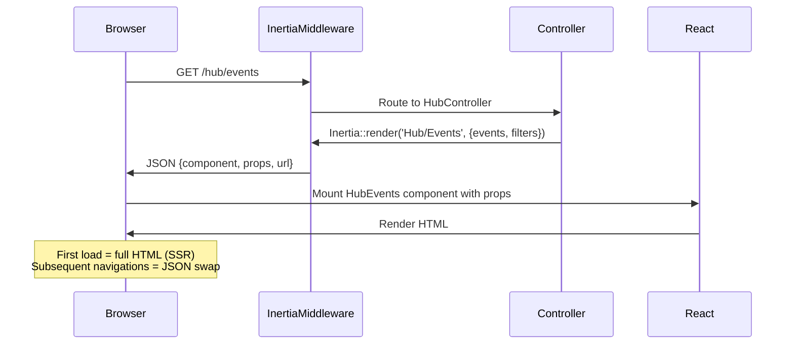

# 6. The Public Hub — Inertia + React

> **Milestone:** A fast, SEO-friendly public event listing page built with Inertia v3, React, and shadcn/ui. Visitors can browse events across all centers, search by keyword, and see real-time results — no full-page reloads.

## Prerequisites

- [Section 5: Filament Admin](section-05-filament.md) completed
- Docker services running (`docker compose up -d`)
- Node.js 20+ and npm installed
- A working Laravel app with tenants, events, and Filament admin

## What You'll Learn

| Concept | What it is | Why it matters |
|---------|-----------|----------------|
| Inertia v3 | Server-side routing + client-side rendering | Best of both worlds: no API layer, but SPA-like UX |
| React | UI component library | Rich interactivity for the registration wizard |
| shadcn/ui | Pre-built React components | Consistent, accessible UI without writing CSS |
| SSR | Server-side rendering | Event pages are crawlable by search engines |
| Wayfinder | Typed route definitions | No more hardcoded URLs in React code |
| Hub Module | Cross-tenant public pages | Visitors browse events from all centers in one place |

## The Big Picture

So far, Zendo has a Filament admin panel — powerful for center staff, but invisible to the outside world. Visitors need a public-facing website where they can discover events, learn about retreat centers, and eventually register. That's the **Hub**.

The Hub is different from admin pages in a critical way: it's **cross-tenant**. A visitor browsing `/hub/events` sees published events from *all* active centers, not just one. This is the discovery layer — the front door of Zendo.

We'll build it with **Inertia v3**, which lets us use React components for interactivity while keeping Laravel routes as the single source of truth for URLs and data. No REST API needed.

??? question "How does Inertia work?"
    Think of Inertia like a smart delivery driver. Traditionally, the server sends a full HTML page — like delivering a whole house. With a pure SPA, the server sends JSON and the client builds the house from scratch. 

    Inertia sends just the data and the component name — like delivering the furniture and telling you which room it goes in. The "house" (your layout) stays the same. Only the content changes. When you click a link, Inertia intercepts it, sends an XHR to the server, and the server responds with the component name + props instead of a full HTML document. The client swaps the component, no page reload.

    And SSR is like staging the house for a photo shoot before the buyer arrives — search engines see a fully rendered page.

    | Approach | Server sends | Client does | SEO? |
    |----------|-------------|-------------|------|
    | Classic Blade | Full HTML | Renders it | Yes |
    | SPA + API | JSON | Builds the whole page | No (without extra work) |
    | Inertia | Component name + props | Swaps content in existing layout | Yes (with SSR) |



---

## Step 1: Install Inertia v3 with React

Inertia v3 is the latest major version with SSR support built in. Let's install it along with React.

```bash
cd ~/Work/metaprovide/lotus/zendo

# Server side
composer require inertiajs/inertia-laravel

# Client side
npm install @inertiajs/react react react-dom
npm install -D @vitejs/plugin-react
```

Publish the Inertia config and error views:

```bash
php artisan vendor:publish --provider="Inertia\InertiaServiceProvider"
```

## Step 2: Configure Vite for React

Edit `vite.config.js` to use the React plugin:

```js
import { defineConfig } from 'vite';
import laravel from 'laravel-vite-plugin';
import react from '@vitejs/plugin-react';

export default defineConfig({
    plugins: [
        laravel({
            input: [
                'resources/js/app.tsx',
                'resources/css/app.css',
            ],
            refresh: true,
        }),
        react(),
    ],
    ssr: {
        noExternal: ['@inertiajs/react'],
    },
});
```

??? tip "Why `ssr.noExternal`?"
    Inertia's React adapter includes SSR-specific code that must be bundled into the SSR build rather than treated as an external dependency. Without this config, the SSR server would crash trying to resolve Inertia's internal imports.

## Step 3: Create the Root Layout

Inertia needs a root Blade template that bootstraps the React app. This is the "house" that stays the same — only the content changes.

Create `resources/views/app.blade.php`:

```html
<!DOCTYPE html>
<html lang="{{ str_replace('_', '-', app()->getLocale()) }}">
<head>
    <meta charset="utf-8">
    <meta name="viewport" content="width=device-width, initial-scale=1">
    <title>@yield('title', config('app.name'))</title>
    @vite(['resources/js/app.tsx', 'resources/css/app.css'])
    @inertiaHead
</head>
<body class="antialiased">
    @inertia
</body>
</html>
```

Create `resources/js/app.tsx` — the React entry point:

```tsx
import { createInertiaApp } from '@inertiajs/react';
import { resolvePageComponent } from 'laravel-vite-plugin/inertia-helpers';
import { hydrateRoot } from 'react-dom/client';
import '@/css/app.css';

const appName = import.meta.env.VITE_APP_NAME || 'Zendo';

createInertiaApp({
    title: (title) => `${title} — ${appName}`,
    resolve: (name) =>
        resolvePageComponent(
            `./Pages/${name}.tsx`,
            import.meta.glob('./Pages/**/*.tsx'),
        ),
    setup({ el, App, props }) {
        hydrateRoot(el, <App {...props} />);
    },
});
```

Create the SSR entry point at `resources/js/ssr.tsx`:

```tsx
import { createInertiaApp } from '@inertiajs/react';
import { renderToString } from 'react-dom/server';
import { resolvePageComponent } from 'laravel-vite-plugin/inertia-helpers';

const appName = import.meta.env.VITE_APP_NAME || 'Zendo';

export default function defineApple(app) {
    createInertiaApp({
        title: (title) => `${title} — ${appName}`,
        resolve: (name) =>
            resolvePageComponent(
                `./Pages/${name}.tsx`,
                import.meta.glob('./Pages/**/*.tsx'),
            ),
        setup({ App, props }) {
            return <App {...props} />;
        },
        render: renderToString,
    });
}
```

??? question "Why two entry files — app.tsx and ssr.tsx?"
    `app.tsx` runs in the browser and uses `hydrateRoot` to attach React to existing HTML. `ssr.tsx` runs in Node.js on the server and uses `renderToString` to generate HTML for the initial request. The first page load renders on the server (good for SEO), then React takes over on the client (good for interactivity).

## Step 4: Install shadcn/ui

shadcn/ui gives us pre-built, accessible, beautiful React components. It's not a dependency — it copies component files into your project so you can customize them.

```bash
cd ~/Work/metaprovide/lotus/zendo

# Initialize shadcn/ui
npx shadcn@latest init
```

When prompted, choose:

- Style: **Default**
- Base color: **Slate**
- CSS variables: **Yes**
- TypeScript: **Yes**
- Tailwind config path: **resources/css/app.css** (or adjust to match your setup)

Now install the components we'll need:

```bash
npx shadcn@latest add card button input badge dialog toast table search
```

This copies component files into `resources/js/components/ui/`. Each one is fully customizable — you own the code.

??? tip "Why shadcn/ui and not MUI or Chakra?"
    shadcn/ui uses Radix UI primitives for accessibility, Tailwind for styling, and gives you **the actual source code**. No vendor lock-in, no version conflicts, no fighting the framework's opinionated styles. You want a different border radius? Edit the file. Compare this with MUI where overriding styles means writing `sx` props or theme extensions that fight the library.

## Step 5: Create the HubController

The Hub module handles all cross-tenant public pages. It's separate from the admin controllers because it has no tenant scope — it queries across all active tenants.

Create `app/Modules/Hub/Controllers/HubController.php`:

```php
<?php

namespace App\Modules\Hub\Controllers;

use App\Modules\Tenancy\Models\Tenant;
use App\Modules\Events\Models\EventInstance;
use Inertia\Inertia;
use Illuminate\Http\Request;

class HubController
{
    public function home()
    {
        $centers = Tenant::where('is_active', true)
            ->select(['id', 'slug', 'name', 'description', 'logo', 'features'])
            ->orderBy('name')
            ->get();

        $featuredEvents = EventInstance::with(['event.tenant', 'event.teachers'])
            ->where('is_published', true)
            ->where('starts_at', '>', now())
            ->orderBy('starts_at')
            ->limit(6)
            ->get();

        return Inertia::render('Hub/Home', [
            'centers' => $centers,
            'featuredEvents' => $featuredEvents,
        ]);
    }

    public function centers()
    {
        $centers = Tenant::where('is_active', true)
            ->select(['id', 'slug', 'name', 'description', 'logo', 'features', 'timezone', 'locale'])
            ->orderBy('name')
            ->get();

        return Inertia::render('Hub/CenterList', [
            'centers' => $centers,
        ]);
    }

    public function events(Request $request)
    {
        $query = EventInstance::with(['event.tenant', 'event.teachers'])
            ->where('is_published', true)
            ->where('starts_at', '>', now());

        if ($search = $request->input('search')) {
            $query->whereHas('event', function ($q) use ($search) {
                $q->where('title', 'ilike', "%{$search}%")
                  ->orWhere('description', 'ilike', "%{$search}%");
            });
        }

        if ($center = $request->input('center')) {
            $query->whereHas('event.tenant', function ($q) use ($center) {
                $q->where('slug', $center);
            });
        }

        $events = $query->orderBy('starts_at')->paginate(12);

        $centers = Tenant::where('is_active', true)
            ->select(['slug', 'name'])
            ->orderBy('name')
            ->get();

        return Inertia::render('Hub/Events', [
            'events' => $events,
            'centers' => $centers,
            'filters' => [
                'search' => $request->input('search', ''),
                'center' => $request->input('center', ''),
            ],
        ]);
    }

    public function teachers()
    {
        $teachers = \App\Modules\People\Models\Teacher::with('tenants')
            ->where('is_published', true)
            ->orderBy('name')
            ->paginate(20);

        return Inertia::render('Hub/Teachers', [
            'teachers' => $teachers,
        ]);
    }
}
```

!!! note "Cross-tenant queries"
    Notice there's no `tenant()` scope here. Hub pages intentionally query **across** all active tenants. This is the only place in Zendo that does this — every other controller is scoped to the current tenant. That's why it lives in a separate module with its own controller.

## Step 6: Register the Hub Routes

Add the hub routes to `routes/web.php`:

```php
use App\Modules\Hub\Controllers\HubController;

// Hub — cross-tenant public pages (no tenant scope)
Route::prefix('hub')->name('hub.')->group(function () {
    Route::get('/', [HubController::class, 'home'])->name('home');
    Route::get('/centers', [HubController::class, 'centers'])->name('centers');
    Route::get('/events', [HubController::class, 'events'])->name('events');
    Route::get('/teachers', [HubController::class, 'teachers'])->name('teachers');
});
```

!!! warning "Route order matters"
    The `hub` routes must be registered **outside** the tenant-scoped middleware group. If they end up inside the tenant scope, they'll try to filter by a specific tenant and return no results. Check your `RouteServiceProvider` or `web.php` to make sure hub routes are not wrapped in tenant middleware.

## Step 7: Install and Configure Wayfinder

Wayfinder generates TypeScript route definitions from your Laravel routes, so you never hardcode a URL in React. If a route changes, Wayfinder updates the TypeScript — and your editor catches the error before it hits production.

```bash
composer require wayfinder/wayfinder
php artisan vendor:publish --provider="Wayfinder\WayfinderServiceProvider"
```

Generate the routes:

```bash
php artisan wayfinder:generate
```

This creates `resources/js/types/generated.js` with typed route helpers. You'll use them like:

```tsx
import { route } from '@/types/generated';

// Instead of:
// <a href="/hub/events?search=yoga">

// You write:
// <a href={route('hub.events', { search: 'yoga' })}>
```

??? question "Why not just hardcode URLs?"
    Hardcoded URLs are silent killers. You rename a route in Laravel, forget to update the React component, and the user gets a 404. Wayfinder makes this impossible — if the route changes, the TypeScript type changes, and your build fails until you fix it.

Add Wayfinder to your build pipeline by editing `package.json` scripts:

```json
{
    "scripts": {
        "build": "wayfinder:generate && vite build",
        "dev": "wayfinder:generate && vite"
    }
}
```

## Step 8: Create the Event Listing Page

Now the fun part — building the actual React page. Create `resources/js/Pages/Hub/Events.tsx`:

```tsx
import { Head, Link } from '@inertiajs/react';
import { Card, CardContent, CardHeader, CardTitle } from '@/components/ui/card';
import { Badge } from '@/components/ui/badge';
import { Input } from '@/components/ui/input';
import { Button } from '@/components/ui/button';
import { route } from '@/types/generated';
import { router } from '@inertiajs/react';

interface EventInstance {
    id: string;
    starts_at: string;
    ends_at: string;
    price_cents: number;
    spots_total: number;
    spots_taken: number;
    event: {
        id: string;
        title: string;
        description: string;
        slug: string;
        tenant: { slug: string; name: string };
        teachers: { name: string }[];
    };
}

interface Props {
    events: { data: EventInstance[]; current_page: number; last_page: number };
    centers: { slug: string; name: string }[];
    filters: { search: string; center: string };
}

export default function HubEvents({ events, centers, filters }: Props) {
    const handleSearch = (search: string) => {
        router.get(route('hub.events'), { search, center: filters.center }, {
            preserveState: true,
            preserveScroll: true,
        });
    };

    const handleCenterFilter = (center: string) => {
        router.get(route('hub.events'), { search: filters.search, center }, {
            preserveState: true,
            preserveScroll: true,
        });
    };

    return (
        <>
            <Head title="Events" />

            <div className="max-w-6xl mx-auto px-4 py-8">
                <h1 className="text-3xl font-bold tracking-tight mb-2">
                    Find Your Retreat
                </h1>
                <p className="text-muted-foreground mb-8">
                    Browse events from retreat centers around the world.
                </p>

                <div className="flex gap-4 mb-8 flex-wrap">
                    <Input
                        placeholder="Search events..."
                        defaultValue={filters.search}
                        onChange={(e) => handleSearch(e.target.value)}
                        className="max-w-sm"
                    />
                    <div className="flex gap-2 flex-wrap">
                        <Button
                            variant={filters.center === '' ? 'default' : 'outline'}
                            size="sm"
                            onClick={() => handleCenterFilter('')}
                        >
                            All Centers
                        </Button>
                        {centers.map((center) => (
                            <Button
                                key={center.slug}
                                variant={filters.center === center.slug ? 'default' : 'outline'}
                                size="sm"
                                onClick={() => handleCenterFilter(center.slug)}
                            >
                                {center.name}
                            </Button>
                        ))}
                    </div>
                </div>

                <div className="grid grid-cols-1 md:grid-cols-2 lg:grid-cols-3 gap-6">
                    {events.data.map((instance) => (
                        <Card key={instance.id} className="hover:shadow-lg transition-shadow">
                            <CardHeader>
                                <div className="flex items-center justify-between">
                                    <Badge variant="secondary">
                                        {instance.event.tenant.name}
                                    </Badge>
                                    <span className="text-sm text-muted-foreground">
                                        {instance.spots_taken}/{instance.spots_total} spots
                                    </span>
                                </div>
                                <CardTitle className="text-lg">
                                    <Link href={route('hub.events.show', { id: instance.id })}>
                                        {instance.event.title}
                                    </Link>
                                </CardTitle>
                            </CardHeader>
                            <CardContent>
                                <p className="text-sm text-muted-foreground line-clamp-2">
                                    {instance.event.description}
                                </p>
                                <div className="mt-4 flex items-center justify-between">
                                    <span className="text-sm">
                                        {new Date(instance.starts_at).toLocaleDateString('en-US', {
                                            month: 'short',
                                            day: 'numeric',
                                            year: 'numeric',
                                        })}
                                    </span>
                                    <span className="font-semibold">
                                        €{instance.price_cents / 100}
                                    </span>
                                </div>
                                {instance.event.teachers.length > 0 && (
                                    <div className="mt-2 flex gap-1 flex-wrap">
                                        {instance.event.teachers.map((teacher) => (
                                            <Badge key={teacher.name} variant="outline" className="text-xs">
                                                {teacher.name}
                                            </Badge>
                                        ))}
                                    </div>
                                )}
                            </CardContent>
                        </Card>
                    ))}
                </div>

                {events.last_page > 1 && (
                    <div className="mt-8 flex justify-center gap-2">
                        {Array.from({ length: events.last_page }, (_, i) => i + 1).map((page) => (
                            <Button
                                key={page}
                                variant={page === events.current_page ? 'default' : 'outline'}
                                size="sm"
                                onClick={() =>
                                    router.get(route('hub.events'), {
                                        page,
                                        search: filters.search,
                                        center: filters.center,
                                    })
                                }
                            >
                                {page}
                            </Button>
                        ))}
                    </div>
                )}
            </div>
        </>
    );
}
```

Inertia passes the controller's props directly to this component as typed props. When the user types in the search box, `router.get()` sends an Inertia request — the server responds with new props, and React re-renders. No page reload, no API to write.

## Step 9: Add SSR Configuration

SSR renders the initial HTML on the server so search engines can index your event pages. Without it, crawlers see a blank page.

Add the SSR build command to `vite.config.js` — it's already configured via the `ssr` key we set earlier. Now build the SSR bundle:

```bash
npm run build
```

This generates `bootstrap/ssr/ssr.mjs`. Now configure Inertia to use it. In `config/inertia.php`, make sure SSR is enabled:

```php
return [
    'ssr' => [
        'enabled' => true,
        'url' => 'http://localhost:13714',
    ],
];
```

Add the SSR server to your dev workflow. Create `bootstrap/ssr.js` (or confirm it was generated):

```js
import '~/bootstrap/ssr/ssr.mjs';
```

Run the SSR server in a new terminal:

```bash
# Terminal 4: SSR server
php artisan inertia:start-ssr
```

??? tip "When SSR matters and when it doesn't"
    SSR is critical for the **hub** pages (events, centers, teachers) because these are the pages search engines index. The admin panel doesn't need SSR — it's behind authentication. The registration wizard doesn't need SSR either — the user is already on the site and interacting. Only enable SSR for pages that need to be discovered via search engines.

## Step 10: Create the Event Detail Page

Individual event pages need SSR for SEO. Create `resources/js/Pages/Hub/EventDetail.tsx`:

```tsx
import { Head, Link } from '@inertiajs/react';
import { Card, CardContent, CardHeader, CardTitle } from '@/components/ui/card';
import { Badge } from '@/components/ui/badge';
import { Button } from '@/components/ui/button';
import { route } from '@/types/generated';

interface Props {
    event: {
        id: string;
        title: string;
        description: string;
        slug: string;
        tenant: { slug: string; name: string };
        teachers: { name: string; bio: string }[];
        instances: {
            id: string;
            starts_at: string;
            ends_at: string;
            price_cents: number;
            spots_total: number;
            spots_taken: number;
        }[];
    };
}

export default function EventDetail({ event }: Props) {
    const nextInstance = event.instances[0];

    return (
        <>
            <Head title={event.title}>
                <meta name="description" content={event.description} />
            </Head>

            <div className="max-w-4xl mx-auto px-4 py-8">
                <Link
                    href={route('hub.events')}
                    className="text-sm text-muted-foreground hover:text-foreground mb-4 inline-block"
                >
                    &larr; Back to all events
                </Link>

                <h1 className="text-4xl font-bold tracking-tight">{event.title}</h1>
                <div className="flex items-center gap-2 mt-2">
                    <Badge variant="secondary">{event.tenant.name}</Badge>
                    {event.teachers.map((t) => (
                        <Badge key={t.name} variant="outline">{t.name}</Badge>
                    ))}
                </div>

                <div className="mt-8 prose max-w-none">
                    <p>{event.description}</p>
                </div>

                {nextInstance && (
                    <Card className="mt-8">
                        <CardHeader>
                            <CardTitle>Next Available Date</CardTitle>
                        </CardHeader>
                        <CardContent className="flex items-center justify-between">
                            <div>
                                <p className="font-medium">
                                    {new Date(nextInstance.starts_at).toLocaleDateString('en-US', {
                                        weekday: 'long',
                                        month: 'long',
                                        day: 'numeric',
                                        year: 'numeric',
                                    })}
                                </p>
                                <p className="text-sm text-muted-foreground">
                                    {nextInstance.spots_total - nextInstance.spots_taken} spots remaining
                                </p>
                            </div>
                            <div className="text-right">
                                <p className="text-2xl font-bold">&#8364;{nextInstance.price_cents / 100}</p>
                                <Link href={route('register.create', { instance: nextInstance.id })}>
                                    <Button size="lg" className="mt-2">
                                        Register Now
                                    </Button>
                                </Link>
                            </div>
                        </CardContent>
                    </Card>
                )}
            </div>
        </>
    );
}
```

Add the detail route to `routes/web.php` inside the hub group:

```php
Route::get('/events/{id}', [HubController::class, 'eventDetail'])->name('events.show');
```

And add the controller method:

```php
public function eventDetail(string $id)
{
    $instance = EventInstance::with(['event.tenant', 'event.teachers'])
        ->where('is_published', true)
        ->where('id', $id)
        ->firstOrFail();

    return Inertia::render('Hub/EventDetail', [
        'event' => [
            'id' => $instance->event->id,
            'title' => $instance->event->title,
            'description' => $instance->event->description,
            'slug' => $instance->event->slug,
            'tenant' => [
                'slug' => $instance->event->tenant->slug,
                'name' => $instance->event->tenant->name,
            ],
            'teachers' => $instance->event->teachers->map(fn ($t) => [
                'name' => $t->name,
                'bio' => $t->bio,
            ]),
            'instances' => $instance->event->instances()
                ->where('is_published', true)
                ->where('starts_at', '>', now())
                ->orderBy('starts_at')
                ->get()
                ->map(fn ($i) => [
                    'id' => $i->id,
                    'starts_at' => $i->starts_at->toIso8601String(),
                    'ends_at' => $i->ends_at->toIso8601String(),
                    'price_cents' => $i->price_cents,
                    'spots_total' => $i->spots_total,
                    'spots_taken' => $i->spots_taken,
                ]),
        ],
    ]);
}
```

## Step 11: Set Up Inertia Middleware

Configure Inertia to use the root template we created. Edit `config/inertia.php`:

```php
return [
    'root_view' => 'app',
    'ssr' => [
        'enabled' => true,
        'url' => 'http://localhost:13714',
    ],
];
```

And make sure the middleware is registered. In `bootstrap/app.php`, add the middleware to the web group:

```php
->withMiddleware(function (Middleware $middleware) {
    $middleware->web(append: [
        \App\Http\Middleware\HandleInertiaRequests::class,
    ]);
})
```

Generate the middleware if it doesn't exist:

```bash
php artisan inertia:middleware
```

This creates `app/Http/Middleware/HandleInertiaRequests.php`. The important method is `version()`, which Inertia uses for asset invalidation:

```php
public function version(Request $request): ?string
{
    return parent::version($request);
}
```

## Step 12: Build and Test

Now compile everything and test:

```bash
# Regenerate Wayfinder routes
php artisan wayfinder:generate

# Build frontend assets
npm run build

# Start all services
# Terminal 1: Laravel
php artisan serve

# Terminal 2: Vite dev server
npm run dev

# Terminal 3: Queue worker
php artisan queue:work

# Terminal 4: SSR server (optional, for SEO)
php artisan inertia:start-ssr
```

Visit `http://localhost:8000/hub/events` — you should see the event listing page with search and center filtering, all rendered as a React SPA with Inertia navigating between pages.

Try searching — notice how the URL updates and the content swaps without a full page reload. That's Inertia at work. View the page source and you'll see fully rendered HTML — that's SSR.

!!! success "Checkpoint"
    At this point you should have:

    - ✅ Inertia v3 installed and configured with React
    - ✅ shadcn/ui components integrated (Card, Button, Badge, Input)
    - ✅ HubController serving cross-tenant event data
    - ✅ `/hub/events` page with search and center filtering
    - ✅ `/hub/events/{id}` detail page with SSR for SEO
    - ✅ Wayfinder generating typed routes from Laravel routes
    - ✅ SSR configured for crawlable pages
    - ✅ No hardcoded URLs anywhere in React — all routes come from Wayfinder

---

## What's Next

In [Section 7: Events, Queues & Realtime](section-07-queues-realtime.md), we'll wire up the event system that powers everything behind the scenes: when a registration is confirmed, emails get queued, availability updates, and the user sees a live toast notification — all without blocking the HTTP response.

We'll cover:

- **Laravel Events & Listeners** — RegistrationConfirmed fires all the downstream actions
- **Queues** — email sending, PDF generation, webhooks are all async
- **Reverb** — Laravel's WebSocket server for real-time browser updates
- **Echo** — client-side library subscribing to channels
- **Transactional Outbox** — never lose an event, even if the broadcast fails