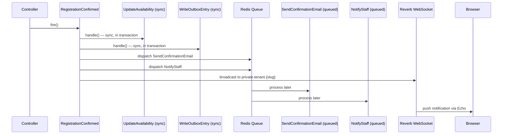
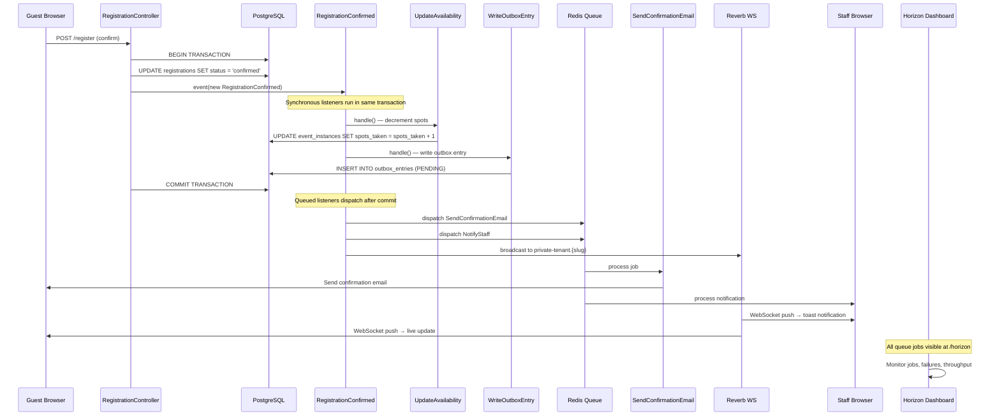

# 7. Events, Queues & Realtime

> **Milestone:** When a registration is confirmed, an email is queued, availability updates synchronously, a WebSocket broadcast fires, and the user sees a live toast notification — all without blocking the HTTP response.

## Prerequisites

- [Section 6: Inertia Hub](section-06-inertia-hub.md) completed
- Docker services running (`docker compose up -d`) — Redis is used for queues
- Reverb available (we'll install it)

## What You'll Learn

| Concept | What it is | Why it matters |
|---------|-----------|----------------|
| Laravel Events & Listeners | Decoupled event handling | Registration confirmed → email + broadcast + outbox |
| Queues | Async job processing | Don't make the user wait for an email to send |
| Redis Queue Driver | In-memory queue backend | Fast, reliable, already in our stack |
| Reverb | Laravel's WebSocket server | Push updates to browsers in real time |
| Echo | Client-side WebSocket library | Subscribe to channels, receive broadcasts |
| Transactional Outbox | Guaranteed delivery pattern | Never lose an event, even if the broadcast fails |
| Horizon | Queue monitoring dashboard | See what's in the queue, what failed, what's running |

## The Big Picture

When a guest registers for a retreat, a lot needs to happen: send a confirmation email, update room availability, notify the center staff, broadcast a live update to the browser, and record the event for reliable delivery. If we did all of this synchronously, the user would stare at a spinner for 5 seconds.

Instead, we fire a **single event** — `RegistrationConfirmed` — and let listeners handle each piece independently. Some run synchronously (updating availability), some get queued (sending email), and some broadcast in real time (WebSocket push).

??? question "How does this compare to a restaurant kitchen?"
    Think of events like a restaurant kitchen. When an order comes in (`RegistrationConfirmed`), it doesn't go to just one chef. A ticket is printed and handed to multiple stations:

    | Station | Listener | How |
    |---------|----------|-----|
    | The grill | `SendConfirmationEmail` | Queued — slow, do it later |
    | The expediter | `UpdateAvailability` | Sync — must happen now, in the same transaction |
    | The delivery driver | `BroadcastToTenant` | Reverb — push to the browser in real time |
    | The receipt printer | `WriteOutboxEntry` | Sync in transaction — record that this happened |
    | The manager's desk | `NotifyStaff` | Queued — notification can wait a few seconds |

    Each station works independently and at its own pace. If the grill is slow (email takes 3 seconds), the delivery driver (WebSocket broadcast) doesn't wait. The guest gets their confirmation page instantly, and everything else catches up.



---

## Step 1: Install Reverb and Horizon

Reverb is Laravel's first-party WebSocket server. Horizon gives us a beautiful dashboard for monitoring queues.

```bash
cd ~/Work/metaprovide/lotus/zendo

# Reverb — WebSocket server (Laravel's first-party broadcasting server)
composer require laravel/reverb

# Horizon — queue monitoring dashboard
composer require laravel/horizon
php artisan horizon:install

# Echo — client-side WebSocket library
npm install laravel-echo pusher-js
```

??? tip "Why Reverb and not Pusher?"
    Reverb is Laravel's official WebSocket server, released in Laravel 11. It's self-hosted (no third-party dependency), free, and integrates natively with Laravel's broadcasting system. Pusher is a hosted alternative — great for getting started fast, but adds a third-party dependency and costs money at scale. Since we already have Redis, Reverb is the natural choice.

## Step 2: Configure the Redis Queue Driver

We set up Redis in [Section 1](section-01-get-running.md). Now we'll use it for real as our queue backend.

Confirm your `.env` has:

```env
QUEUE_CONNECTION=redis
CACHE_STORE=redis
SESSION_DRIVER=redis
```

Configure Horizon by editing `config/horizon.php`. The default config works, but let's ensure our environments are set up properly:

```php
'environments' => [
    'local' => [
        'supervisor-1' => [
            'maxProcesses' => 3,
            'balanceMaxShift' => 1,
            'balanceCooldown' => 3,
            'tries' => 3,
        ],
    ],
    'production' => [
        'supervisor-1' => [
            'maxProcesses' => 10,
            'balanceMaxShift' => 1,
            'balanceCooldown' => 3,
            'tries' => 3,
        ],
    ],
],
```

Now run Horizon instead of the plain queue worker:

```bash
# Terminal 3: Horizon dashboard + queue worker
php artisan horizon
```

Visit `http://localhost:8000/horizon` — you'll see the Horizon dashboard showing recent jobs, failed jobs, and metrics.

!!! warning "Don't use `queue:work` and `horizon` at the same time"
    `php artisan horizon` starts the queue worker with the Horizon monitor. If you also run `php artisan queue:work`, you'll have two workers fighting for the same jobs. Pick one. For dev, use Horizon. For production, use Supervisor with Horizon.

## Step 3: Create the RegistrationConfirmed Event

Laravel events are the central nervous system of Zendo. Instead of one big controller method that does everything, the controller fires an event and each listener handles one piece.

Create the event:

```bash
php artisan make:event RegistrationConfirmed
```

Move it to the Registration module:

```bash
mkdir -p app/Modules/Registration/Events
mv app/Events/RegistrationConfirmed.php app/Modules/Registration/Events/
```

Edit `app/Modules/Registration/Events/RegistrationConfirmed.php`:

```php
<?php

namespace App\Modules\Registration\Events;

use App\Modules\Registration\Models\Registration;
use Illuminate\Foundation\Events\Dispatchable;
use Illuminate\Queue\SerializesModels;

class RegistrationConfirmed
{
    use Dispatchable, SerializesModels;

    public function __construct(
        public Registration $registration,
    ) {}
}
```

??? question "Why not `ShouldBroadcast` on the event itself?"
    We separate the **broadcast** from the **event**. The `RegistrationConfirmed` event is a plain data object — it doesn't implement `ShouldBroadcast`. Instead, `BroadcastToTenant` is both a listener (registered in `EventServiceProvider`) **and** a broadcastable event (implements `ShouldBroadcast`). When Laravel dispatches `BroadcastToTenant` as a listener, it sees the `ShouldBroadcast` interface and pushes it to the queue for broadcasting via Reverb.

    This separation means we can add new broadcast channels later without touching the event class. The event is "what happened"; the listeners are "what to do about it". Note that `BroadcastToTenant` uses the `InteractsWithQueue` trait for retry logic — without it, a failed broadcast would be silently discarded.

## Step 4: Create the Listeners

Each listener is a single-responsibility class. Let's create them all:

```bash
mkdir -p app/Modules/Registration/Listeners
mkdir -p app/Modules/Notifications/Jobs
mkdir -p app/Modules/Notifications/Mailables
```

### SendConfirmationEmail (queued)

This sends the confirmation email. It's queued because email is slow (1-3 seconds) and we don't want to block the response.

Create `app/Modules/Registration/Listeners/SendConfirmationEmail.php`:

```php
<?php

namespace App\Modules\Registration\Listeners;

use App\Modules\Registration\Events\RegistrationConfirmed;
use App\Modules\Notifications\Mailables\RegistrationConfirmedMailable;
use Illuminate\Contracts\Queue\ShouldQueue;
use Illuminate\Support\Facades\Mail;

class SendConfirmationEmail implements ShouldQueue
{
    public int $tries = 3;
    public int $backoff = 30;

    public function handle(RegistrationConfirmed $event): void
    {
        $registration = $event->registration;
        $guest = $registration->guest;

        Mail::to($guest->email)
            ->send(new RegistrationConfirmedMailable($registration));
    }
}
```

### UpdateAvailability (sync)

This decrements available spots. It must happen synchronously, in the same database transaction, so we never overbook.

Create `app/Modules/Registration/Listeners/UpdateAvailability.php`:

```php
<?php

namespace App\Modules\Registration\Listeners;

use App\Modules\Registration\Events\RegistrationConfirmed;

class UpdateAvailability
{
    public function handle(RegistrationConfirmed $event): void
    {
        $instance = $event->registration->eventInstance;
        $instance->increment('spots_taken');
    }
}
```

### BroadcastToTenant (Reverb)

This pushes a real-time notification to the tenant's admin panel. We'll set up the Reverb channel subscription later — for now, we broadcast the event.

!!! note "ShouldBroadcast vs InteractsWithQueue"
    The `BroadcastToTenant` listener implements `ShouldBroadcast`, which tells Laravel to broadcast the event over WebSockets via Reverb. Because broadcasting is inherently async, we also add the `InteractsWithQueue` trait to handle retry logic if the broadcast job fails. Without `InteractsWithQueue`, a failed broadcast would silently discard — with it, Laravel retries using the queue's configured retry logic.

Create `app/Modules/Registration/Listeners/BroadcastToTenant.php`:

```php
<?php

namespace App\Modules\Registration\Listeners;

use App\Modules\Registration\Events\RegistrationConfirmed;
use Illuminate\Broadcasting\PrivateChannel;
use Illuminate\Contracts\Broadcasting\ShouldBroadcast;
use Illuminate\Queue\InteractsWithQueue;
use Illuminate\Queue\SerializesModels;

class BroadcastToTenant implements ShouldBroadcast
{
    use InteractsWithQueue, SerializesModels;

    public function __construct(
        public RegistrationConfirmed $event,
    ) {}

    public function broadcastOn(): array
    {
        return [
            new PrivateChannel('tenant.' . $this->event->registration->eventInstance->event->tenant->slug),
        ];
    }

    public function broadcastWith(): array
    {
        $registration = $this->event->registration;

        return [
            'type' => 'registration.confirmed',
            'registration_id' => $registration->id,
            'guest_name' => $registration->guest->full_name,
            'event_title' => $registration->eventInstance->event->title,
            'timestamp' => now()->toIso8601String(),
        ];
    }

    public function broadcastAs(): string
    {
        return 'registration.confirmed';
    }
}
```

!!! note "Why PrivateChannel and not Channel?"
    Private channels require authentication — only users who belong to a tenant can subscribe to `private-tenant.{slug}`. This prevents cross-tenant data leaks over WebSockets. We'll set up the authorization route in Step 8.

### WriteOutboxEntry (sync in transaction)

This is the **transactional outbox** pattern — we write a record in the same database transaction as the registration, guaranteeing the event is never lost even if the broadcast fails.

Create `app/Modules/Registration/Listeners/WriteOutboxEntry.php`:

```php
<?php

namespace App\Modules\Registration\Listeners;

use App\Modules\Registration\Events\RegistrationConfirmed;
use App\Modules\Notifications\Models\OutboxEntry;

class WriteOutboxEntry
{
    public function handle(RegistrationConfirmed $event): void
    {
        OutboxEntry::create([
            'uuid' => (string) \Illuminate\Support\Str::uuid(),
            'tenant_id' => $event->registration->eventInstance->event->tenant_id,
            'event_type' => 'registration.confirmed',
            'payload' => [
                'registration_id' => $event->registration->id,
                'guest_name' => $event->registration->guest->full_name,
                'event_title' => $event->registration->eventInstance->event->title,
            ],
            'status' => 'PENDING',
            'attempts' => 0,
        ]);
    }
}
```

### NotifyStaff (queued)

This sends a notification to the center's staff. It's queued because it's not time-critical — a second or two delay is fine.

Create `app/Modules/Registration/Listeners/NotifyStaff.php`:

```php
<?php

namespace App\Modules\Registration\Listeners;

use App\Modules\Registration\Events\RegistrationConfirmed;
use Illuminate\Contracts\Queue\ShouldQueue;

class NotifyStaff implements ShouldQueue
{
    public int $tries = 3;

    public function handle(RegistrationConfirmed $event): void
    {
        $tenant = $event->registration->eventInstance->event->tenant;

        $staff = $tenant->users()
            ->where('role', '!=', 'viewer')
            ->get();

        \Illuminate\Support\Facades\Notification::send(
            $staff,
            new \App\Modules\Notifications\Notifications\NewRegistrationNotification(
                $event->registration,
            ),
        );
    }
}
```

## Step 5: Register the Event-Listener Mapping

Wire the event to its listeners in `app/Providers/EventServiceProvider.php`:

```php
<?php

namespace App\Providers;

use Illuminate\Foundation\Support\Providers\EventServiceProvider as ServiceProvider;
use App\Modules\Registration\Events\RegistrationConfirmed;
use App\Modules\Registration\Events\RegistrationCancelled;
use App\Modules\Registration\Events\PaymentSettled;
use App\Modules\Registration\Listeners\SendConfirmationEmail;
use App\Modules\Registration\Listeners\UpdateAvailability;
use App\Modules\Registration\Listeners\BroadcastToTenant;
use App\Modules\Registration\Listeners\WriteOutboxEntry;
use App\Modules\Registration\Listeners\NotifyStaff;

class EventServiceProvider extends ServiceProvider
{
    protected $listen = [
        RegistrationConfirmed::class => [
            UpdateAvailability::class,
            WriteOutboxEntry::class,
            SendConfirmationEmail::class,
            BroadcastToTenant::class,
            NotifyStaff::class,
        ],
    ];
}
```

??? question "Why is `UpdateAvailability` listed first?"
    Order matters. `UpdateAvailability` and `WriteOutboxEntry` are synchronous — they run in the same database transaction as the registration confirmation. If they fail, the whole transaction rolls back and the registration is not confirmed. The queued listeners (`SendConfirmationEmail`, `BroadcastToTenant`, `NotifyStaff`) are dispatched *after* the transaction commits, so they never fire unless the registration actually succeeded.

## Step 6: Create the OutboxEntry Model and Migration

The transactional outbox pattern ensures reliable event delivery. An outbox entry is written in the same transaction as the business data, then a background job drains the outbox and delivers the events.

Create the model and migration:

```bash
php artisan make:model OutboxEntry -m
```

Move it to the Notifications module:

```bash
mv app/Models/OutboxEntry.php app/Modules/Notifications/Models/
```

Edit the migration (`database/migrations/*_create_outbox_entries_table.php`):

```php
Schema::create('outbox_entries', function (Blueprint $table) {
    $table->uuid('id')->primary();
    $table->uuid('tenant_id');
    $table->string('event_type');
    $table->json('payload');
    $table->enum('status', ['PENDING', 'PROCESSING', 'SENT', 'FAILED'])->default('PENDING');
    $table->unsignedInteger('attempts')->default(0);
    $table->timestamp('sent_at')->nullable();
    $table->timestamp('next_attempt_at')->nullable();
    $table->timestamps();

    $table->foreign('tenant_id')->references('id')->on('tenants')->onDelete('cascade');
    $table->index(['status', 'next_attempt_at']);
    $table->index('tenant_id');
});
```

Edit `app/Modules/Notifications/Models/OutboxEntry.php`:

```php
<?php

namespace App\Modules\Notifications\Models;

use Illuminate\Database\Eloquent\Model;
use Illuminate\Database\Eloquent\Concerns\HasUuids;

class OutboxEntry extends Model
{
    use HasUuids;

    protected $fillable = [
        'tenant_id',
        'event_type',
        'payload',
        'status',
        'attempts',
        'sent_at',
        'next_attempt_at',
    ];

    protected $casts = [
        'payload' => 'array',
        'sent_at' => 'datetime',
        'next_attempt_at' => 'datetime',
    ];

    public function markSent(): void
    {
        $this->update([
            'status' => 'SENT',
            'sent_at' => now(),
        ]);
    }

    public function markFailed(): void
    {
        $this->update([
            'status' => 'FAILED',
            'attempts' => $this->attempts + 1,
            'next_attempt_at' => now()->addMinutes(2 ** $this->attempts),
        ]);
    }
}
```

Run the migration:

```bash
php artisan migrate
```

## Step 7: Create the ProcessOutboxEntries Job

The outbox needs a background job that periodically drains pending entries and delivers them (via webhook, broadcast retry, etc.).

```bash
php artisan make:job ProcessOutboxEntries
```

Move and edit `app/Modules/Notifications/Jobs/ProcessOutboxEntries.php`:

```php
<?php

namespace App\Modules\Notifications\Jobs;

use App\Modules\Notifications\Models\OutboxEntry;
use Illuminate\Bus\Queueable;
use Illuminate\Contracts\Queue\ShouldQueue;
use Illuminate\Foundation\Bus\Dispatchable;
use Illuminate\Queue\InteractsWithQueue;
use Illuminate\Queue\SerializesModels;
use Illuminate\Support\Facades\Log;

class ProcessOutboxEntries implements ShouldQueue
{
    use Dispatchable, InteractsWithQueue, Queueable, SerializesModels;

    public int $tries = 1;

    public function handle(): void
    {
        $entries = OutboxEntry::where('status', 'PENDING')
            ->where(function ($query) {
                $query->whereNull('next_attempt_at')
                    ->orWhere('next_attempt_at', '<=', now());
            })
            ->orderBy('created_at')
            ->limit(50)
            ->get();

        foreach ($entries as $entry) {
            $entry->update(['status' => 'PROCESSING']);

            try {
                $this->deliver($entry);
                $entry->markSent();
            } catch (\Throwable $e) {
                Log::error('Outbox entry delivery failed', [
                    'entry_id' => $entry->id,
                    'event_type' => $entry->event_type,
                    'error' => $e->getMessage(),
                ]);
                $entry->markFailed();
            }
        }
    }

    private function deliver(OutboxEntry $entry): void
    {
        switch ($entry->event_type) {
            case 'registration.confirmed':
            case 'registration.cancelled':
            case 'payment.settled':
            case 'payment.failed':
                broadcast(new \App\Modules\Notifications\Events\OutboxEvent($entry))
                    ->toOthers();
                break;
        }
    }
}
```

Schedule the outbox processor. In `routes/console.php`:

```php
use App\Modules\Notifications\Jobs\ProcessOutboxEntries;

Schedule::job(new ProcessOutboxEntries)->everyMinute();
```

??? question "Why transactional outbox instead of just broadcasting?"
    Broadcasting fails silently. If the Reverb server is down when a registration is confirmed, the broadcast is lost — the admin never sees the real-time notification. The outbox pattern writes a record *in the same database transaction* as the registration. Even if Reverb is down, the outbox entry exists. When Reverb comes back, `ProcessOutboxEntries` picks it up and delivers it. **Zero lost events.**

    This is especially important for **webhooks** (which we'll add later). If we send a webhook and it fails, we need to retry. The outbox entry tracks attempts and uses exponential backoff.

## Step 8: Configure Reverb and Echo

Reverb is Laravel's WebSocket server. It runs as a standalone process and manages persistent connections to browsers.

Publish the Reverb config:

```bash
php artisan reverb:install
```

This updates your `.env` with Reverb settings and creates `config/reverb.php`. Confirm your `.env` has:

```env
BROADCAST_CONNECTION=reverb
REVERB_APP_ID=zendo
REVERB_APP_KEY=app-key
REVERB_APP_SECRET=app-secret
REVERB_HOST=localhost
REVERB_PORT=8080
REVERB_SCHEME=http
```

Now set up the client side. Create `resources/js/echo.ts`:

```ts
import Echo from 'laravel-echo';
import Pusher from 'pusher-js';

window.Echo = new Echo({
    broadcaster: 'reverb',
    key: import.meta.env.VITE_REVERB_APP_KEY,
    wsHost: import.meta.env.VITE_REVERB_HOST,
    wsPort: import.meta.env.VITE_REVERB_PORT ?? 8080,
    wssPort: import.meta.env.VITE_REVERB_PORT ?? 8080,
    forceTLS: false,
    enabledTransports: ['ws'],
});
```

Add the Vite env variables to `.env`:

```env
VITE_REVERB_APP_KEY="${REVERB_APP_KEY}"
VITE_REVERB_HOST="${REVERB_HOST}"
VITE_REVERB_PORT="${REVERB_PORT}"
```

Import Echo in `resources/js/app.tsx` (add at the top):

```ts
import './echo';
```

## Step 9: Set Up Channel Authorization

Private channels require authorization — the server must confirm that the authenticated user is allowed to listen to a given channel.

Add the authorization route. In `routes/channels.php`:

```php
use Illuminate\Support\Facades\Broadcast;

Broadcast::channel('tenant.{slug}', function ($user, $slug) {
    return $user->tenants()->where('slug', $slug)->exists();
});
```

This ensures only users belonging to a tenant can subscribe to that tenant's private channel.

## Step 10: Add Real-Time Toast Notifications

Now let's make the toast appear in real-time when a registration is confirmed. First, make sure the toast component exists:

```bash
npx shadcn@latest add sonner
```

Create `resources/js/components/RealtimeToasts.tsx`:

```tsx
import { useEffect } from 'react';
import { usePage } from '@inertiajs/react';
import { toast } from 'sonner';

export default function RealtimeToasts() {
    const { auth } = usePage().props as any;

    useEffect(() => {
        if (!auth?.user || !window.Echo) return;

        const tenant = auth.user.current_tenant;
        if (!tenant) return;

        window.Echo.private(`tenant.${tenant.slug}`)
            .listen('.registration.confirmed', (e: any) => {
                toast.success('New Registration', {
                    description: `${e.guest_name} registered for ${e.event_title}`,
                });
            })
            .error((error: any) => {
                console.error('Echo subscription error:', error);
            });

        return () => {
            window.Echo.leave(`tenant.${tenant.slug}`);
        };
    }, [auth?.user?.current_tenant?.slug]);

    return null;
}
```

Add the toast provider and the listener to your root layout. Edit `resources/js/Pages/Hub/Events.tsx` (or the shared layout component) to include:

```tsx
import { Toaster } from '@/components/ui/sonner';
import RealtimeToasts from '@/components/RealtimeToasts';

// Inside your layout wrapper:
<>
    <RealtimeToasts />
    <Toaster position="top-right" />
    {/* ... rest of the page */}
</>
```

## Step 11: Wire It Up End-to-End

Let's create a quick test to see the whole flow in action. We'll create a controller method that simulates confirming a registration:

In `app/Modules/Registration/Controllers/RegistrationController.php`, add a confirm method:

```php
public function confirm(Registration $registration)
{
    $registration->update(['status' => 'confirmed']);

    event(new RegistrationConfirmed($registration));

    return back()->with('success', 'Registration confirmed!');
}
```

Now let's test the full flow:

```bash
# Terminal 1: Laravel server
php artisan serve

# Terminal 2: Vite dev server
npm run dev

# Terminal 3: Horizon (queue worker + monitoring)
php artisan horizon

# Terminal 4: Reverb (WebSocket server)
php artisan reverb:start

# Terminal 5: SSR server (optional)
php artisan inertia:start-ssr
```

Now use Tinker to trigger the event manually:

```bash
php artisan tinker
```

```php
use App\Modules\Registration\Models\Registration;
use App\Modules\Registration\Events\RegistrationConfirmed;
$reg = Registration::first();
event(new RegistrationConfirmed($reg));
```

Watch what happens:

1. **UpdateAvailability** runs synchronously — `spots_taken` increments
2. **WriteOutboxEntry** runs synchronously — a row appears in `outbox_entries`
3. **SendConfirmationEmail** is dispatched to the Redis queue — Horizon shows it
4. **BroadcastToTenant** is dispatched — Reverb pushes a WebSocket message
5. **NotifyStaff** is dispatched — staff users get notified

Check the outbox:

```php
OutboxEntry::where('status', 'SENT')->count();
// => 1
```

Check Horizon at `http://localhost:8000/horizon` — you'll see the completed jobs, their runtime, and any failures.

??? tip "Debugging Reverb connections"
    Open your browser's DevTools → Network → WS tab. You should see an active WebSocket connection to Reverb. If it's not there, check:

    - Is `php artisan reverb:start` running?
    - Do the `VITE_REVERB_*` env variables match `.env`?
    - Did you run `npm run dev` after changing env? (Vite needs a restart for env changes)
    - Is the user authenticated? Private channels require auth.

## Step 12: Create the Confirmation Email Mailable

Let's create the actual email that gets queued. The `SendConfirmationEmail` listener references it.

```bash
php artisan make:mail RegistrationConfirmedMailable
```

Move it to the Notifications module:

```bash
mv app/Mail/RegistrationConfirmedMailable.php app/Modules/Notifications/Mailables/
```

Edit `app/Modules/Notifications/Mailables/RegistrationConfirmedMailable.php`:

```php
<?php

namespace App\Modules\Notifications\Mailables;

use App\Modules\Registration\Models\Registration;
use Illuminate\Bus\Queueable;
use Illuminate\Mail\Mailable;
use Illuminate\Queue\SerializesModels;

class RegistrationConfirmedMailable extends Mailable
{
    use Queueable, SerializesModels;

    public function __construct(
        public Registration $registration,
    ) {}

    public function build(): self
    {
        return $this->subject('Your Retreat Registration is Confirmed')
            ->markdown('emails.registration-confirmed', [
                'guestName' => $this->registration->guest->full_name,
                'eventTitle' => $this->registration->eventInstance->event->title,
                'startDate' => $this->registration->eventInstance->starts_at->format('F j, Y'),
                'centerName' => $this->registration->eventInstance->event->tenant->name,
            ]);
    }
}
```

Create the email template at `resources/views/emails/registration-confirmed.blade.php`:

```html
@component('mail::message')
# Your Registration is Confirmed

Hello {{ $guestName }},

Your registration for **{{ $eventTitle }}** at {{ $centerName }} has been confirmed.

**Start date:** {{ $startDate }}

We look forward to seeing you there!

@component('mail::button', ['url' => url('/my-registrations')])
View Your Registration
@endcomponent

Thanks,<br>
The Zendo Team
@endcomponent
```

## Step 13: The Full Event Flow Visualized

Here's the complete flow, start to finish:



!!! success "Checkpoint"
    At this point you should have:

    - ✅ `RegistrationConfirmed` event firing from the controller
    - ✅ Five listeners: UpdateAvailability (sync), WriteOutboxEntry (sync), SendConfirmationEmail (queued), BroadcastToTenant (Reverb), NotifyStaff (queued)
    - ✅ Redis queue driver processing jobs via Horizon
    - ✅ Reverb WebSocket server running and accepting connections
    - ✅ Echo subscribing to private tenant channels
    - ✅ OutboxEntry model ensuring zero lost events
    - ✅ ProcessOutboxEntries job draining the outbox every minute
    - ✅ Real-time toast notifications in the browser
    - ✅ Horizon dashboard monitoring at `/horizon`
    - ✅ Confirmation email mailable queued and sent

---

## What's Next

In [Section 8: The Registration Wizard](section-08-registration-wizard.md), we'll build the multi-step form that guests use to register for events — a React wizard with Zustand state management, feature-gated steps (lodging and meals only if the center has them), and atomic database transactions.

We'll cover:

- **Zustand** — lightweight React state for the wizard
- **Form Requests** — Laravel validation classes
- **DB Transactions** — registration + stay + meals commit together or not at all
- **Feature-gated UI** — conditionally showing wizard steps based on tenant features