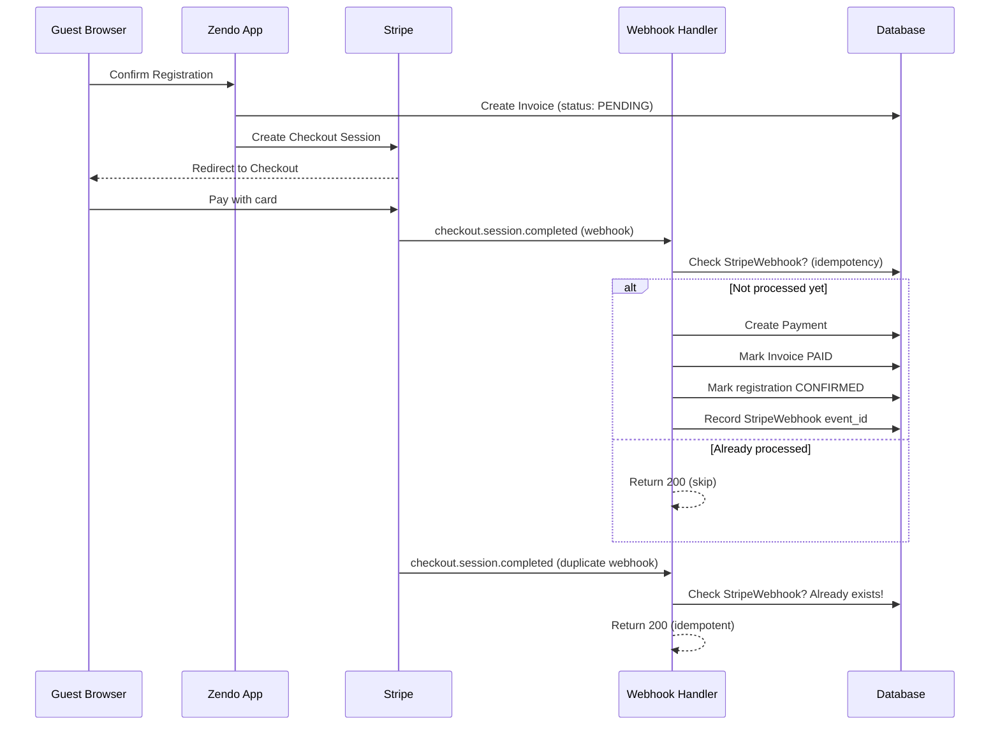

# 9. Payments with Stripe

> **Milestone:** Guests can pay for registrations via Stripe Checkout, and webhooks are processed idempotently.

## Prerequisites

- [Section 8: Registration Wizard](section-08-registration-wizard.md) completed
- Docker services running (`docker compose up -d`)
- A Stripe account (test mode)

## What You'll Learn

| Concept | What it is | Why it matters |
|---------|-----------|----------------|
| Stripe Connect | Multi-party payments | Money goes directly to the retreat center's account |
| Custom payment domain | Our own Invoice/Payment/Refund models | One-time payments that don't fit Cashier's model |
| Cashier | Laravel's subscription billing package | Membership subscriptions with recurring billing |
| Webhook idempotency | Processing each event exactly once | Duplicate webhooks don't create duplicate payments |
| HandleStripeWebhook | Job that safely processes Stripe events | Queue-based webhook processing with retry logic |

## The Big Picture

When a guest finishes the registration wizard and confirms, we create an Invoice for the total amount, then redirect them to Stripe Checkout. After they pay, Stripe sends a webhook to our server — and it might send the same event twice. Webhook idempotency is like getting the same bill in the mail twice. The first time you pay it, you write "PAID" on it. The second time it arrives, you check your records, see it's already paid, and throw it away. You don't pay twice. Stripe webhooks work the same way — they might send the same event twice, but we only process it once.



---

## Step 1: Install and Configure Stripe

```bash
composer require stripe/stripe-php
```

Add Stripe keys to `.env`:

```env
STRIPE_KEY=pk_test_...
STRIPE_SECRET=sk_test_...
STRIPE_WEBHOOK_SECRET=whsec_...

# Stripe Connect — each center gets its own connected account
STRIPE_CONNECT_CLIENT_ID=ca_...
```

Add to `config/services.php`:

```php
'stripe' => [
    'key' => env('STRIPE_KEY'),
    'secret' => env('STRIPE_SECRET'),
    'webhook_secret' => env('STRIPE_WEBHOOK_SECRET'),
    'connect_client_id' => env('STRIPE_CONNECT_CLIENT_ID'),
],
```

!!! note "Why Stripe Connect and not plain Stripe?"
    Zendo is multi-tenant. When a guest pays for a retreat at Ivy Retreat Center, the money should go to **Ivy's** bank account, not Zendo's. Stripe Connect creates a connected account for each center. Zendo acts as the platform (taking a small fee), and the center receives the funds directly. This is the same pattern Uber uses — riders pay Uber, Uber pays drivers.

## Step 2: Create the Payment Domain Models

We use our own Invoice, InvoiceLineItem, Payment, and Refund models rather than Cashier's `Cashier::billable()`. Cashier is great for recurring subscriptions (which we use for memberships later), but one-time event payments need a custom domain.

```bash
php artisan make:model Invoice -m
php artisan make:model InvoiceLineItem -m
php artisan make:model Payment -m
php artisan make:model Refund -m
php artisan make:model StripeWebhook -m
```

Edit the migrations. First, `database/migrations/*_create_invoices_table.php`:

```php
Schema::create('invoices', function (Blueprint $table) {
    $table->uuid('id')->primary();
    $table->foreignUuid('tenant_id')->constrained()->cascadeOnDelete();
    $table->foreignUuid('registration_id')->constrained()->cascadeOnDelete();
    $table->string('stripe_checkout_session_id')->nullable()->unique();
    $table->string('status')->default('PENDING');
    $table->unsignedBigInteger('total_cents')->default(0);
    $table->string('currency', 3)->default('EUR');
    $table->timestamps();
    $table->softDeletes();

    $table->index(['tenant_id', 'status']);
});
```

Then, `database/migrations/*_create_invoice_line_items_table.php`:

```php
Schema::create('invoice_line_items', function (Blueprint $table) {
    $table->uuid('id')->primary();
    $table->foreignUuid('invoice_id')->constrained()->cascadeOnDelete();
    $table->string('description');
    $table->unsignedInteger('quantity')->default(1);
    $table->unsignedBigInteger('unit_price_cents');
    $table->unsignedBigInteger('total_cents');
    $table->string('type');
    $table->uuidMorphs('itemable');
    $table->timestamps();
});
```

Then, `database/migrations/*_create_payments_table.php`:

```php
Schema::create('payments', function (Blueprint $table) {
    $table->uuid('id')->primary();
    $table->foreignUuid('tenant_id')->constrained()->cascadeOnDelete();
    $table->foreignUuid('invoice_id')->constrained()->cascadeOnDelete();
    $table->string('stripe_payment_intent_id')->nullable()->unique();
    $table->string('method')->default('card');
    $table->unsignedBigInteger('amount_cents');
    $table->string('currency', 3)->default('EUR');
    $table->string('status')->default('PENDING');
    $table->json('stripe_metadata')->nullable();
    $table->timestamps();

    $table->index(['tenant_id', 'status']);
});
```

Then, `database/migrations/*_create_refunds_table.php`:

```php
Schema::create('refunds', function (Blueprint $table) {
    $table->uuid('id')->primary();
    $table->foreignUuid('tenant_id')->constrained()->cascadeOnDelete();
    $table->foreignUuid('payment_id')->constrained()->cascadeOnDelete();
    $table->foreignUuid('invoice_id')->constrained()->cascadeOnDelete();
    $table->string('stripe_refund_id')->nullable()->unique();
    $table->unsignedBigInteger('amount_cents');
    $table->string('reason')->nullable();
    $table->string('status')->default('PENDING');
    $table->timestamps();

    $table->index(['tenant_id', 'status']);
});
```

Finally, `database/migrations/*_create_stripe_webhooks_table.php`:

```php
Schema::create('stripe_webhooks', function (Blueprint $table) {
    $table->uuid('id')->primary();
    $table->string('stripe_event_id')->unique();
    $table->string('type');
    $table->json('payload');
    $table->string('status')->default('PENDING');
    $table->text('error')->nullable();
    $table->timestamps();

    $table->index('status');
    $table->index('created_at');
});
```

Move all models to the Payments module:

```bash
mv app/Models/Invoice.php app/Modules/Payments/Models/Invoice.php
mv app/Models/InvoiceLineItem.php app/Modules/Payments/Models/InvoiceLineItem.php
mv app/Models/Payment.php app/Modules/Payments/Models/Payment.php
mv app/Models/Refund.php app/Modules/Payments/Models/Refund.php
mv app/Models/StripeWebhook.php app/Modules/Payments/Models/StripeWebhook.php
```

## Step 3: Define the Payment Enums and Models

Create the enums first:

```bash
mkdir -p app/Modules/Payments/Enums
```

Create `app/Modules/Payments/Enums/InvoiceStatus.php`:

```php
<?php

namespace App\Modules\Payments\Enums;

enum InvoiceStatus: string
{
    case PENDING = 'PENDING';
    case PAID = 'PAID';
    case PARTIALLY_REFUNDED = 'PARTIALLY_REFUNDED';
    case REFUNDED = 'REFUNDED';
    case VOIDED = 'VOIDED';
}
```

Create `app/Modules/Payments/Enums/PaymentStatus.php`:

```php
<?php

namespace App\Modules\Payments\Enums;

enum PaymentStatus: string
{
    case PENDING = 'PENDING';
    case COMPLETED = 'COMPLETED';
    case FAILED = 'FAILED';
    case REFUNDED = 'REFUNDED';
}
```

Now edit `app/Modules/Payments/Models/Invoice.php`:

```php
<?php

namespace App\Modules\Payments\Models;

use App\Modules\Payments\Enums\InvoiceStatus;
use App\Modules\Tenancy\Models\Tenant;
use App\Modules\Registration\Models\Registration;
use Illuminate\Database\Eloquent\Model;
use Illuminate\Database\Eloquent\Concerns\HasUuids;
use Illuminate\Database\Eloquent\Relations\BelongsTo;
use Illuminate\Database\Eloquent\Relations\HasMany;
use Illuminate\Database\Eloquent\Relations\HasOne;

class Invoice extends Model
{
    use HasUuids;

    protected $fillable = [
        'tenant_id',
        'registration_id',
        'stripe_checkout_session_id',
        'status',
        'total_cents',
        'currency',
    ];

    protected $casts = [
        'status' => InvoiceStatus::class,
        'total_cents' => 'integer',
    ];

    public function tenant(): BelongsTo
    {
        return $this->belongsTo(Tenant::class);
    }

    public function registration(): BelongsTo
    {
        return $this->belongsTo(Registration::class);
    }

    public function lineItems(): HasMany
    {
        return $this->hasMany(InvoiceLineItem::class);
    }

    public function payments(): HasMany
    {
        return $this->hasMany(Payment::class);
    }

    public function refund(): HasOne
    {
        return $this->hasOne(Refund::class);
    }

    public function isPaid(): bool
    {
        return $this->status === InvoiceStatus::PAID;
    }
}
```

Edit `app/Modules/Payments/Models/InvoiceLineItem.php`:

```php
<?php

namespace App\Modules\Payments\Models;

use Illuminate\Database\Eloquent\Model;
use Illuminate\Database\Eloquent\Concerns\HasUuids;
use Illuminate\Database\Eloquent\Relations\BelongsTo;
use Illuminate\Database\Eloquent\Relations\MorphTo;

class InvoiceLineItem extends Model
{
    use HasUuids;

    protected $fillable = [
        'invoice_id',
        'description',
        'quantity',
        'unit_price_cents',
        'total_cents',
        'type',
        'itemable_id',
        'itemable_type',
    ];

    protected $casts = [
        'quantity' => 'integer',
        'unit_price_cents' => 'integer',
        'total_cents' => 'integer',
    ];

    public function invoice(): BelongsTo
    {
        return $this->belongsTo(Invoice::class);
    }

    public function itemable(): MorphTo
    {
        return $this->morphTo();
    }
}
```

Edit `app/Modules/Payments/Models/Payment.php`:

```php
<?php

namespace App\Modules\Payments\Models;

use App\Modules\Payments\Enums\PaymentStatus;
use App\Modules\Tenancy\Models\Tenant;
use Illuminate\Database\Eloquent\Model;
use Illuminate\Database\Eloquent\Concerns\HasUuids;
use Illuminate\Database\Eloquent\Relations\BelongsTo;

class Payment extends Model
{
    use HasUuids;

    protected $fillable = [
        'tenant_id',
        'invoice_id',
        'stripe_payment_intent_id',
        'method',
        'amount_cents',
        'currency',
        'status',
        'stripe_metadata',
    ];

    protected $casts = [
        'amount_cents' => 'integer',
        'status' => PaymentStatus::class,
        'stripe_metadata' => 'array',
    ];

    public function tenant(): BelongsTo
    {
        return $this->belongsTo(Tenant::class);
    }

    public function invoice(): BelongsTo
    {
        return $this->belongsTo(Invoice::class);
    }
}
```

Edit `app/Modules/Payments/Models/Refund.php`:

```php
<?php

namespace App\Modules\Payments\Models;

use App\Modules\Tenancy\Models\Tenant;
use Illuminate\Database\Eloquent\Model;
use Illuminate\Database\Eloquent\Concerns\HasUuids;
use Illuminate\Database\Eloquent\Relations\BelongsTo;

class Refund extends Model
{
    use HasUuids;

    protected $fillable = [
        'tenant_id',
        'payment_id',
        'invoice_id',
        'stripe_refund_id',
        'amount_cents',
        'reason',
        'status',
    ];

    protected $casts = [
        'amount_cents' => 'integer',
    ];

    public function tenant(): BelongsTo
    {
        return $this->belongsTo(Tenant::class);
    }

    public function payment(): BelongsTo
    {
        return $this->belongsTo(Payment::class);
    }

    public function invoice(): BelongsTo
    {
        return $this->belongsTo(Invoice::class);
    }
}
```

Edit `app/Modules/Payments/Models/StripeWebhook.php`:

```php
<?php

namespace App\Modules\Payments\Models;

use Illuminate\Database\Eloquent\Model;
use Illuminate\Database\Eloquent\Concerns\HasUuids;

class StripeWebhook extends Model
{
    use HasUuids;

    protected $fillable = [
        'stripe_event_id',
        'type',
        'payload',
        'status',
        'error',
    ];

    protected $casts = [
        'payload' => 'array',
    ];
}
```

Run the migrations:

```bash
php artisan migrate
```

??? question "Why not use Cashier for everything?"
    Laravel Cashier is built for **subscriptions** — recurring billing, billing cycles, prorations, grace periods. Those are perfect for membership plans (Section 11).
    
    But event registrations are **one-time payments** with line items. An invoice for a 5-day retreat with lodging, 15 meals, and a massage add-on doesn't map to Cashier's `Charge::create()` model cleanly. We need our own Invoice → InvoiceLineItem → Payment domain because:
    
    1. We need per-line-item tracking (which meal was paid for)
    2. We need to support partial refunds on individual items
    3. We need a Stripe Connect destination (Cashier doesn't natively route to connected accounts)
    4. We need webhook tracking for idempotency

## Step 4: Build the InvoiceService

This service creates an invoice from a registration, calculates line items, and redirects to Stripe Checkout.

Create `app/Modules/Payments/Services/InvoiceService.php`:

```php
<?php

namespace App\Modules\Payments\Services;

use App\Modules\Payments\Enums\InvoiceStatus;
use App\Modules\Payments\Models\Invoice;
use App\Modules\Payments\Models\InvoiceLineItem;
use App\Modules\Registration\Models\Registration;
use Stripe\Checkout\Session;
use Stripe\Stripe;

class InvoiceService
{
    public function createFromRegistration(Registration $registration): Invoice
    {
        $invoice = Invoice::create([
            'tenant_id' => $registration->tenant_id,
            'registration_id' => $registration->id,
            'status' => InvoiceStatus::PENDING,
            'total_cents' => 0,
            'currency' => $registration->tenant->currency ?? 'EUR',
        ]);

        $totalCents = 0;

        $lineItem = $invoice->lineItems()->create([
            'description' => $registration->eventInstance->event->title,
            'quantity' => 1,
            'unit_price_cents' => $registration->eventInstance->price_cents,
            'total_cents' => $registration->eventInstance->price_cents,
            'type' => 'event',
            'itemable_id' => $registration->eventInstance->id,
            'itemable_type' => get_class($registration->eventInstance),
        ]);
        $totalCents += $lineItem->total_cents;

        if ($registration->stay) {
            $stayLine = $invoice->lineItems()->create([
                'description' => 'Lodging: ' . $registration->stay->roomType->name,
                'quantity' => 1,
                'unit_price_cents' => $registration->stay->price_cents,
                'total_cents' => $registration->stay->price_cents,
                'type' => 'lodging',
                'itemable_id' => $registration->stay->id,
                'itemable_type' => get_class($registration->stay),
            ]);
            $totalCents += $stayLine->total_cents;
        }

        foreach ($registration->mealSelections as $mealSelection) {
            $mealLine = $invoice->lineItems()->create([
                'description' => "Meal: {$mealSelection->meal_type} on {$mealSelection->date->format('M j')}",
                'quantity' => 1,
                'unit_price_cents' => $mealSelection->price_cents,
                'total_cents' => $mealSelection->price_cents,
                'type' => 'meal',
                'itemable_id' => $mealSelection->id,
                'itemable_type' => get_class($mealSelection),
            ]);
            $totalCents += $mealLine->total_cents;
        }

        foreach ($registration->addOnSelections as $addOnSelection) {
            $addOnLine = $invoice->lineItems()->create([
                'description' => $addOnSelection->addOn->name,
                'quantity' => $addOnSelection->quantity,
                'unit_price_cents' => $addOnSelection->price_cents / $addOnSelection->quantity,
                'total_cents' => $addOnSelection->price_cents,
                'type' => 'add_on',
                'itemable_id' => $addOnSelection->id,
                'itemable_type' => get_class($addOnSelection),
            ]);
            $totalCents += $addOnLine->total_cents;
        }

        $invoice->update(['total_cents' => $totalCents]);

        return $invoice->fresh(['lineItems']);
    }

    public function createCheckoutSession(Invoice $invoice): string
    {
        Stripe::setApiKey(config('services.stripe.secret'));

        $tenant = $invoice->tenant;
        $lineItems = [];

        foreach ($invoice->lineItems as $item) {
            $lineItems[] = [
                'price_data' => [
                    'currency' => $invoice->currency,
                    'unit_amount' => $item->unit_price_cents,
                    'product_data' => [
                        'name' => $item->description,
                    ],
                ],
                'quantity' => $item->quantity,
            ];
        }

        $session = Session::create([
            'payment_method_types' => ['card'],
            'line_items' => $lineItems,
            'mode' => 'payment',
            'success_url' => route('payments.success', ['invoice' => $invoice->id]),
            'cancel_url' => route('payments.cancel', ['invoice' => $invoice->id]),
            'metadata' => [
                'invoice_id' => $invoice->id,
                'tenant_id' => $tenant->id,
                'registration_id' => $invoice->registration_id,
            ],
        ]);

        $invoice->update(['stripe_checkout_session_id' => $session->id]);

        return $session->url;
    }
}
```

## Step 5: Build the Webhook Handler with Idempotency

This is the critical piece. Stripe may send the same webhook event multiple times. We must process each event exactly once.

Create `app/Modules/Payments/Jobs/HandleStripeWebhook.php`:

```php
<?php

namespace App\Modules\Payments\Jobs;

use App\Modules\Payments\Enums\InvoiceStatus;
use App\Modules\Payments\Enums\PaymentStatus;
use App\Modules\Payments\Events\RegistrationConfirmed;
use App\Modules\Payments\Models\Invoice;
use App\Modules\Payments\Models\Payment;
use App\Modules\Payments\Models\StripeWebhook;
use App\Modules\Registration\Enums\RegistrationStatus as RegStatus;
use App\Modules\Registration\Models\Registration;
use Illuminate\Bus\Queueable;
use Illuminate\Contracts\Queue\ShouldQueue;
use Illuminate\Foundation\Bus\Dispatchable;
use Illuminate\Queue\InteractsWithQueue;
use Illuminate\Queue\SerializesModels;
use Illuminate\Support\Facades\DB;
use Illuminate\Support\Facades\Log;
use Stripe\Stripe;

class HandleStripeWebhook implements ShouldQueue
{
    use Dispatchable, InteractsWithQueue, Queueable, SerializesModels;

    public int $tries = 3;
    public int $backoff = 30;

    public function __construct(
        public string $stripeEventId
    ) {}

    public function handle(): void
    {
        Stripe::setApiKey(config('services.stripe.secret'));

        $alreadyProcessed = StripeWebhook::where('stripe_event_id', $this->stripeEventId)->exists();

        if ($alreadyProcessed) {
            Log::info('Stripe webhook already processed, skipping', [
                'stripe_event_id' => $this->stripeEventId,
            ]);
            return;
        }

        DB::transaction(function () {
            $webhook = StripeWebhook::create([
                'stripe_event_id' => $this->stripeEventId,
                'type' => 'checkout.session.completed',
                'payload' => ['stripe_event_id' => $this->stripeEventId],
                'status' => 'PROCESSING',
            ]);

            try {
                $session = \Stripe\Checkout\Session::retrieve($this->stripeEventId);

                $invoice = Invoice::where('stripe_checkout_session_id', $session->id)->firstOrFail();

                Payment::create([
                    'tenant_id' => $invoice->tenant_id,
                    'invoice_id' => $invoice->id,
                    'stripe_payment_intent_id' => $session->payment_intent,
                    'method' => 'card',
                    'amount_cents' => $session->amount_total,
                    'currency' => $session->currency,
                    'status' => PaymentStatus::COMPLETED,
                    'stripe_metadata' => [
                        'checkout_session_id' => $session->id,
                        'payment_intent_id' => $session->payment_intent,
                    ],
                ]);

                $invoice->update(['status' => InvoiceStatus::PAID]);

                $registration = $invoice->registration;
                $registration->update(['status' => RegStatus::CONFIRMED]);

                event(new RegistrationConfirmed($registration));

                $webhook->update(['status' => 'PROCESSED']);
            } catch (\Throwable $e) {
                $webhook->update([
                    'status' => 'FAILED',
                    'error' => $e->getMessage(),
                ]);

                Log::error('Stripe webhook processing failed', [
                    'stripe_event_id' => $this->stripeEventId,
                    'error' => $e->getMessage(),
                ]);

                throw $e;
            }
        });
    }
}
```

??? question "Why is idempotency inside a DB transaction?"
    We check `StripeWebhook::where('stripe_event_id', ...)->exists()` and then create the record **inside a transaction**. This prevents a race condition: if two webhook deliveries arrive at the same millisecond, both threads might pass the `exists()` check before either creates the record. Wrapping the check-and-create in a transaction with the `unique` constraint on `stripe_event_id` means the second insertion fails, and the database rejects the duplicate.

## Step 6: Create the Webhook Controller

The controller receives the Stripe webhook, verifies its signature, and dispatches the processing job.

Create `app/Modules/Payments/Controllers/StripeWebhookController.php`:

```php
<?php

namespace App\Modules\Payments\Controllers;

use App\Modules\Payments\Jobs\HandleStripeWebhook;
use Illuminate\Http\Request;
use Illuminate\Http\Response;
use Illuminate\Support\Facades\Log;
use Stripe\Webhook;

class StripeWebhookController
{
    public function __invoke(Request $request): Response
    {
        $payload = $request->getContent();
        $signature = $request->header('Stripe-Signature');
        $secret = config('services.stripe.webhook_secret');

        try {
            $event = Webhook::constructEvent(
                $payload,
                $signature,
                $secret
            );
        } catch (\Stripe\Exception\SignatureVerificationException $e) {
            Log::warning('Stripe webhook signature verification failed', [
                'error' => $e->getMessage(),
            ]);
            return response('Invalid signature', 400);
        } catch (\UnexpectedValueException $e) {
            return response('Invalid payload', 400);
        }

        if ($event->type === 'checkout.session.completed') {
            HandleStripeWebhook::dispatch($event->data->object->id);
        }

        return response('OK', 200);
    }
}
```

Register the route. Edit `routes/web.php`:

```php
Route::post('/stripe/webhook', [StripeWebhookController::class, '__invoke'])
    ->name('stripe.webhook')
    ->withoutMiddleware([\App\Http\Middleware\VerifyCsrfToken::class]);
```

!!! warning "Disable CSRF for this route only"
    Stripe sends raw JSON webhooks that don't include a CSRF token. We disable CSRF verification on this one route using `withoutMiddleware`. The webhook signature verification is our real security layer — without the correct secret, the request is rejected.

## Step 7: Create the Payment Controller

The payment controller handles the redirect from the registration wizard to Stripe and back.

Create `app/Modules/Payments/Controllers/PaymentController.php`:

```php
<?php

namespace App\Modules\Payments\Controllers;

use App\Modules\Payments\Services\InvoiceService;
use App\Modules\Registration\Models\Registration;
use Illuminate\Http\Request;
use Illuminate\Support\Facades\Auth;

class PaymentController
{
    public function __construct(
        private InvoiceService $invoiceService
    ) {}

    public function checkout(Request $request, string $registrationId)
    {
        $registration = Registration::where('tenant_id', tenant()->id)
            ->where('id', $registrationId)
            ->firstOrFail();

        $invoice = $this->invoiceService->createFromRegistration($registration);
        $checkoutUrl = $this->invoiceService->createCheckoutSession($invoice);

        return redirect($checkoutUrl);
    }

    public function success(Request $request, string $invoice)
    {
        return inertia('payments/Success', [
            'invoice' => $invoice,
        ]);
    }

    public function cancel(Request $request, string $invoice)
    {
        return inertia('payments/Cancel', [
            'invoice' => $invoice,
        ]);
    }
}
```

Register the routes. Edit `routes/web.php`:

```php
Route::middleware(['tenant'])->group(function () {
    Route::get('/payment/checkout/{registrationId}', [PaymentController::class, 'checkout'])
        ->name('payments.checkout');
    Route::get('/payment/success/{invoice}', [PaymentController::class, 'success'])
        ->name('payments.success');
    Route::get('/payment/cancel/{invoice}', [PaymentController::class, 'cancel'])
        ->name('payments.cancel');
});
```

## Step 8: Wire Registration to Payment

Update the `RegistrationController::store` method to redirect to checkout after creating the registration:

Edit `app/Modules/Registration/Controllers/RegistrationController.php`, adding the InvoiceService dependency and updating the `store` method:

```php
<?php

namespace App\Modules\Registration\Controllers;

use App\Http\Controllers\Controller;
use App\Modules\Payments\Services\InvoiceService;
use App\Modules\Registration\Requests\CreateRegistrationRequest;
use App\Modules\Registration\Services\RegistrationService;
use App\Modules\Events\Models\EventInstance;
use App\Modules\Lodging\Models\RoomType;
use App\Modules\Meals\Models\MealPlan;
use Illuminate\Support\Facades\Auth;
use Inertia\Inertia;

class RegistrationController extends Controller
{
    public function __construct(
        private RegistrationService $registrationService,
        private InvoiceService $invoiceService
    ) {}

    public function store(CreateRegistrationRequest $request)
    {
        $registration = $this->registrationService->create([
            ...$request->validated(),
            'tenant_id' => tenant()->id,
            'user_id' => Auth::id(),
        ]);

        $invoice = $this->invoiceService->createFromRegistration($registration);
        $checkoutUrl = $this->invoiceService->createCheckoutSession($invoice);

        return redirect($checkoutUrl);
    }

    // ... rest of the controller methods remain the same
}
```

## Step 9: Create the RegistrationConfirmed Event

After payment succeeds and the registration is confirmed, we fire `RegistrationConfirmed`. This is distinct from `RegistrationCreated` — a registration can be created (PENDING) without being confirmed if the center uses manual review mode.

Create `app/Modules/Payments/Events/RegistrationConfirmed.php`:

```php
<?php

namespace App\Modules\Payments\Events;

use App\Modules\Registration\Models\Registration;
use Illuminate\Broadcasting\InteractsWithSockets;
use Illuminate\Foundation\Events\Dispatchable;
use Illuminate\Queue\SerializesModels;

class RegistrationConfirmed
{
    use Dispatchable, InteractsWithSockets, SerializesModels;

    public function __construct(
        public Registration $registration
    ) {}
}
```

Register the listeners in `app/Providers/EventServiceProvider.php`:

```php
protected $listen = [
    \App\Modules\Registration\Events\RegistrationCreated::class => [
        \App\Modules\Notifications\Listeners\SendRegistrationConfirmationEmail::class,
        \App\Modules\Events\Listeners\DecrementAvailability::class,
    ],
    \App\Modules\Payments\Events\RegistrationConfirmed::class => [
        \App\Modules\Notifications\Listeners\SendPaymentConfirmationEmail::class,
        \App\Modules\Notifications\Listeners\BroadcastRegistrationConfirmed::class,
    ],
];
```

??? tip "RegistrationCreated vs RegistrationConfirmed"
    `RegistrationCreated` fires when the wizard submits — the registration is **PENDING** and the guest hasn't paid yet. `RegistrationConfirmed` fires after Stripe payment succeeds — the registration is now **CONFIRMED** and the guest is guaranteed a spot.
    
    For centers using `AUTO_CONFIRM` mode, the registration goes directly to CONFIRMED without payment. For `AUTO_IF_PAID` mode, it's confirmed only after Stripe confirms payment. For `MANUAL_REVIEW`, an admin must approve it. This is why we have two separate lifecycle events.

## Step 10: Test the Payment Flow

```bash
php artisan tinker
```

```php
use App\Modules\Tenancy\Models\Tenant;
use App\Modules\Events\Models\Event;
use App\Modules\Events\Models\EventInstance;
use App\Modules\Registration\Services\RegistrationService;
use App\Modules\Payments\Services\InvoiceService;

$ivy = Tenant::where('slug', 'ivy')->first();
tenant_scope($ivy);

// Create a registration
$service = app(RegistrationService::class);
$event = Event::first();
$instance = $event->instances()->first();
$registration = $service->create([
'tenant_id' => $ivy->id,
'event_instance_id' => $instance->id,
'guest_first_name' => 'Jane',
'guest_last_name' => 'Doe',
'guest_email' => 'jane@example.com',
]);
$registration->status->value;
// => "PENDING"

// Create an invoice
$invoiceService = app(InvoiceService::class);
$invoice = $invoiceService->createFromRegistration($registration);
$invoice->total_cents;
// => 50000 (i.e., €500.00)

// The invoice has line items
$invoice->lineItems->count();
// => 1 (just the event, since we didn't add lodging or meals)
```

??? tip "Testing webhooks locally"
    Use the Stripe CLI to forward webhooks to your local server:
    
    ```bash
    stripe listen --forward-to http://localhost:8000/stripe/webhook
    ```
    
    This gives you a `whsec_...` value for your `.env` file. When you complete a checkout in test mode, the CLI forwards the webhook to your local app. Try completing a payment and check `stripe_webhooks` table — you should see exactly one row per event, even if Stripe sends it twice.

!!! success "Checkpoint"
    At this point you should have:
    
    - ✅ Invoice, InvoiceLineItem, Payment, Refund, and StripeWebhook models
    - ✅ InvoiceService creating invoices from registrations and generating Stripe Checkout sessions
    - ✅ HandleStripeWebhook job processing `checkout.session.completed` idempotently
    - ✅ StripeWebhook model tracking processed event IDs (no duplicate processing)
    - ✅ Payment flow: Registration → Invoice → Checkout Session → Webhook → Payment → CONFIRMED
    - ✅ RegistrationConfirmed event firing after successful payment
    - ✅ Custom payment domain for one-time event payments (not Cashier)

---

## What's Next

In [Section 10: Search with Meilisearch](section-10-search.md), we'll make it possible for guests to search across all retreat centers from the hub, while keeping admin search scoped to the current tenant.

We'll cover:

- **Scout** — Laravel's search abstraction for engine-agnostic searching
- **Meilisearch** — fast, typo-tolerant search engine
- **Tenant-aware indexing** — public cross-tenant search + private tenant-scoped search
- **Async indexing** — search updates via queue, not blocking the HTTP response