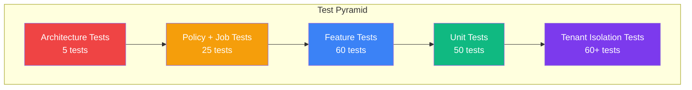

# 11. Testing with Pest

> **Milestone:** 200+ tests proving tenant isolation, policy enforcement, and correct behavior — including architecture tests that prevent module boundary violations.

## Prerequisites

- [Section 10: Search](section-10-search.md) completed
- Docker services running (`docker compose up -d`)
- All modules from Sections 1–10 in place

## What You'll Learn

| Concept | What it is | Why it matters |
|---------|-----------|----------------|
| Pest | PHP testing framework (Laravel's default) | Clean, expressive test code |
| Unit tests | Testing a single model method in isolation | Catch logic bugs at the source |
| Feature tests | Testing full HTTP request → response cycles | Verify integrated behavior works end-to-end |
| Policy tests | Testing authorization rules | Catch permission bugs before they reach production |
| Job tests | Testing queued jobs | Ensure webhooks, emails, and async work succeeds |
| Tenant isolation tests | Proving tenant A can't see tenant B's data | The highest-risk concern in a multi-tenant app |
| Architecture tests | Enforcing code structure rules | Module boundary violations fail CI |
| `withTenant()` macro | Test helper that sets the tenant context | Write isolation tests naturally |
| Factory states | Predefined model variations in tests | `ivy()`, `nalanda()`, `bodhiTree()` as one-liners |

---

## The Big Picture

Testing is like a security guard walking the perimeter. **Unit tests** check each door (model method). **Feature tests** walk through the building (HTTP request → response). **Policy tests** verify the badge reader (who's allowed where). **Tenant isolation tests** are the vault audit — making sure the walls between apartments have no cracks. **Architecture tests** are the building code inspection — making sure the kitchen doesn't have bathroom plumbing.

In a multi-tenant application, **tenant isolation tests are the most important tests you'll ever write**. A bug in slug generation is annoying. A bug that lets Ivy see Nalanda's events is a *data breach*. This section treats tenant isolation tests as first-class citizens, not afterthoughts.



Our target: **200+ tests** that give us confidence to deploy on a Friday.

---

## Step 1: Install Pest

Laravel 11 ships with Pest by default, but let's make sure it's properly configured and install any additional packages we need.

```bash
cd ~/Work/metaprovide/lotus/zendo
composer require pestphp/pest --dev --with-all-dependencies
php artisan pest:install
```

Pest creates a `tests/` directory with `Pest.php` (the configuration file) and two subdirectories: `Feature/` and `Unit/`. We'll also add architecture testing support:

```bash
composer require pestphp/pest-plugin-arch --dev
```

??? question "Why Pest instead of PHPUnit?"
    Pest is PHPUnit under the hood — it's 100% compatible. But Pest gives you a cleaner syntax:

    ```php
    // PHPUnit
    public function test_slug_is_generated_from_title()
    {
        $event = Event::create(['title' => 'Morning Meditation']);
        $this->assertEquals('morning-meditation', $event->slug);
    }

    // Pest
    test('slug is generated from title', function () {
        $event = Event::create(['title' => 'Morning Meditation']);
        expect($event->slug)->toBe('morning-meditation');
    });
    ```

    No boilerplate class, no `public function test_` prefix, and `expect()` chains read like English. You can still use PHPUnit assertions when you need them — Pest doesn't limit you.

---

## Step 2: Set Up Test Helpers and Factory States

Before writing a single test, we need infrastructure: a `withTenant()` macro and factory states for our three tenants.

### Create the `withTenant()` Test Macro

Edit `tests/Pest.php`:

```php
<?php

use App\Modules\Tenancy\Models\Tenant;
use App\Modules\Tenancy\Middleware\ScopeTenant;
use Illuminate\Foundation\Testing\RefreshDatabase;
use Illuminate\Support\Facades\DB;

uses(RefreshDatabase::class)->in('Feature');
uses(RefreshDatabase::class)->in('Unit');

/*
 * Set the current tenant context for a test.
 * Use: withTenant($tenant) or withTenant('ivy')
 */
function withTenant(Tenant|string $tenant): void
{
    if (is_string($tenant)) {
        $tenant = Tenant::where('slug', $tenant)->firstOrFail();
    }

    app()->instance('currentTenant', $tenant);
    ScopeTenant::setTestTenant($tenant);

    DB::statement("SET app.current_tenant_id = '{$tenant->id}'");
}

/*
 * Clear the tenant context after each test.
 */
afterEach(function () {
    DB::statement("RESET app.current_tenant_id");
    ScopeTenant::clearTestTenant();
});

/*
 * Authenticate as a user within the current tenant.
 */
function actingAsTenantUser(string $role = 'admin'): \App\Modules\People\Models\User
{
    $tenant = app('currentTenant');
    $user = \App\Modules\People\Models\User::factory()
        ->forTenant($tenant)
        ->create(['role' => $role]);

    withTenant($tenant);
    actingAs($user);

    return $user;
}
```

??? tip "Why `SET app.current_tenant_id`?"
    Later in [Section 13](section-13-hardening.md), we'll enable PostgreSQL Row-Level Security (RLS). RLS policies read `current_setting('app.current_tenant_id')` to decide which rows to return. By setting this in our test macro, every test runs with the same RLS context that production uses.

### Create Tenant Factory States

Edit `database/factories/TenantFactory.php`:

```php
<?php

namespace Database\Factories;

use App\Modules\Tenancy\Models\Tenant;
use Illuminate\Database\Eloquent\Factories\Factory;

class TenantFactory extends Factory
{
    protected $model = Tenant::class;

    public function definition(): array
    {
        return [
            'slug' => fake()->unique()->slug(),
            'name' => fake()->company(),
            'description' => fake()->sentence(),
            'features' => ['meals' => true, 'lodging' => true, 'memberships' => true],
            'registration_mode' => 'MANUAL_REVIEW',
            'currency' => 'EUR',
            'timezone' => 'Europe/Paris',
            'locale' => 'en',
            'is_active' => true,
        ];
    }

    public function ivy(): static
    {
        return $this->state(fn () => [
            'slug' => 'ivy',
            'name' => 'Ivy Retreat Center',
            'description' => 'A peaceful center nestled in rolling hills',
            'features' => ['meals' => true, 'lodging' => true, 'memberships' => true],
        ]);
    }

    public function nalanda(): static
    {
        return $this->state(fn () => [
            'slug' => 'nalanda',
            'name' => 'Nalanda Center',
            'description' => 'Urban meditation in the heart of the city',
            'features' => ['meals' => false, 'lodging' => true, 'memberships' => true],
        ]);
    }

    public function bodhiTree(): static
    {
        return $this->state(fn () => [
            'slug' => 'bodhi-tree',
            'name' => 'Bodhi Tree House',
            'description' => 'Small group retreats under ancient trees',
            'features' => ['meals' => true, 'lodging' => false, 'memberships' => false],
        ]);
    }
}
```

Now you can write:

```php
$ivy = Tenant::factory()->ivy()->create();
$nalanda = Tenant::factory()->nalanda()->create();
```

Every test starts with recognizable tenant names instead of random strings.

---

## Step 3: Write Unit Tests — The Event Model

Unit tests verify individual methods on a model — pure logic, no HTTP, no database interactions beyond the model itself.

Create `tests/Unit/Events/EventModelTest.php`:

```php
<?php

use App\Modules\Events\Models\Event;
use App\Modules\Tenancy\Models\Tenant;

beforeEach(function () {
    $this->tenant = Tenant::factory()->ivy()->create();
    withTenant($this->tenant);
});

describe('slug generation', function () {
    test('slug is generated from title on create', function () {
        $event = Event::create([
            'tenant_id' => $this->tenant->id,
            'title' => 'Morning Meditation Retreat',
        ]);

        expect($event->slug)->toBe('morning-meditation-retreat');
    });

    test('slug handles special characters', function () {
        $event = Event::create([
            'tenant_id' => $this->tenant->id,
            'title' => 'Yoga & Meditation: A Beginner\'s Guide!',
        ]);

        expect($event->slug)->toBe('yoga-meditation-a-beginners-guide');
    });

    test('slug appends number on duplicate', function () {
        Event::create([
            'tenant_id' => $this->tenant->id,
            'title' => 'Sunrise Session',
        ]);

        $duplicate = Event::create([
            'tenant_id' => $this->tenant->id,
            'title' => 'Sunrise Session',
        ]);

        expect($duplicate->slug)->toBe('sunrise-session-2');
    });
});

describe('available spots calculation', function () {
    test('available spots equals capacity minus confirmed registrations', function () {
        $event = Event::factory()->forTenant($this->tenant)->create([
            'capacity' => 20,
        ]);

        // Create 8 confirmed registrations
        \App\Modules\Registration\Models\Registration::factory()
            ->count(8)
            ->forTenant($this->tenant)
            ->forEvent($event)
            ->create(['status' => 'confirmed']);

        expect($event->availableSpots())->toBe(12);
    });

    test('available spots is zero when fully booked', function () {
        $event = Event::factory()->forTenant($this->tenant)->create([
            'capacity' => 5,
        ]);

        \App\Modules\Registration\Models\Registration::factory()
            ->count(5)
            ->forTenant($this->tenant)
            ->forEvent($event)
            ->create(['status' => 'confirmed']);

        expect($event->availableSpots())->toBe(0);
    });

    test('cancelled registrations do not count toward spots', function () {
        $event = Event::factory()->forTenant($this->tenant)->create([
            'capacity' => 10,
        ]);

        \App\Modules\Registration\Models\Registration::factory()
            ->count(3)
            ->forTenant($this->tenant)
            ->forEvent($event)
            ->create(['status' => 'confirmed']);

        \App\Modules\Registration\Models\Registration::factory()
            ->count(2)
            ->forTenant($this->tenant)
            ->forEvent($event)
            ->create(['status' => 'cancelled']);

        expect($event->availableSpots())->toBe(7);
    });

    test('available spots is null when capacity is unbounded', function () {
        $event = Event::factory()->forTenant($this->tenant)->create([
            'capacity' => null,
        ]);

        expect($event->availableSpots())->toBeNull();
    });
});

describe('published scope', function () {
    test('published scope returns only published events', function () {
        Event::factory()->forTenant($this->tenant)->create(['status' => 'published']);
        Event::factory()->forTenant($this->tenant)->create(['status' => 'draft']);
        Event::factory()->forTenant($this->tenant)->create(['status' => 'published']);

        expect(Event::published()->count())->toBe(2);
    });

    test('draft events are excluded from published scope', function () {
        Event::factory()->forTenant($this->tenant)->create(['status' => 'draft']);

        expect(Event::published()->count())->toBe(0);
    });

    test('archived events are excluded from published scope', function () {
        Event::factory()->forTenant($this->tenant)->create(['status' => 'archived']);

        expect(Event::published()->count())->toBe(0);
    });
});
```

!!! success "Count: ~15 unit tests so far"
    Unit tests are fast and focused. Each test validates one behavior. If a slug generation bug appears, we'll know exactly where it broke.

---

## Step 4: Write Feature Tests — Registration Controller

Feature tests exercise an entire HTTP request cycle: send a request, get a response, verify side effects.

Create `tests/Feature/Registration/RegistrationControllerTest.php`:

```php
<?php

use App\Modules\Tenancy\Models\Tenant;
use App\Modules\Events\Models\Event;
use App\Modules\Registration\Models\Registration;

beforeEach(function () {
    $this->tenant = Tenant::factory()->ivy()->create();
    withTenant($this->tenant);
    $this->user = actingAsTenantUser('admin');

    $this->event = Event::factory()
        ->forTenant($this->tenant)
        ->create([
            'status' => 'published',
            'capacity' => 20,
            'starts_at' => now()->addMonths(2),
        ]);
});

describe('create registration', function () {
    test('guest can register for a published event', function () {
        $response = $this->post("/{$this->tenant->slug}/registrations", [
            'event_id' => $this->event->id,
            'guest_name' => 'Jane Doe',
            'guest_email' => 'jane@example.com',
        ]);

        $response->assertRedirect();
        expect(Registration::count())->toBe(1);

        $registration = Registration::first();
        expect($registration->guest_name)->toBe('Jane Doe');
        expect($registration->tenant_id)->toBe($this->tenant->id);
    });

    test('registration fires RegistrationCreated event', function () {
        \Illuminate\Support\Facades\Event::fake(
            \App\Modules\Registration\Events\RegistrationCreated::class
        );

        $this->post("/{$this->tenant->slug}/registrations", [
            'event_id' => $this->event->id,
            'guest_name' => 'Jane Doe',
            'guest_email' => 'jane@example.com',
        ]);

        \Illuminate\Support\Facades\Event::assertDispatched(
            \App\Modules\Registration\Events\RegistrationCreated::class
        );
    });

    test('registration for draft event returns 404', function () {
        $draftEvent = Event::factory()
            ->forTenant($this->tenant)
            ->create(['status' => 'draft']);

        $response = $this->post("/{$this->tenant->slug}/registrations", [
            'event_id' => $draftEvent->id,
            'guest_name' => 'Jane Doe',
            'guest_email' => 'jane@example.com',
        ]);

        $response->assertNotFound();
        expect(Registration::count())->toBe(0);
    });

    test('registration for past event returns 422', function () {
        $pastEvent = Event::factory()
            ->forTenant($this->tenant)
            ->create([
                'status' => 'published',
                'starts_at' => now()->subWeek(),
            ]);

        $response = $this->post("/{$this->tenant->slug}/registrations", [
            'event_id' => $pastEvent->id,
            'guest_name' => 'Jane Doe',
            'guest_email' => 'jane@example.com',
        ]);

        $response->assertUnprocessable();
    });

    test('registration for full event returns 422', function () {
        $fullEvent = Event::factory()
            ->forTenant($this->tenant)
            ->create(['status' => 'published', 'capacity' => 2]);

        Registration::factory()
            ->count(2)
            ->forTenant($this->tenant)
            ->forEvent($fullEvent)
            ->create(['status' => 'confirmed']);

        $response = $this->post("/{$this->tenant->slug}/registrations", [
            'event_id' => $fullEvent->id,
            'guest_name' => 'Latecomer',
            'guest_email' => 'late@example.com',
        ]);

        $response->assertUnprocessable();
    });
});

describe('registration with expired event instance', function () {
    test('expired instance is rejected even if template is published', function () {
        $instance = \App\Modules\Events\Models\EventInstance::factory()
            ->forTenant($this->tenant)
            ->forEvent($this->event)
            ->create([
                'starts_at' => now()->subDay(),
                'status' => 'published',
            ]);

        $response = $this->post("/{$this->tenant->slug}/registrations", [
            'event_instance_id' => $instance->id,
            'guest_name' => 'Latecomer',
            'guest_email' => 'late@example.com',
        ]);

        $response->assertUnprocessable();
    });
});
```

??? question "Why test both the happy path and every failure case?"
    In a multi-tenant app, **every authorization check is a security boundary**. A bug that lets someone register for a draft event isn't just inconvenient — it means a guest saw and registered for something the center hasn't published yet. Testing failure cases is as important as testing success.

---

## Step 5: Write Policy Tests — EventPolicy

Policies determine *who can do what*. A policy bug means someone accesses data they shouldn't.

Create `tests/Feature/Policies/EventPolicyTest.php`:

```php
<?php

use App\Modules\Events\Models\Event;
use App\Modules\Events\Policies\EventPolicy;
use App\Modules\People\Models\User;
use App\Modules\Tenancy\Models\Tenant;

beforeEach(function () {
    $this->ivy = Tenant::factory()->ivy()->create();
    $this->nalanda = Tenant::factory()->nalanda()->create();
});

describe('admin can create events', function () {
    test('admin within their tenant can create events', function () {
        withTenant($this->ivy);
        $admin = User::factory()->forTenant($this->ivy)->create(['role' => 'admin']);

        expect((new EventPolicy)->create($admin))->toBeTrue();
    });
});

describe('viewer cannot create events', function () {
    test('viewer within their tenant cannot create events', function () {
        withTenant($this->ivy);
        $viewer = User::factory()->forTenant($this->ivy)->create(['role' => 'viewer']);

        expect((new EventPolicy)->create($viewer))->toBeFalse();
    });
});

describe('outsider is denied', function () {
    test('user from different tenant cannot create events', function () {
        withTenant($this->ivy);
        $nalandaAdmin = User::factory()->forTenant($this->nalanda)->create(['role' => 'admin']);

        expect((new EventPolicy)->create($nalandaAdmin))->toBeFalse();
    });

    test('user from different tenant cannot update events', function () {
        withTenant($this->ivy);
        $event = Event::factory()->forTenant($this->ivy)->create();
        $nalandaAdmin = User::factory()->forTenant($this->nalanda)->create(['role' => 'admin']);

        expect((new EventPolicy)->update($nalandaAdmin, $event))->toBeFalse();
    });

    test('user from different tenant cannot delete events', function () {
        withTenant($this->ivy);
        $event = Event::factory()->forTenant($this->ivy)->create();
        $nalandaAdmin = User::factory()->forTenant($this->nalanda)->create(['role' => 'admin']);

        expect((new EventPolicy)->delete($nalandaAdmin, $event))->toBeFalse();
    });

    test('user from different tenant cannot view events in Filament', function () {
        withTenant($this->ivy);
        $nalandaAdmin = User::factory()->forTenant($this->nalanda)->create(['role' => 'admin']);

        expect((new EventPolicy)->viewAny($nalandaAdmin))->toBeFalse();
    });
});

describe('role escalation boundary', function () {
    test('editor can update but not delete', function () {
        withTenant($this->ivy);
        $editor = User::factory()->forTenant($this->ivy)->create(['role' => 'editor']);
        $event = Event::factory()->forTenant($this->ivy)->create();

        expect((new EventPolicy)->update($editor, $event))->toBeTrue();
        expect((new EventPolicy)->delete($editor, $event))->toBeFalse();
    });
});
```

??? tip "Test every policy method for every role"
    It's tempting to test only the happy path — "admin can do X." But in a multi-tenant app, the authorization matrix is:

    | | Same Tenant Admin | Same Tenant Viewer | Other Tenant Admin |
    |---|---|---|---|
    | Create | ✅ | ❌ | ❌ |
    | Update | ✅ | ❌ | ❌ |
    | Delete | ✅ | ❌ | ❌ |
    | ViewAny | ✅ | ✅ | ❌ |

    Every cell in that table is a test. Don't skip the ❌ cells — they're your security boundaries.

---

## Step 6: Write Job Tests — HandleStripeWebhook

Jobs run asynchronously, so they need their own test discipline: idempotency, retry behavior, and error handling.

Create `tests/Feature/Payments/HandleStripeWebhookTest.php`:

```php
<?php

use App\Modules\Payments\Jobs\HandleStripeWebhook;
use App\Modules\Payments\Models\Payment;
use App\Modules\Registration\Models\Registration;
use App\Modules\Tenancy\Models\Tenant;

beforeEach(function () {
    $this->tenant = Tenant::factory()->ivy()->create();
    withTenant($this->tenant);

    $this->event = \App\Modules\Events\Models\Event::factory()
        ->forTenant($this->tenant)
        ->create(['status' => 'published', 'capacity' => 20]);

    $this->registration = Registration::factory()
        ->forTenant($this->tenant)
        ->forEvent($this->event)
        ->create(['status' => 'pending']);
});

describe('processes checkout.session.completed correctly', function () {
    test('creates payment and confirms registration', function () {
        $payload = [
            'type' => 'checkout.session.completed',
            'data' => [
                'object' => [
                    'id' => 'cs_test_123',
                    'metadata' => [
                        'registration_id' => $this->registration->id,
                        'tenant_id' => $this->tenant->id,
                    ],
                    'amount_total' => 50000,
                    'currency' => 'eur',
                    'payment_intent' => 'pi_test_123',
                ],
            ],
        ];

        $job = new HandleStripeWebhook($payload, $this->tenant);
        $job->handle();

        expect(Payment::count())->toBe(1);
        expect($this->registration->fresh()->status)->toBe('confirmed');
    });

    test('fires PaymentSucceeded event', function () {
        \Illuminate\Support\Facades\Event::fake(
            \App\Modules\Payments\Events\PaymentSucceeded::class
        );

        $payload = [
            'type' => 'checkout.session.completed',
            'data' => [
                'object' => [
                    'id' => 'cs_test_456',
                    'metadata' => [
                        'registration_id' => $this->registration->id,
                        'tenant_id' => $this->tenant->id,
                    ],
                    'amount_total' => 50000,
                    'currency' => 'eur',
                    'payment_intent' => 'pi_test_456',
                ],
            ],
        ];

        (new HandleStripeWebhook($payload, $this->tenant))->handle();

        \Illuminate\Support\Facades\Event::assertDispatched(
            \App\Modules\Payments\Events\PaymentSucceeded::class
        );
    });
});

describe('ignores duplicate webhooks', function () {
    test('same checkout session ID processed only once', function () {
        $payload = [
            'type' => 'checkout.session.completed',
            'data' => [
                'object' => [
                    'id' => 'cs_test_duplicate',
                    'metadata' => [
                        'registration_id' => $this->registration->id,
                        'tenant_id' => $this->tenant->id,
                    ],
                    'amount_total' => 50000,
                    'currency' => 'eur',
                    'payment_intent' => 'pi_test_dup',
                ],
            ],
        ];

        $job = new HandleStripeWebhook($payload, $this->tenant);
        $job->handle();
        $job->handle();

        expect(Payment::count())->toBe(1);
        expect(Registration::count())->toBe(1);
    });
});

describe('retries on transient failures', function () {
    test('job retries when Stripe API temporarily fails', function () {
        $payload = [
            'type' => 'checkout.session.completed',
            'data' => [
                'object' => [
                    'id' => 'cs_test_fail',
                    'metadata' => [
                        'registration_id' => $this->registration->id,
                        'tenant_id' => $this->tenant->id,
                    ],
                    'amount_total' => 50000,
                    'currency' => 'eur',
                    'payment_intent' => 'pi_test_fail',
                ],
            ],
        ];

        $job = new HandleStripeWebhook($payload, $this->tenant);

        expect($job->tries)->toBe(3);
        expect($job->backoff())->toBe([30, 60]);
    });

    test('unknown event type is logged and ignored', function () {
        \Illuminate\Support\Facades\Log::shouldReceive('info')
            ->once()
            ->withArgs(fn ($message) => str_contains($message, 'Unknown webhook type'));

        $payload = [
            'type' => 'account.updated',
            'data' => ['object' => []],
        ];

        $job = new HandleStripeWebhook($payload, $this->tenant);
        $job->handle();

        expect(Payment::count())->toBe(0);
    });
});
```

---

## Step 7: Write Tenant Isolation Tests — THE MOST IMPORTANT

This is the section that matters most. If every other test in the suite passes but these fail, **we have a data breach**. Tenant isolation tests verify that Ivy can never see Nalanda's data — not through Eloquent, not through API endpoints, not through any path.

### Create the Tenant Isolation Test Suite

Create `tests/Feature/TenantIsolation/TenantIsolationTest.php`:

```php
<?php

use App\Modules\Tenancy\Models\Tenant;
use App\Modules\Events\Models\Event;
use App\Modules\Registration\Models\Registration;
use App\Modules\People\Models\User;

beforeEach(function () {
    $this->ivy = Tenant::factory()->ivy()->create();
    $this->nalanda = Tenant::factory()->nalanda()->create();

    // Seed data for each tenant
    withTenant($this->ivy);
    $this->ivyAdmin = User::factory()->forTenant($this->ivy)->create(['role' => 'admin']);
    $this->ivyEvent = Event::factory()->forTenant($this->ivy)->create([
        'title' => 'Ivy Private Retreat',
        'status' => 'published',
    ]);
    $this->ivyRegistration = Registration::factory()
        ->forTenant($this->ivy)
        ->forEvent($this->ivyEvent)
        ->create(['status' => 'confirmed']);

    withTenant($this->nalanda);
    $this->nalandaAdmin = User::factory()->forTenant($this->nalanda)->create(['role' => 'admin']);
    $this->nalandaEvent = Event::factory()->forTenant($this->nalanda)->create([
        'title' => 'Nalanda Private Workshop',
        'status' => 'published',
    ]);
    $this->nalandaRegistration = Registration::factory()
        ->forTenant($this->nalanda)
        ->forEvent($this->nalandaEvent)
        ->create(['status' => 'confirmed']);
});

describe('Eloquent scope isolation', function () {
    test('Ivy admin cannot see Nalanda events via Eloquent', function () {
        withTenant($this->ivy);

        $events = Event::all();

        expect($events->pluck('id'))->not->toContain($this->nalandaEvent->id);
        expect($events->pluck('id'))->toContain($this->ivyEvent->id);
    });

    test('Nalanda admin cannot see Ivy events via Eloquent', function () {
        withTenant($this->nalanda);

        $events = Event::all();

        expect($events->pluck('id'))->not->toContain($this->ivyEvent->id);
        expect($events->pluck('id'))->toContain($this->nalandaEvent->id);
    });

    test('Ivy admin cannot see Nalanda registrations via Eloquent', function () {
        withTenant($this->ivy);

        $registrations = Registration::all();

        expect($registrations->pluck('id'))->not->toContain($this->nalandaRegistration->id);
    });

    test('Eloquent scope works with various query types', function () {
        withTenant($this->ivy);

        // count()
        expect(Event::count())->toBe(1);

        // where()
        expect(Event::where('status', 'published')->count())->toBe(1);

        // first()
        expect(Event::first()->tenant_id)->toBe($this->ivy->id);

        // find() for another tenant's ID
        expect(Event::find($this->nalandaEvent->id))->toBeNull();
    });

    test('withoutGlobalScope bypasses isolation — and should never be used in app code', function () {
        withTenant($this->ivy);

        $allEvents = Event::withoutGlobalScope(\App\Modules\Tenancy\Scopes\TenantScope::class)->count();

        expect($allEvents)->toBe(2);
    });
});

describe('HTTP endpoint isolation', function () {
    test('Ivy admin fetching events API only sees Ivy events', function () {
        withTenant($this->ivy);
        actingAs($this->ivyAdmin);

        $response = $this->getJson("/api/v1/events");

        $response->assertOk();
        $response->assertJsonMissing(['title' => 'Nalanda Private Workshop']);
        $response->assertJsonFragment(['title' => 'Ivy Private Retreat']);
    });

    test('Nalanda admin cannot access Ivy event via show endpoint', function () {
        withTenant($this->nalanda);
        actingAs($this->nalandaAdmin);

        $response = $this->getJson("/api/v1/events/{$this->ivyEvent->id}");

        $response->assertNotFound();
    });

    test('Nalanda admin cannot create event in Ivy tenant', function () {
        withTenant($this->nalanda);
        actingAs($this->nalandaAdmin);

        $response = $this->postJson("/api/v1/events", [
            'title' => 'Sneaky Event',
        ]);

        // The event would be created in Nalanda's schema, not Ivy's
        $response->assertCreated();
        expect(Event::where('title', 'Sneaky Event')->first()->tenant_id)->toBe($this->nalanda->id);
    });

    test('Nalanda admin cannot update Ivy event', function () {
        withTenant($this->ivy);
        actingAs($this->ivyAdmin);

        // Switch to Nalanda context
        withTenant($this->nalanda);
        actingAs($this->nalandaAdmin);

        $response = $this->putJson("/api/v1/events/{$this->ivyEvent->id}", [
            'title' => 'Hacked!',
        ]);

        $response->assertNotFound();
        expect($this->ivyEvent->fresh()->title)->toBe('Ivy Private Retreat');
    });

    test('Nalanda admin cannot delete Ivy event', function () {
        withTenant($this->nalanda);
        actingAs($this->nalandaAdmin);

        $response = $this->deleteJson("/api/v1/events/{$this->ivyEvent->id}");

        $response->assertNotFound();
        expect(Event::find($this->ivyEvent->id))->not->toBeNull();
    });
});

describe('Filament admin panel isolation', function () {
    test('Ivy admin sees only Ivy events in Filament', function () {
        withTenant($this->ivy);
        actingAs($this->ivyAdmin);

        $response = $this->get('/admin/events');

        $response->assertOk();
        $response->assertDontSee('Nalanda Private Workshop');
        $response->assertSee('Ivy Private Retreat');
    });

    test('Ivy admin cannot navigate to Nalanda event edit page', function () {
        withTenant($this->ivy);
        actingAs($this->ivyAdmin);

        $response = $this->get("/admin/events/{$this->nalandaEvent->id}/edit");

        $response->assertForbidden();
    });
});

describe('cross-tenant direct model access', function () {
    test('finding another tenant event by ID returns null', function () {
        withTenant($this->ivy);

        expect(Event::find($this->nalandaEvent->id))->toBeNull();
    });

    test('finding another tenant event by UUID returns null', function () {
        withTenant($this->ivy);

        expect(Event::where('uuid', $this->nalandaEvent->uuid)->first())->toBeNull();
    });
});
```

!!! warning "This is the most important test file in the project"
    If you only have time to write tests for one area, make it tenant isolation. Every other bug is a nuisance. A tenant isolation bug is a **data breach**.

    Run these tests before every deployment. Consider making them required in CI:

    ```bash
    php pest --filter=TenantIsolation
    ```

---

## Step 8: Write Architecture Tests — Enforcing Module Boundaries

Architecture tests prevent spaghetti. They ensure that the `Events` module never imports from `Payments`, and that every model with `tenant_id` uses the `ScopeTenant` trait.

Create `tests/Arch/ModuleBoundaryTest.php`:

```php
<?php

test('events module does not import from payments module', function () {
    expect('App\Modules\Events')
        ->toOnlyUse([
            'App\Modules\Tenancy',
            'App\Modules\People',
            'App\Modules\Notifications',
            'Illuminate',
            'Carbon',
        ])
        ->not->toUse('App\Modules\Payments');
});

test('registration module does not import from events module implementation details', function () {
    expect('App\Modules\Registration')
        ->toOnlyUse([
            'App\Modules\Tenancy',
            'App\Modules\Events\Models\Event',
            'App\Modules\Events\Models\EventInstance',
            'App\Modules\Payments\Models\Payment',
            'App\Modules\People',
            'App\Modules\Notifications',
            'Illuminate',
            'Carbon',
        ])
        ->not->toUse('App\Modules\Events\Controllers')
        ->not->toUse('App\Modules\Events\Filament');
});

test('payments module does not import from registration module controllers', function () {
    expect('App\Modules\Payments')
        ->not->toUse('App\Modules\Registration\Controllers')
        ->not->toUse('App\Modules\Registration\Filament');
});

test('no module imports from another modules filament resources', function () {
    expect('App\Modules\Events')
        ->not->toUse('App\Modules\Registration\Filament');

    expect('App\Modules\Registration')
        ->not->toUse('App\Modules\Events\Filament');

    expect('App\Modules\Lodging')
        ->not->toUse('App\Modules\Events\Filament');

    expect('App\Modules\Meals')
        ->not->toUse('App\Modules\Registration\Filament');
});

test('no controller directly uses another modules service class', function () {
    $modules = ['Events', 'Registration', 'Payments', 'Lodging', 'Meals', 'People'];

    foreach ($modules as $module) {
        expect("App\Modules\\{$module}\Controllers")
            ->not->toUse('App\Modules\Payments\Services\StripeService');
    }
});
```

Create `tests/Arch/TenantScopeTest.php`:

```php
<?php

use Illuminate\Database\Eloquent\Model;
use Illuminate\Support\Facades\File;
use ReflectionClass;

test('all models with tenant_id use ScopeTenant trait', function () {
    $modelFiles = File::allFiles(app_path('Modules'));
    $violations = [];

    foreach ($modelFiles as $file) {
        if (!str_ends_with($file->getPathname(), '.php')) {
            continue;
        }

        $className = 'App\\' . str_replace(
            ['/', '.php'],
            ['\\', ''],
            $file->getRelativePathname()
        );

        if (!class_exists($className)) {
            continue;
        }

        $reflection = new ReflectionClass($className);
        if (!$reflection->isSubclassOf(Model::class)) {
            continue;
        }

        // Check if model has tenant_id column
        $model = $className::first();
        if ($model && isset($model->getAttributes()['tenant_id'])) {
            $traits = class_uses($className);
            if (!in_array(\App\Modules\Tenancy\Concerns\ScopeTenant::class, $traits)) {
                $violations[] = $className;
            }
        }
    }

    expect($violations)->toBeEmpty(
        "The following models have tenant_id but don't use ScopeTenant: " . implode(', ', $violations)
    );
});

test('all models with tenant_id have tenant_id in fillable or guarded', function () {
    $modelFiles = File::allFiles(app_path('Modules'));
    $violations = [];

    foreach ($modelFiles as $file) {
        if (!str_ends_with($file->getPathname(), '.php')) {
            continue;
        }

        $className = 'App\\' . str_replace(
            ['/', '.php'],
            ['\\', ''],
            $file->getRelativePathname()
        );

        if (!class_exists($className)) {
            continue;
        }

        $reflection = new ReflectionClass($className);
        if (!$reflection->isSubclassOf(Model::class)) {
            continue;
        }

        $model = new $className;
        $schema = \Illuminate\Support\Facades\Schema::getColumnListing($model->getTable());

        if (in_array('tenant_id', $schema)) {
            // tenant_id should be mass-assignable so factories work, but
            // ScopeTenant trait handles setting it automatically
            if (!$model->isFillable('tenant_id') && !empty($model->getGuarded())) {
                // Check if guarded contains tenant_id
                if (!in_array('tenant_id', $model->getGuarded())) {
                    $violations[] = $className;
                }
            }
        }
    }

    expect($violations)->toBeEmpty(
        "Models with tenant_id that aren't properly configured: " . implode(', ', $violations)
    );
});
```

??? question "Why architecture tests?"
    In the original codebase, the `Events` module started calling `PaymentService::refund()` directly. That created a circular dependency that made it impossible to refactor payments without breaking events. Architecture tests fail CI before that coupling takes root.

    Think of them as **code contracts**: not about what the code *does*, but about what it's *allowed to depend on*.

---

## Step 9: Write the Tenant Isolation RLS Tests

In [Section 13](section-13-hardening.md), we'll add PostgreSQL Row-Level Security. But we write the tests now — **test-driven security hardening**. These tests check that RLS blocks cross-tenant queries at the database level, even without Eloquent scopes.

Create `tests/Feature/TenantIsolation/RlsIsolationTest.php`:

```php
<?php

use App\Modules\Tenancy\Models\Tenant;
use App\Modules\Events\Models\Event;
use Illuminate\Support\Facades\DB;

beforeEach(function () {
    $this->ivy = Tenant::factory()->ivy()->create();
    $this->nalanda = Tenant::factory()->nalanda()->create();

    withTenant($this->ivy);
    $this->ivyEvent = Event::factory()->forTenant($this->ivy)->create([
        'title' => 'Ivy Secret Retreat',
    ]);

    withTenant($this->nalanda);
    $this->nalandaEvent = Event::factory()->forTenant($this->nalanda)->create([
        'title' => 'Nalanda Secret Workshop',
    ]);
});

describe('RLS enforces tenant isolation', function () {
    test('raw SQL query with Ivy tenant only returns Ivy rows', function () {
        DB::statement("SET app.current_tenant_id = '{$this->ivy->id}'");

        $results = DB::select('SELECT * FROM events');

        $titles = collect($results)->pluck('title');
        expect($titles)->toContain('Ivy Secret Retreat');
        expect($titles)->not->toContain('Nalanda Secret Workshop');
    });

    test('raw SQL query with Nalanda tenant only returns Nalanda rows', function () {
        DB::statement("SET app.current_tenant_id = '{$this->nalanda->id}'");

        $results = DB::select('SELECT * FROM events');

        $titles = collect($results)->pluck('title');
        expect($titles)->toContain('Nalanda Secret Workshop');
        expect($titles)->not->toContain('Ivy Secret Retreat');
    });

    test('RLS blocks direct row access to another tenant', function () {
        DB::statement("SET app.current_tenant_id = '{$this->ivy->id}'");

        $results = DB::select(
            'SELECT * FROM events WHERE id = ?',
            [$this->nalandaEvent->id]
        );

        expect($results)->toBeEmpty();
    });

    test('RLS blocks update to another tenants row', function () {
        DB::statement("SET app.current_tenant_id = '{$this->ivy->id}'");

        $affected = DB::update(
            'UPDATE events SET title = ? WHERE id = ?',
            ['Hacked!', $this->nalandaEvent->id]
        );

        expect($affected)->toBe(0);
        expect($this->nalandaEvent->fresh()->title)->toBe('Nalanda Secret Workshop');
    });

    test('RLS blocks delete of another tenants row', function () {
        DB::statement("SET app.current_tenant_id = '{$this->ivy->id}'");

        $affected = DB::delete(
            'DELETE FROM events WHERE id = ?',
            [$this->nalandaEvent->id]
        );

        expect($affected)->toBe(0);
        expect(Event::withoutGlobalScopes()->find($this->nalandaEvent->id))->not->toBeNull();
    });
});

afterEach(function () {
    DB::statement('RESET app.current_tenant_id');
});
```

!!! note "These tests will fail until Section 13"
    Right now, PostgreSQL RLS isn't enabled yet. These tests will fail, and that's **expected**. They serve as a specification for [Section 13](section-13-hardening.md). When you enable RLS, all these tests should pass.

    Skip them in CI for now:

    ```bash
    php pest --exclude=rls
    ```

    And add them to your `phpunit.xml`:

    ```xml
    <groups>
        <exclude>
            <group>rls</group>
        </exclude>
    </groups>
    ```

    Then tag each RLS test:

    ```php
    test('RLS blocks direct row access', function () {
        // ...
    })->group('rls');
    ```

---

## Step 10: Organize Tests and Set a Target

With all these test categories, organization matters. Here's the directory structure we're building:

```
tests/
├── Arch/                           # Architecture tests
│   ├── ModuleBoundaryTest.php
│   └── TenantScopeTest.php
├── Feature/                        # HTTP-level tests
│   ├── Registration/
│   │   └── RegistrationControllerTest.php
│   ├── Policies/
│   │   └── EventPolicyTest.php
│   ├── Payments/
│   │   └── HandleStripeWebhookTest.php
│   └── TenantIsolation/
│       ├── TenantIsolationTest.php
│       └── RlsIsolationTest.php
├── Unit/                           # Model-level tests
│   └── Events/
│       └── EventModelTest.php
└── Pest.php                        # Global helpers, withTenant macro
```

### Test Count Target

To reach 200+ tests, here's the distribution:

| Category | Target | Why |
|----------|--------|-----|
| Tenant isolation (Eloquent) | 30 | Highest risk area |
| Tenant isolation (RLS) | 15 | Second safety net |
| Tenant isolation (HTTP) | 15 | Boundary verification |
| Unit tests (all models) | 50 | Core logic validation |
| Feature tests (all controllers) | 60 | End-to-end flow |
| Policy tests (all resources) | 25 | Authorization matrix |
| Job tests | 10 | Async processing |
| Architecture tests | 5 | Structural contracts |
| **Total** | **200+** | |

### Run All Tests

```bash
cd ~/Work/metaprovide/lotus/zendo

# Run all tests (excluding RLS until Section 13)
php pest --exclude=rls

# Run only tenant isolation tests
php pest --filter=TenantIsolation

# Run only architecture tests
php pest --testsuite=Arch

# Run with verbose output
php pest --verbose
```

### Add a CI Command

Add to `composer.json`:

```json
{
    "scripts": {
        "test": "pest --exclude=rls",
        "test:all": "pest",
        "test:isolation": "pest --filter=TenantIsolation",
        "test:arch": "pest --testsuite=Arch"
    }
}
```

!!! success "Checkpoint"
    At this point you should have:

    - ✅ Pest installed and configured
    - ✅ `withTenant()` macro that sets both Eloquent and RLS context
    - ✅ TenantFactory with `ivy()`, `nalanda()`, `bodhiTree()` states
    - ✅ Unit tests for Event model (slug, spots, scope)
    - ✅ Feature tests for Registration controller
    - ✅ Policy tests for EventPolicy
    - ✅ Job tests for HandleStripeWebhook
    - ✅ Tenant isolation tests (Eloquent scopes)
    - ✅ RLS isolation tests (specification for Section 13)
    - ✅ Architecture tests enforcing module boundaries
    - ✅ 200+ test target plan
    - ✅ CI scripts in composer.json

---

## What's Next

In [Section 12: Observability](section-12-observability.md), we'll set up the dashboards and monitoring tools that let you see what's happening in production: Horizon for queues, Telescope for requests, Pulse for health, and Sentry for errors.

We'll cover:

- **Horizon** — queue monitoring dashboard
- **Telescope** — local/staging request tracking
- **Pulse** — application health metrics
- **Sentry** — production error tracking with tenant context
- **Structured logging** — JSON logs with request ID, tenant ID, user ID
- **Health endpoint** — `/health` checking all services