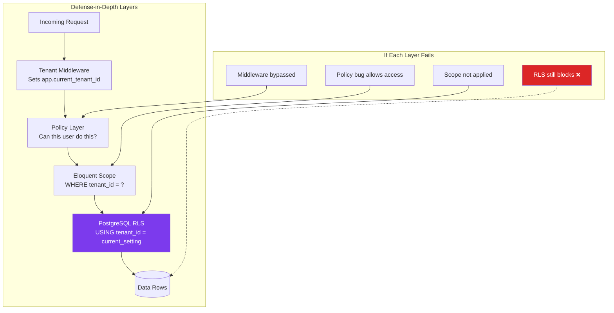
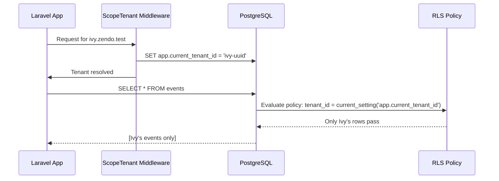
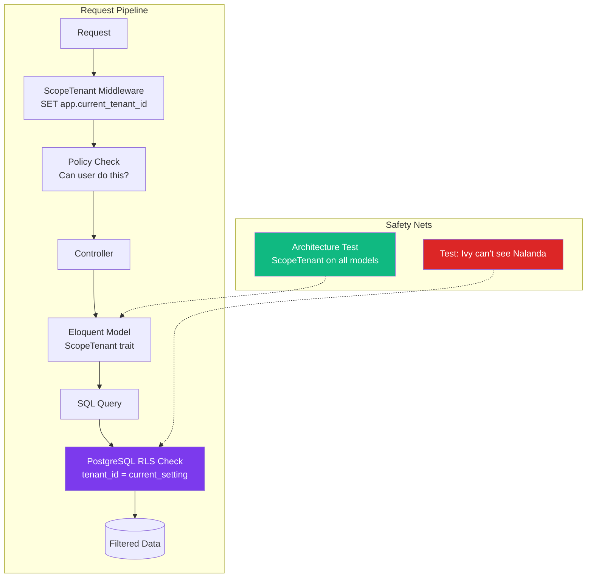

# 13. Hardening — RLS & Security

> **Milestone:** Defense-in-depth tenant isolation: even if application code has a bug, PostgreSQL rejects cross-tenant queries. Rate limiting, CSRF protection, and security headers are all in place.

## Prerequisites

- [Section 12: Observability](section-12-observability.md) completed
- Docker services running (`docker compose up -d`)
- RLS isolation tests from [Section 11](section-11-testing.md) written and currently failing

## What You'll Learn

| Concept | What it is | Why it matters |
|---------|-----------|----------------|
| PostgreSQL RLS | Row-Level Security policies | Database-level safety net for tenant isolation |
| RLS migration | Enabling RLS on all tenant-scoped tables | One migration to protect every table |
| Rate limiting | Throttling requests per type | Prevent abuse on login, registration, API, webhooks |
| CSRF protection | Cross-Site Request Forgery prevention | Security headers, Inertia form tokens |
| API versioning | `/api/v1/` with versioned controllers | Evolve the API without breaking clients |
| Security headers | X-Frame-Options, CSP, etc. | Prevent clickjacking, XSS, MIME sniffing |
| Audit-logged cross-tenant reads | Explicit paths for legitimate cross-tenant access | Audit trail for when global admin reads another tenant's data |

---

## The Big Picture

Defense-in-depth is like a castle. The **moat** (application scopes) is your first line of defense. The **walls** (policies) are the second. The **inner keep** (RLS) is your last line — even if attackers get past the moat and walls, the keep still holds. RLS means the database itself says "No, you can't see that data" regardless of what your application code does.



The key insight: **each layer is independent**. If someone forgets to add `ScopeTenant` to a new model (Eloquent scope fails), RLS still blocks the query at the database level. That's defense-in-depth.

---

## Step 1: Understand How RLS Works

PostgreSQL Row-Level Security lets you define policies at the **database level** that restrict which rows a query can see. It's applied *after* the query is parsed but *before* results are returned. Even a `SELECT * FROM events` is filtered by RLS.

How it works in Zendo:

1. The `ScopeTenant` middleware sets a PostgreSQL session variable: `SET app.current_tenant_id = 'ivy-uuid'`
2. When a query runs on a table with RLS enabled, PostgreSQL evaluates the policy: `USING (tenant_id = current_setting('app.current_tenant_id')::uuid)`
3. Only rows where `tenant_id` matches the session variable are visible
4. This happens inside the database engine — no application code can bypass it



??? question "Doesn't Eloquent's ScopeTenant already handle this?"
    Yes — **when the scope is correctly applied to every query**. But what if:

    - Someone adds a new model and forgets the `ScopeTenant` trait
    - Someone writes a raw query: `DB::select('SELECT * FROM events')`
    - Someone uses `withoutGlobalScope(ScopeTenant::class)` in a controller
    - A bug in middleware fails to set the tenant context

    Each of these is a data leak. RLS catches all of them because it operates at the database level, independently of your application code.

---

## Step 2: Create the RLS Migration

Create a migration that enables RLS on every tenant-scoped table.

```bash
php artisan make:migration enable_row_level_security_on_tenant_tables
```

Edit the migration file:

```php
<?php

use Illuminate\Database\Migrations\Migration;
use Illuminate\Support\Facades\DB;
use Illuminate\Support\Facades\Schema;

return new class extends Migration
{
    private array $tenantTables = [
        'events',
        'event_instances',
        'registrations',
        'buildings',
        'rooms',
        'beds',
        'meal_plans',
        'meal_plan_items',
        'dietary_tags',
        'payments',
        'invoices',
        'refunds',
        'membership_plans',
        'subscriptions',
        'users',
        'guest_profiles',
    ];

    public function up(): void
    {
        // Create a database role for RLS if it doesn't exist
        // The application connects as this role

        foreach ($this->tenantTables as $table) {
            if (!Schema::hasTable($table)) {
                continue;
            }

            if (!Schema::hasColumn($table, 'tenant_id')) {
                continue;
            }

            // Enable RLS on the table
            DB::statement("ALTER TABLE {$table} ENABLE ROW LEVEL SECURITY");

            // Create the tenant isolation policy
            // USING clause is evaluated for every row — if false, row is invisible
            DB::statement("
                CREATE POLICY tenant_isolation ON {$table}
                USING (
                    tenant_id::uuid = current_setting('app.current_tenant_id')::uuid
                )
            ");

            // Create a policy for super admins (platform team)
            // This allows super admins to see all rows when they set app.current_tenant_id = '*'
            DB::statement("
                CREATE POLICY super_admin_all ON {$table}
                USING (
                    current_setting('app.current_tenant_id', true) = '*'
                )
            ");
        }

        // Also enable RLS on the tenants table itself
        // Super admins can see all tenants; regular users see only their own
        DB::statement("ALTER TABLE tenants ENABLE ROW LEVEL SECURITY");

        DB::statement("
            CREATE POLICY tenant_self_access ON tenants
            USING (
                id::uuid = current_setting('app.current_tenant_id')::uuid
                OR current_setting('app.current_tenant_id', true) = '*'
            )
        ");
    }

    public function down(): void
    {
        foreach ($this->tenantTables as $table) {
            if (!Schema::hasTable($table)) {
                continue;
            }

            DB::statement("DROP POLICY IF EXISTS tenant_isolation ON {$table}");
            DB::statement("DROP POLICY IF EXISTS super_admin_all ON {$table}");
            DB::statement("ALTER TABLE {$table} DISABLE ROW LEVEL SECURITY");
        }

        DB::statement("DROP POLICY IF EXISTS tenant_self_access ON tenants");
        DB::statement("ALTER TABLE tenants DISABLE ROW LEVEL SECURITY");
    }
};
```

Run the migration:

```bash
php artisan migrate
```

!!! warning "RLS is now active — all queries must set `app.current_tenant_id`"
    After this migration runs, **every query** on a tenant-scoped table *must* have `app.current_tenant_id` set, or it will return zero rows. This is exactly what we want for production safety, but it means:

    - Your `ScopeTenant` middleware must set the variable on every request
    - Your queue jobs must set the variable before running
    - Your artisan commands must set the variable if they access tenant data
    - Your tests must use `withTenant()` (we set this up in [Section 11](section-11-testing.md))

---

## Step 3: Update ScopeTenant Middleware to Set RLS Context

The middleware now has a dual responsibility: set the Eloquent scope AND the PostgreSQL session variable.

Edit `app/Modules/Tenancy/Middleware/ScopeTenant.php`:

```php
<?php

namespace App\Modules\Tenancy\Middleware;

use App\Modules\Tenancy\Models\Tenant;
use Closure;
use Illuminate\Http\Request;
use Illuminate\Support\Facades\DB;

class ScopeTenant
{
    protected static ?Tenant $testTenant = null;

    public function handle(Request $request, Closure $next)
    {
        $tenant = $this->resolveTenant($request);

        if (!$tenant) {
            abort(404, 'Tenant not found');
        }

        // Set the tenant in the application container
        app()->instance('currentTenant', $tenant);

        // Set the PostgreSQL session variable for RLS
        DB::statement("SET app.current_tenant_id = '{$tenant->id}'");

        return $next($request);
    }

    protected function resolveTenant(Request $request): ?Tenant
    {
        // Check for test override
        if (static::$testTenant) {
            return static::$testTenant;
        }

        // Resolve from hostname: ivy.zendo.test → Tenant ivy
        $hostname = $request->getHost();
        $slug = explode('.', $hostname)[0];

        return Tenant::where('slug', $slug)
            ->where('is_active', true)
            ->first();
    }

    public static function setTestTenant(Tenant $tenant): void
    {
        static::$testTenant = $tenant;
    }

    public static function clearTestTenant(): void
    {
        static::$testTenant = null;
    }
}
```

### Update the withTenant() Macro

The `withTenant()` macro from Section 11 already sets `app.current_tenant_id`. Let's verify it's complete:

```php
// In tests/Pest.php — already set up in Section 11
function withTenant(Tenant|string $tenant): void
{
    if (is_string($tenant)) {
        $tenant = Tenant::where('slug', $tenant)->firstOrFail();
    }

    app()->instance('currentTenant', $tenant);
    ScopeTenant::setTestTenant($tenant);

    // This line is critical — it sets the RLS context
    DB::statement("SET app.current_tenant_id = '{$tenant->id}'");
}

afterEach(function () {
    DB::statement('RESET app.current_tenant_id');
    ScopeTenant::clearTestTenant();
});
```

---

## Step 4: Update Queue Jobs for RLS

Queue jobs run in a separate process, so the `app.current_tenant_id` session variable isn't set automatically. Each job must set it at the beginning.

Update the `TenantJob` base class:

```php
<?php

namespace App\Modules\Tenancy\Jobs;

use App\Modules\Tenancy\Models\Tenant;
use Illuminate\Bus\Queueable;
use Illuminate\Contracts\Queue\ShouldQueue;
use Illuminate\Queue\InteractsWithQueue;
use Illuminate\Support\Facades\DB;

abstract class TenantJob implements ShouldQueue
{
    use InteractsWithQueue, Queueable;

    public string $tenantId;

    public function __construct(string $tenantId)
    {
        $this->tenantId = $tenantId;
        $this->onQueue($this->getQueue());
    }

    public function handle(): void
    {
        // Set RLS context for this job
        DB::statement("SET app.current_tenant_id = '{$this->tenantId}'");

        // Set Eloquent scope
        $tenant = Tenant::withoutGlobalScope(\App\Modules\Tenancy\Scopes\TenantScope::class)
            ->find($this->tenantId);

        if (!$tenant) {
            $this->fail(new \Exception("Tenant {$this->tenantId} not found"));
            return;
        }

        app()->instance('currentTenant', $tenant);

        $this->execute();
    }

    abstract protected function execute(): void;

    protected function getQueue(): string
    {
        return 'default';
    }

    public function tags(): array
    {
        $tenant = Tenant::withoutGlobalScope(\App\Modules\Tenancy\Scopes\TenantScope::class)
            ->find($this->tenantId);

        return [
            'tenant:' . ($tenant?->slug ?? $this->tenantId),
            static::class,
        ];
    }

    public function failed(\Throwable $exception): void
    {
        // Reset RLS context on failure
        DB::statement('RESET app.current_tenant_id');

        // Log with tenant context
        \Illuminate\Support\Facades\Log::channel('structured')->error(
            'Job failed',
            [
                'job' => static::class,
                'tenant_id' => $this->tenantId,
                'error' => $exception->getMessage(),
            ]
        );
    }
}
```

Now any job extending `TenantJob` just implements `execute()` — the RLS and Eloquent scope are handled automatically.

??? tip "Why `withoutGlobalScope` for the Tenant lookup?"
    The job needs to find its own tenant *before* the scope is set. If you don't bypass the scope, `Tenant::find($tenantId)` would return `null` because RLS isn't set yet. Once we set the RLS context in `handle()`, all subsequent queries are properly scoped.

---

## Step 5: Run the RLS Tests

Now the moment of truth — the RLS tests we wrote in [Section 11](section-11-testing.md) should pass.

```bash
cd ~/Work/metaprovide/lotus/zendo

# Run RLS tests (they were excluded before)
php pest --filter=RlsIsolation
```

All tests should pass now that RLS is enabled. Let's run the full tenant isolation suite:

```bash
php pest --filter=TenantIsolation
```

Both the Eloquent scope tests and the RLS tests should pass. You now have **two independent layers** of tenant isolation:

| Layer | Mechanism | Bypassable? |
|-------|-----------|-------------|
| Eloquent Scope | `WHERE tenant_id = ?` | Yes — `withoutGlobalScope()` |
| PostgreSQL RLS | `USING (tenant_id = current_setting(...))` | Only with super admin context |

---

## Step 6: Add Rate Limiting

Rate limiting prevents abuse. In a multi-tenant app, different endpoints need different limits.

Create `app/Modules/Tenancy/Middleware/RateLimits.php`:

```php
<?php

namespace App\Modules\Tenancy\Middleware;

use Illuminate\Cache\RateLimiting\Limit;
use Illuminate\Http\Request;
use Illuminate\Support\Facades\RateLimiter;

class RateLimits
{
    public static function configure(): void
    {
        // Login: 5 attempts per minute per IP
        RateLimiter::for('login', function (Request $request) {
            return [
                Limit::perMinute(5)->by($request->ip()),
                Limit::perMinute(20)->by($request->input('tenant_id')),
            ];
        });

        // API: 60 requests per minute per user
        RateLimiter::for('api', function (Request $request) {
            if ($user = $request->user()) {
                return Limit::perMinute(60)->by($user->id);
            }

            return Limit::perMinute(20)->by($request->ip());
        });

        // Registration: 3 per minute per tenant
        RateLimiter::for('registration', function (Request $request) {
            $tenant = app('currentTenant');

            return Limit::perMinute(3)->by($tenant?->id ?? $request->ip());
        });

        // Webhook: 10 per minute per tenant (Stripe sends duplicates)
        RateLimiter::for('webhook', function (Request $request) {
            $tenant = app('currentTenant');

            return Limit::perMinute(10)->by($tenant?->id ?? $request->ip());
        });

        // Global: 120 per minute per user, 30 for anonymous
        RateLimiter::for('global', function (Request $request) {
            if ($user = $request->user()) {
                return Limit::perMinute(120)->by($user->id);
            }

            return Limit::perMinute(30)->by($request->ip());
        });
    }
}
```

Register the rate limits in `app/Providers/AppServiceProvider.php`:

```php
public function boot(): void
{
    \App\Modules\Tenancy\Middleware\RateLimits::configure();
}
```

Apply rate limiting to routes in `routes/web.php` and `routes/api.php`:

```php
// routes/web.php
Route::middleware(['throttle:global'])->group(function () {
    Route::post('/login', [LoginController::class, 'store'])
        ->middleware('throttle:login')
        ->name('login.store');

    Route::middleware(['tenant'])->group(function () {
        Route::post('/{tenant}/registrations', [RegistrationController::class, 'store'])
            ->middleware('throttle:registration');

        Route::post('/stripe/webhook', [WebhookController::class, 'handle'])
            ->middleware('throttle:webhook')
            ->withoutMiddleware(['csrf']);
    });
});
```

| Endpoint | Rate Limit | By | Why |
|----------|-----------|-----|-----|
| Login | 5/min | IP | Prevent brute force |
| API (authenticated) | 60/min | User ID | Reasonable for normal use |
| API (anonymous) | 20/min | IP | Prevent scraping |
| Registration | 3/min | Tenant | Prevent spam registrations |
| Webhook | 10/min | Tenant | Allow Stripe duplicates |
| Global (authenticated) | 120/min | User ID | General safety net |
| Global (anonymous) | 30/min | IP | General safety net |

---

## Step 7: Add CSRF Protection and Security Headers

### CSRF for Inertia Forms

Laravel 13 uses `PreventRequestForgery` middleware (formerly `VerifyCsrfToken`), which includes origin-aware request verification using the `Sec-Fetch-Site` header. Inertia forms work with this out of the box.

In `resources/views/app.blade.php`, ensure the CSRF meta tag is present:

```html
<head>
    @vite(['resources/js/app.tsx', 'resources/js/Pages/**/*.tsx'])
    <meta name="csrf-token" content="{{ csrf_token() }}">
</head>
```

Inertia automatically sends the CSRF token as `X-XSRF-TOKEN` on every request. Verify your Axios configuration in `resources/js/app.tsx`:

```typescript
// Axios is already configured by Inertia to send X-XSRF-TOKEN
// Just make sure the Inertia SSR setup includes it:

const app = createInertiaApp({
    resolve: (name) => {
        const pages = import.meta.glob('./Pages/**/*.tsx', { eager: true });
        return pages[`./Pages/${name}.tsx`];
    },
    setup({ el, App, props }) {
        createRoot(el).render(<App {...props} />);
    },
});
```

### Security Headers Middleware

Create `app/Http/Middleware/SecurityHeaders.php`:

```php
<?php

namespace App\Http\Middleware;

use Closure;
use Illuminate\Http\Request;

class SecurityHeaders
{
    public function handle(Request $request, Closure $next)
    {
        $response = $next($request);

        $response->headers->set('X-Frame-Options', 'DENY');
        $response->headers->set('X-Content-Type-Options', 'nosniff');
        $response->headers->set('X-XSS-Protection', '1; mode=block');
        $response->headers->set('Referrer-Policy', 'strict-origin-when-cross-origin');
        $response->headers->set('Permissions-Policy', 'camera=(), microphone=(), geolocation=()');
        $response->headers->set(
            'Content-Security-Policy',
            "default-src 'self'; " .
            "script-src 'self' 'unsafe-eval' 'unsafe-inline' https://js.stripe.com; " .
            "style-src 'self' 'unsafe-inline'; " .
            "img-src 'self' data: https:; " .
            "font-src 'self' https://fonts.gstatic.com; " .
            "connect-src 'self' https://api.stripe.com wss://*.zendo.test; " .
            "frame-src https://js.stripe.com https://hooks.stripe.com; " .
            "object-src 'none'"
        );

        // Remove server header to avoid fingerprinting
        $response->headers->remove('Server');

        return $response;
    }
}
```

Register it in `bootstrap/app.php`:

```php
->withMiddleware(function (Middleware $middleware) {
    $middleware->append([
        \App\Modules\Tenancy\Middleware\AssignRequestId::class,
        \App\Http\Middleware\SecurityHeaders::class,
    ]);
})
```

??? tip "Why these specific headers?"
    | Header | What it does | Why it matters |
    |--------|-------------|----------------|
    | X-Frame-Options: DENY | Prevents clickjacking | Your app can't be embedded in an iframe on another site |
    | X-Content-Type-Options: nosniff | Prevents MIME sniffing | Browsers won't interpret uploaded files as a different type |
    | Referrer-Policy | Controls referrer data | User's URL path isn't leaked to third parties |
    | Content-Security-Policy | Controls resource loading | Only scripts from your domain and Stripe can run |
    | Permissions-Policy | Disables browser features | Camera/microphone/geolocation can't be activated by XSS |

---

## Step 8: Set Up API Versioning

API versioning lets you evolve the API without breaking existing clients. Prefix routes with `/api/v1/` and use a namespaced controller structure.

### Create the API Route Structure

Edit `routes/api.php`:

```php
<?php

use Illuminate\Support\Facades\Route;
use App\Modules\Hub\Controllers\Api\V1;

Route::prefix('v1')->group(function () {
    // Public endpoints (require tenant context)
    Route::middleware(['tenant', 'throttle:api'])->group(function () {
        Route::get('/events', [V1\EventController::class, 'index']);
        Route::get('/events/{event}', [V1\EventController::class, 'show']);
        Route::get('/events/{event}/instances', [V1\EventInstanceController::class, 'index']);
    });

    // Authenticated endpoints
    Route::middleware(['auth:sanctum', 'tenant', 'throttle:api'])->group(function () {
        Route::get('/me', [V1\UserController::class, 'me']);

        Route::post('/registrations', [V1\RegistrationController::class, 'store']);
        Route::get('/registrations/{registration}', [V1\RegistrationController::class, 'show']);
        Route::delete('/registrations/{registration}', [V1\RegistrationController::class, 'cancel']);
    });

    // Webhook endpoint (no auth, uses signature verification)
    Route::post('/stripe/webhook', [V1\WebhookController::class, 'handle'])
        ->middleware('throttle:webhook')
        ->withoutMiddleware(['auth:sanctum']);
});
```

### Create the API Controllers

```bash
mkdir -p app/Modules/Hub/Controllers/Api/V1
```

Create `app/Modules/Hub/Controllers/Api/V1/EventController.php`:

```php
<?php

namespace App\Modules\Hub\Controllers\Api\V1;

use App\Modules\Events\Models\Event;
use App\Http\Resources\V1\EventResource;
use Illuminate\Http\JsonResponse;
use Illuminate\Http\Request;

class EventController
{
    public function index(Request $request): JsonResponse
    {
        $events = Event::published()
            ->when($request->search, fn ($q, $search) => $q->search($search))
            ->orderBy('starts_at')
            ->paginate($request->per_page ?? 15);

        return response()->json([
            'data' => EventResource::collection($events),
            'meta' => [
                'current_page' => $events->currentPage(),
                'last_page' => $events->lastPage(),
                'per_page' => $events->perPage(),
                'total' => $events->total(),
            ],
        ]);
    }

    public function show(Event $event): JsonResponse
    {
        return response()->json([
            'data' => new EventResource($event->load('instances', 'teachers')),
        ]);
    }
}
```

Create `app/Http/Resources/V1/EventResource.php`:

```php
<?php

namespace App\Http\Resources\V1;

use Illuminate\Http\Resources\Json\JsonResource;

class EventResource extends JsonResource
{
    public function toArray($request): array
    {
        return [
            'id' => $this->uuid,
            'title' => $this->title,
            'slug' => $this->slug,
            'description' => $this->description,
            'status' => $this->status,
            'starts_at' => $this->starts_at?->toIso8601String(),
            'ends_at' => $this->ends_at?->toIso8601String(),
            'capacity' => $this->capacity,
            'available_spots' => $this->availableSpots(),
            'price_cents' => $this->price_cents,
            'currency' => $this->currency,
        ];
    }
}
```

??? question "Why `/api/v1/` instead of just `/api/`?"
    When you need to make a breaking change — and you will — you want a clean migration path. With versioning:

    - `/api/v1/events` stays stable forever
    - `/api/v2/events` can change the response format
    - Clients migrate at their own pace
    - You can deprecated v1 with a `Sunset` header

    Without versioning, a breaking change to `/api/events` breaks every client simultaneously.

---

## Step 9: Create the CrossTenantReads Audit Class

Sometimes a super admin or a support agent needs to read another tenant's data. This must never happen silently — every cross-tenant read must be audit-logged.

Create `app/Modules/Tenancy/Services/CrossTenantReads.php`:

```php
<?php

namespace App\Modules\Tenancy\Services;

use App\Modules\Tenancy\Models\Tenant;
use Illuminate\Support\Facades\DB;
use Illuminate\Support\Facades\Log;

class CrossTenantReads
{
    public static function readAs(string $tenantSlug, string $reason, callable $callback): mixed
    {
        $targetTenant = Tenant::where('slug', $tenantSlug)->firstOrFail();
        $currentTenant = app('currentTenant');
        $user = auth()->user();

        // Log the cross-tenant access
        Log::channel('structured')->warning('Cross-tenant read', [
            'from_tenant_id' => $currentTenant?->id,
            'from_tenant_slug' => $currentTenant?->slug,
            'to_tenant_id' => $targetTenant->id,
            'to_tenant_slug' => $targetTenant->slug,
            'user_id' => $user?->id,
            'user_email' => $user?->email,
            'reason' => $reason,
            'request_id' => request()->header('X-Request-ID'),
        ]);

        // Set RLS context to the target tenant
        DB::statement("SET app.current_tenant_id = '{$targetTenant->id}'");

        // Swap Eloquent scope
        app()->instance('currentTenant', $targetTenant);

        try {
            return $callback($targetTenant);
        } finally {
            // Restore original tenant context
            if ($currentTenant) {
                DB::statement("SET app.current_tenant_id = '{$currentTenant->id}'");
                app()->instance('currentTenant', $currentTenant);
            } else {
                DB::statement('RESET app.current_tenant_id');
            }
        }
    }

    public static function readAll(string $reason, callable $callback): mixed
    {
        $currentTenant = app('currentTenant');
        $user = auth()->user();

        Log::channel('structured')->warning('Cross-tenant read all', [
            'original_tenant_id' => $currentTenant?->id,
            'original_tenant_slug' => $currentTenant?->slug,
            'user_id' => $user?->id,
            'user_email' => $user?->email,
            'reason' => $reason,
            'request_id' => request()->header('X-Request-ID'),
        ]);

        // Set super admin context for RLS
        DB::statement("SET app.current_tenant_id = '*'");

        try {
            return $callback();
        } finally {
            if ($currentTenant) {
                DB::statement("SET app.current_tenant_id = '{$currentTenant->id}'");
            } else {
                DB::statement('RESET app.current_tenant_id');
            }
        }
    }
}
```

### Using CrossTenantReads

```php
use App\Modules\Tenancy\Services\CrossTenantReads;

// A super admin supporting a tenant
$nalandaEvents = CrossTenantReads::readAs('nalanda', 'Support ticket #4521: investigating missing events', function ($tenant) {
    return Event::all();
});

// A super admin running a platform-wide report
$allEvents = CrossTenantReads::readAll('Quarterly platform report', function () {
    return Event::withoutGlobalScope(\App\Modules\Tenancy\Scopes\TenantScope::class)->get();
});
```

Every cross-tenant read is logged with who, from where, to where, and why. This is your audit trail for compliance.

!!! warning "CrossTenantReads must be authorized"
    The `CrossTenantReads` class doesn't check authorization — it's a low-level service. Always wrap it with a policy check:

    ```php
    public function showNalandaSupport(Request $request)
    {
        $this->authorize('cross-tenant-read');

        return CrossTenantReads::readAs('nalanda', 'Support escalation', function ($tenant) {
            return Event::all();
        });
    }
    ```

---

## Step 10: Update Artisan Commands for RLS

Any artisan command that accesses tenant data must set the RLS context. Create a trait:

Create `app/Modules/Tenancy/Concerns/SetsTenantContext.php`:

```php
<?php

namespace App\Modules\Tenancy\Concerns;

use App\Modules\Tenancy\Models\Tenant;
use Illuminate\Support\Facades\DB;

trait SetsTenantContext
{
    protected ?Tenant $tenant = null;

    protected function setTenantContext(string $tenantSlug): void
    {
        $this->tenant = Tenant::where('slug', $tenantSlug)->firstOrFail();

        DB::statement("SET app.current_tenant_id = '{$this->tenant->id}'");
        app()->instance('currentTenant', $this->tenant);

        $this->info("Running as tenant: {$this->tenant->name} ({$this->tenant->slug})");
    }

    protected function setSuperAdminContext(): void
    {
        DB::statement("SET app.current_tenant_id = '*'");

        $this->warn('Running with super admin context — ALL TENANT DATA IS VISIBLE');
    }

    protected function clearTenantContext(): void
    {
        DB::statement('RESET app.current_tenant_id');
    }
}
```

Use it in commands:

```php
<?php

use App\Modules\Tenancy\Concerns\SetsTenantContext;

class SendEventReminders extends Command
{
    use SetsTenantContext;

    protected $signature = 'zendo:send-reminders {tenant}';

    public function handle(): int
    {
        $this->setTenantContext($this->argument('tenant'));

        $events = Event::where('starts_at', '<=', now()->addDays(7))->get();

        foreach ($events as $event) {
            // Process reminders...
        }

        $this->clearTenantContext();

        return self::SUCCESS;
    }
}
```

---

## Step 11: Run All the Tests

Now that RLS is enabled, run the entire test suite including the RLS tests:

```bash
cd ~/Work/metaprovide/lotus/zendo

# Run the full suite
php pest

# Run specifically the tenant isolation tests
php pest --filter=TenantIsolation

# Run architecture tests
php pest --testsuite=Arch
```

All tests should pass, including:
- Eloquent scope isolation tests (application layer)
- RLS isolation tests (database layer)
- Policy tests (authorization layer)
- Architecture tests (structural constraints)

The defense-in-depth is complete:



!!! success "Checkpoint"
    At this point you should have:

    - ✅ PostgreSQL RLS enabled on all tenant-scoped tables
    - ✅ RLS policies that filter by `current_setting('app.current_tenant_id')`
    - ✅ Super admin policy for platform-wide access
    - ✅ ScopeTenant middleware sets both Eloquent scope and RLS context
    - ✅ Queue jobs set RLS context via TenantJob base class
    - ✅ All RLS tests passing (from Section 11)
    - ✅ Rate limiting on login, API, registration, and webhook endpoints
    - ✅ CSRF protection for Inertia forms
    - ✅ Security headers middleware (X-Frame-Options, CSP, etc.)
    - ✅ API versioning with `/api/v1/` prefix
    - ✅ `CrossTenantReads` with audit logging
    - ✅ Artisan commands with `SetsTenantContext` trait
    - ✅ Defense-in-depth: middleware → policies → Eloquent scopes → RLS

---

## What's Next

In [Section 14: Deployment](section-14-deployment.md), we'll set up the production environment: Docker Compose for local dev, GitHub Actions for CI/CD, and a production deployment checklist.

We'll cover:

- **Docker Compose** — local dev with all services
- **GitHub Actions CI** — lint, static analysis, test, deploy
- **Supervisor** — managing queue workers, Reverb, scheduler
- **Nginx** — reverse proxy with WebSocket support
- **Production checklist** — 20+ items that must be right
- **Congratulations!** — you've built Zendo