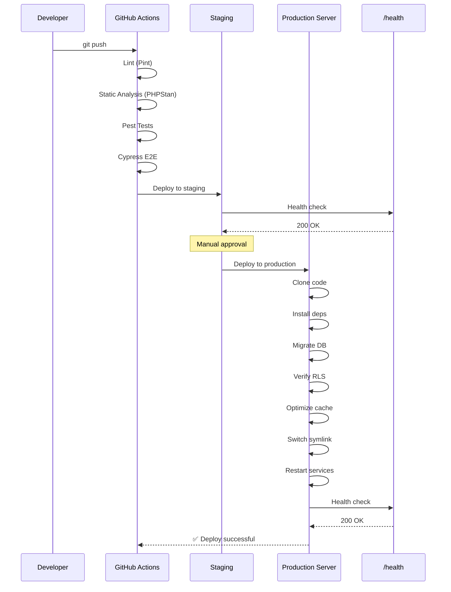
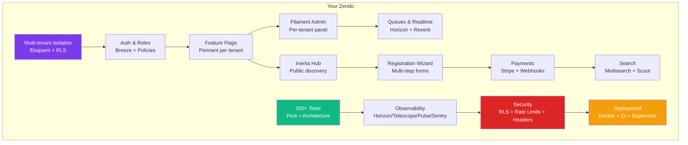

# 14. Deployment

> **Milestone:** The app is deployed: Docker Compose infrastructure for local dev, CI pipeline for staging, production-ready configuration with Supervisor, Nginx, and a 20+ item checklist.

## Prerequisites

- [Section 13: Hardening](section-13-hardening.md) completed
- Docker services running (`docker compose up -d`)
- All 200+ tests passing

## What You'll Learn

| Concept | What it is | Why it matters |
|---------|-----------|----------------|
| Docker Compose | Multi-container local development | One command to start all services |
| GitHub Actions CI | Automated test + deploy pipeline | Every push is tested; merges to main deploy |
| Supervisor | Process management | Keep queue workers, Reverb, and scheduler running |
| Nginx | Reverse proxy, WebSocket proxy, security | Production-ready HTTP server |
| Production checklist | Required configuration items | 20+ settings that must be right before going live |
| Health monitoring | `/health` endpoint and Sentry alerts | Know immediately when something breaks |

---

## The Big Picture

Deployment is like moving from a rehearsal studio to a real theater. In the studio (local dev), you can hit rewind, the audience is just your team, and if something breaks you fix it and try again. On the real stage (production), the audience is live, there are no do-overs, and the curtains (security) better be in place.

**Docker Compose** is your rehearsal studio setup — consistent, reproducible, offline. **CI** is the dress rehearsal checklist. **Supervisor** is the stage manager keeping every actor in their place. **Nginx** is the theater's front of house — controlling who enters, routing them to the right seat, and making sure the backstage stays backstage.

```mermaid
graph TD
    subgraph "Developer Machine"
        DEV[Local Dev] --> DC[Docker Compose<br/>PG + Redis + Meilisearch<br/>+ Reverb + Mailpit]
        DC --> TEST[Pest Tests]
    end

    subgraph "CI Pipeline"
        PUSH[git push] --> LINT[Pint Lint]
        LINT --> STAN[PHPStan Analysis]
        STAN --> PEST[Pest Tests]
        PEST --> CYP[Cypress E2E]
        CYP --> DEPLOY[Deploy to Staging]
    end

    subgraph "Production"
        DEPLOY --> NGINX[Nginx<br/>Reverse Proxy]
        NGINX --> FPM[PHP-FPM]
        NGINX --> REVERB[Reverb WebSocket]
        SUP[Supervisor] --> QW[Queue Workers]
        SUP --> SCH[Scheduler]
        SUP --> REVERB
        HP[/health] --> SENTRY[Sentry Alerts]
    end

    style DC fill:#3b82f6,color:#fff
    style LINT fill:#f59e0b,color:#fff
    style NGINX fill:#10b981,color:#fff
    style SUP fill:#7c3aed,color:#fff
```

---

## Step 1: Docker Compose for Local Development

We've been using Docker Compose since [Section 1](section-01-get-running.md) for infrastructure services only — PostgreSQL, Redis, Meilisearch, and Mailpit. The app itself runs locally. This is our development setup.

For reference, here's the complete `docker-compose.yml` we created in Section 1, with the addition of a queue worker and scheduler that run as Docker services (optional — you can also run them locally in separate terminals):

```yaml
services:
  postgres:
    image: postgres:16
    ports:
      - "5432:5432"
    environment:
      POSTGRES_DB: zendo
      POSTGRES_USER: zendo
      POSTGRES_PASSWORD: secret
    volumes:
      - postgres_data:/var/lib/postgresql/data
    healthcheck:
      test: ["CMD-SHELL", "pg_isready -U zendo"]
      interval: 5s
      timeout: 5s
      retries: 5

  redis:
    image: redis:7-alpine
    ports:
      - "6379:6379"
    healthcheck:
      test: ["CMD", "redis-cli", "ping"]
      interval: 5s
      timeout: 5s
      retries: 5

  meilisearch:
    image: getmeili/meilisearch:v1.8
    ports:
      - "7700:7700"
    environment:
      MEILI_MASTER_KEY: masterKey
    volumes:
      - meilisearch_data:/meili_data

  mailpit:
    image: axllent/mailpit:latest
    ports:
      - "1025:1025"
      - "8025:8025"

volumes:
  postgres_data:
  meilisearch_data:
```

All infrastructure services are accessible at `127.0.0.1` on their standard ports. The `.env` file points to localhost:

```env
DB_HOST=127.0.0.1
DB_PORT=5432
DB_DATABASE=zendo
DB_USERNAME=zendo
DB_PASSWORD=secret
REDIS_HOST=127.0.0.1
REDIS_PORT=6379
MEILISEARCH_HOST=http://127.0.0.1:7700
MEILISEARCH_KEY=masterKey
MAIL_HOST=127.0.0.1
MAIL_PORT=1025
```

### Start Everything

```bash
# Start all infrastructure services
docker compose up -d

# Run migrations (locally)
php artisan migrate

# Seed the database
php artisan db:seed

# Check all services are running
docker compose ps
```

### Running the App

For development, run Laravel, the queue worker, and Vite in separate terminals:

```bash
# Terminal 1: Laravel dev server
php artisan serve --host=0.0.0.0

# Terminal 2: Queue worker
php artisan queue:work

# Terminal 3: Vite (frontend hot-reload)
npm run dev

# Terminal 4: Reverb (WebSockets)
php artisan reverb:start

# Terminal 5: Scheduler (optional, for cron jobs)
php artisan schedule:work
```

For production deployment, see [Step 5](#step-5-production-deployment) below.

---

## Step 2: GitHub Actions CI Pipeline

Every push should be automatically tested. Merges to main should deploy to staging. Here's the full CI pipeline.

Create `.github/workflows/ci.yml`:

```yaml
name: CI

on:
  push:
    branches: [main, develop]
  pull_request:
    branches: [main]

jobs:
  lint:
    name: Lint (Pint)
    runs-on: ubuntu-latest
    steps:
      - uses: actions/checkout@v4

      - name: Setup PHP
        uses: shivammathur/setup-php@v2
        with:
          php-version: '8.3'
          coverage: none

      - name: Install Composer dependencies
        run: composer install --prefer-dist --no-progress

      - name: Run Pint
        run: vendor/bin/pint --test

  static-analysis:
    name: Static Analysis (PHPStan)
    runs-on: ubuntu-latest
    steps:
      - uses: actions/checkout@v4

      - name: Setup PHP
        uses: shivammathur/setup-php@v2
        with:
          php-version: '8.3'
          coverage: none

      - name: Install Composer dependencies
        run: composer install --prefer-dist --no-progress

      - name: Run PHPStan
        run: vendor/bin/phpstan analyse --no-progress

  test:
    name: Tests (Pest)
    runs-on: ubuntu-latest
    services:
      postgres:
        image: postgres:16-alpine
        env:
          POSTGRES_DB: zendo_test
          POSTGRES_USER: zendo
          POSTGRES_PASSWORD: secret
        ports:
          - 5432:5432
        options: >-
          --health-cmd="pg_isready -U zendo"
          --health-interval=10s
          --health-timeout=5s
          --health-retries=3

      redis:
        image: redis:7-alpine
        ports:
          - 6379:6379
        options: >-
          --health-cmd="redis-cli ping"
          --health-interval=10s
          --health-timeout=5s
          --health-retries=3

    steps:
      - uses: actions/checkout@v4

      - name: Setup PHP
        uses: shivammathur/setup-php@v2
        with:
          php-version: '8.3'
          coverage: xdebug

      - name: Install Composer dependencies
        run: composer install --prefer-dist --no-progress

      - name: Setup .env
        run: |
          cp .env.testing .env.testing.local
          sed -i 's/DB_HOST=127.0.0.1/DB_HOST=localhost/' .env.testing
          sed -i 's/DB_DATABASE=zendo/DB_DATABASE=zendo_test/' .env.testing
          sed -i 's/REDIS_HOST=127.0.0.1/REDIS_HOST=localhost/' .env.testing

      - name: Run migrations
        run: php artisan migrate --env=testing

      - name: Enable RLS
        run: php artisan migrate --env=testing

      - name: Run Pest tests
        run: vendor/bin/pest --coverage --min=80

      - name: Run tenant isolation tests specifically
        run: vendor/bin/pest --filter=TenantIsolation

  e2e:
    name: E2E Tests (Cypress)
    runs-on: ubuntu-latest
    needs: [lint, static-analysis, test]
    if: github.event_name == 'pull_request'
    steps:
      - uses: actions/checkout@v4

      - name: Setup Node.js
        uses: actions/setup-node@v4
        with:
          node-version: '20'

      - name: Setup PHP
        uses: shivammathur/setup-php@v2
        with:
          php-version: '8.3'

      - name: Start services
        run: docker compose up -d pgsql redis meilisearch

      - name: Install dependencies
        run: |
          composer install --no-interaction
          npm install

      - name: Build assets
        run: npm run build

      - name: Run Cypress
        run: npx cypress run --record
        env:
          CYPRESS_BASE_URL: http://localhost:8000

  deploy-staging:
    name: Deploy to Staging
    runs-on: ubuntu-latest
    needs: [lint, static-analysis, test]
    if: github.ref == 'refs/heads/main'
    steps:
      - uses: actions/checkout@v4

      - name: Deploy to staging
        uses: deployphp/action@v1
        with:
          deployer-version: '7'
          private-key: ${{ secrets.STAGING_SSH_KEY }}
          known-hosts: ${{ secrets.STAGING_KNOWN_HOSTS}}
        env:
          DEPLOY_HOST: ${{ secrets.STAGING_HOST }}
          DEPLOY_PATH: /var/www/zendo-staging

      - name: Verify deployment
        run: |
          sleep 10
          curl -f https://staging.zendo.test/health || exit 1
```

??? question "Why separate lint, static analysis, and test jobs?"
    Running them as separate jobs means they run **in parallel**. If Pint finds a formatting issue, you get that feedback in 30 seconds instead of waiting 5 minutes for all tests to run. The e2e job runs only after the first three pass (it's slower and more expensive).

---

## Step 3: Supervisor for Process Management

In production, you need several long-running processes: queue workers, the Reverb WebSocket server, and the scheduler. Supervisor keeps them all alive — if one crashes, Supervisor restarts it.

Create `/etc/supervisor/conf.d/zendo.conf` on the production server:

```ini
[zendo-worker-default]
command=php /var/www/zendo/artisan horizon
numprocs=1
autostart=true
autorestart=true
startsecs=0
user=www-data
redirect_stderr=true
stdout_logfile=/var/log/zendo/worker-default.log
stopwaitsecs=3600

[zendo-reverb]
command=php /var/www/zendo/artisan reverb:start --host=0.0.0.0 --port=8080
numprocs=1
autostart=true
autorestart=true
startsecs=0
user=www-data
redirect_stderr=true
stdout_logfile=/var/log/zendo/reverb.log
stopwaitsecs=10

[zendo-scheduler]
command=php /var/www/zendo/artisan schedule:work
numprocs=1
autostart=true
autorestart=true
startsecs=0
user=www-data
redirect_stderr=true
stdout_logfile=/var/log/zendo/scheduler.log
stopwaitsecs=10
```

### Supervisor Commands

```bash
# Read and apply configuration changes
sudo supervisorctl reread
sudo supervisorctl update

# Check status of all processes
sudo supervisorctl status

# Restart all Zendo processes
sudo supervisorctl restart zendo-worker-default:*
sudo supervisorctl restart zendo-reverb:*
sudo supervisorctl restart zendo-scheduler:*

# View logs
sudo tail -f /var/log/zendo/worker-default.log
sudo tail -f /var/log/zendo/reverb.log
```

??? tip "Why `schedule:work` instead of a cron?"
    In development, use `php artisan schedule:work` — it runs the scheduler in the foreground like a daemon. In production, you can use either:

    - **Cron** (traditional): `* * * * * php /var/www/zendo/artisan schedule:run >> /dev/null 2>&1`
    - **Supervisor** (our approach): `php artisan schedule:work` managed by Supervisor

    The Supervisor approach is simpler to debug (logs go to one place) and restarts automatically on failure.

---

## Step 4: Nginx Configuration

Nginx is the production reverse proxy. It handles SSL termination, static files, WebSocket proxying, and security headers.

Create `/etc/nginx/sites-available/zendo.conf`:

```nginx
# Redirect HTTP to HTTPS
server {
    listen 80;
    server_name *.zendo.test zendo.test;
    return 301 https://$server_name$request_uri;
}

# Main application server
server {
    listen 443 ssl http2;
    server_name *.zendo.test zendo.test;

    # SSL configuration
    ssl_certificate /etc/letsencrypt/live/zendo.test/fullchain.pem;
    ssl_certificate_key /etc/letsencrypt/live/zendo.test/privkey.pem;
    ssl_protocols TLSv1.2 TLSv1.3;
    ssl_ciphers ECDHE-ECDSA-AES128-GCM-SHA256:ECDHE-RSA-AES128-GCM-SHA256:ECDHE-ECDSA-AES256-GCM-SHA384:ECDHE-RSA-AES256-GCM-SHA384;
    ssl_prefer_server_ciphers off;

    # Document root
    root /var/www/zendo/public;
    index index.php;

    # Logging
    access_log /var/log/nginx/zendo-access.log;
    error_log /var/log/nginx/zendo-error.log;

    # Security headers (redundant with middleware, but defense-in-depth)
    add_header X-Frame-Options "DENY" always;
    add_header X-Content-Type-Options "nosniff" always;
    add_header X-XSS-Protection "1; mode=block" always;
    add_header Referrer-Policy "strict-origin-when-cross-origin" always;
    add_header Permissions-Policy "camera=(), microphone=(), geolocation=()" always;

    # Max upload size
    client_max_body_size 20M;

    # Location blocks
    location / {
        try_files $uri $uri/ /index.php?$query_string;
    }

    # PHP-FPM
    location ~ \.php$ {
        fastcgi_pass unix:/var/run/php/php8.3-fpm.sock;
        fastcgi_param SCRIPT_FILENAME $realpath_root$fastcgi_script_name;
        include fastcgi_params;

        # Inject the host for tenant resolution
        fastcgi_param HOST $host;

        # Timeouts
        fastcgi_read_timeout 120s;
        fastcgi_send_timeout 120s;

        # Buffers
        fastcgi_buffers 16 16k;
        fastcgi_buffer_size 32k;
    }

    # WebSocket proxy for Reverb
    location /app {
        proxy_pass http://127.0.0.1:8080;
        proxy_http_version 1.1;
        proxy_set_header Upgrade $http_upgrade;
        proxy_set_header Connection "Upgrade";
        proxy_set_header Host $host;
        proxy_set_header X-Real-IP $remote_addr;
        proxy_set_header X-Forwarded-For $proxy_add_x_forwarded_for;
        proxy_set_header X-Forwarded-Proto $scheme;
        proxy_read_timeout 86400s;
        proxy_send_timeout 86400s;
    }

    # Horizon (queue dashboard)
    location /horizon {
        try_files $uri $uri/ /index.php?$query_string;
        # Access restricted by middleware (EnsureSuperAdmin)
    }

    # Health endpoint (public, no auth)
    location /health {
        try_files $uri $uri/ /index.php?$query_string;
        # No rate limiting for health checks
        limit_except GET {
            deny all;
        }
    }

    # Static files with caching
    location ~* \.(css|js|png|jpg|jpeg|gif|ico|svg|woff|woff2|ttf|eot)$ {
        expires 1y;
        add_header Cache-Control "public, immutable";
        access_log off;
    }

    # Deny access to hidden files
    location ~ /\. {
        deny all;
        access_log off;
        log_not_found off;
    }

    # Deny access to storage via web
    location ^~ /storage/ {
        internal;
    }
}

# WebSocket configuration (separate block for clarity)
map $http_upgrade $connection_upgrade {
    default upgrade;
    '' close;
}
```

### Enable the site

```bash
sudo ln -s /etc/nginx/sites-available/zendo.conf /etc/nginx/sites-enabled/zendo.conf
sudo nginx -t
sudo systemctl reload nginx
```

??? question "Why proxy Websockets through Nginx?"
    Reverb uses WebSockets for real-time communication (registration confirmations, event updates). Nginx acts as the WebSocket proxy:

    ```
    Client ←→ Nginx (443/SSL) ←→ Reverb (8080/WebSocket)
    ```

    This gives you:
    - **SSL termination** at Nginx (Reverb doesn't need its own cert)
    - **Connection buffering** (Nginx handles slow clients)
    - **Access control** (only valid routes get proxied)

---

## Step 5: The Production Checklist

Before going live, every single item on this checklist must be verified. Print it out. Check each one.

Create `PRODUCTION-CHECKLIST.md`:

```markdown
# Zendo Production Checklist

## Environment Configuration
- [ ] APP_ENV=production (not local, not staging)
- [ ] APP_DEBUG=false
- [ ] APP_KEY set (not empty)
- [ ] APP_URL uses HTTPS
- [ ] APP_TIMEZONE matches primary user base

## Database
- [ ] DB_CONNECTION=pgsql (not sqlite or mysql)
- [ ] DB_HOST points to production PostgreSQL
- [ ] RLS enabled on all tenant-scoped tables (run migration)
- [ ] Database backups configured (daily minimum)
- [ ] Connection pooling configured for production load

## Redis
- [ ] REDIS_HOST points to production Redis
- [ ] CACHE_DRIVER=redis (not file)
- [ ] QUEUE_CONNECTION=redis (not sync)
- [ ] SESSION_DRIVER=redis (not file)
- [ ] Redis persistence enabled (AOF or RDB)

## Queue & Workers
- [ ] Supervisor running: horizon (queue workers)
- [ ] Supervisor running: reverb (WebSocket server)
- [ ] Supervisor running: scheduler (cron replacement)
- [ ] Failed job retry configured (3 retries, 60s backoff)
- [ ] Horizon dashboard access restricted to super admins

## Search
- [ ] MEILISEARCH_HOST points to production Meilisearch
- [ ] MEILISEARCH_KEY set (not the development key)
- [ ] Scout index imported for all searchable models

## Security
- [ ] RLS enabled and tested (all tenant isolation tests pass)
- [ ] Rate limiting configured on login, API, registration, webhook routes
- [ ] CSRF protection enabled (VerifyCsrfToken middleware active)
- [ ] Security headers middleware active (X-Frame-Options, CSP, etc.)
- [ ] APP_KEY changed from development value
- [ ] All default passwords changed
- [ ] .env file not in version control
- [ ] No debug routes accessible in production
- [ ] Telescope disabled in production
- [ ] Horizon access restricted to super admins

## SSL & Networking
- [ ] SSL certificate installed and valid
- [ ] HTTP redirects to HTTPS
- [ ] Nginx configured with security headers
- [ ] WebSocket proxy configured for Reverb
- [ ] Firewall allows only 80, 443, 22

## Observability
- [ ] Sentry DSN configured
- [ ] Sentry environment set to production
- [ ] Sentry release set to current VERSION
- [ ] Structured logging enabled (LOG_CHANNEL=structured)
- [ ] /health endpoint accessible
- [ ] Log rotation configured (30 days retention)

## Stripe
- [ ] STRIPE_KEY set (publishable key)
- [ ] STRIPE_SECRET set (secret key)
- [ ] STRIPE_WEBHOOK_SECRET set
- [ ] Webhook endpoint configured in Stripe dashboard
- [ ] Stripe Connect configured for multi-tenant

## Email
- [ ] MAIL_MAILER configured (smtp, not log)
- [ ] MAIL_HOST, MAIL_PORT, MAIL_USERNAME, MAIL_PASSWORD set
- [ ] MAIL_FROM_ADDRESS set to real address
- [ ] MAIL_FROM_NAME set to center name

## Backups
- [ ] PostgreSQL automated backups configured
- [ ] Backup restoration tested
- [ ] Backups stored off-site (S3, etc.)
- [ ] Redis RDB/AOF persistence enabled

## DNS & Domains
- [ ] Wildcard DNS configured (*.zendo.test or custom domains)
- [ ] Tenant custom domains configured in nginx
- [ ] SSL covers wildcard domain
- [ ] SPF, DKIM, DMARC configured for email

## Testing
- [ ] All 200+ Pest tests pass
- [ ] Tenant isolation tests pass (Eloquent + RLS)
- [ ] Architecture tests pass
- [ ] Cypress E2E tests pass
- [ ] Load test completed (baseline performance)
```

---

## Step 6: The Deployment Script

This is the actual script you run to deploy. It handles zero-downtime deployment with the current+next symlink pattern.

Create `deploy.sh` at the project root:

```bash
#!/bin/bash
set -e

# Configuration
DEPLOY_PATH="/var/www/zendo"
RELEASES_PATH="${DEPLOY_PATH}/releases"
SHARED_PATH="${DEPLOY_PATH}/shared"
CURRENT_LINK="${DEPLOY_PATH}/current"
KEEP_RELEASES=5

echo "=== Zendo Deployment ==="
echo "Deploying to: ${DEPLOY_PATH}"
echo "Time: $(date -u '+%Y-%m-%d %H:%M:%S UTC')"
echo ""

# Step 1: Create release directory
RELEASE_NAME=$(date +%Y%m%d%H%M%S)
RELEASE_DIR="${RELEASES_PATH}/${RELEASE_NAME}"
mkdir -p "${RELEASE_DIR}"

echo "[1/10] Creating release: ${RELEASE_NAME}"

# Step 2: Clone/pull the code
echo "[2/10] Fetching latest code..."
git clone --depth 1 . "${RELEASE_DIR}" 2>/dev/null || git -C "${RELEASE_DIR}" pull

# Step 3: Install dependencies
echo "[3/10] Installing Composer dependencies..."
cd "${RELEASE_DIR}"
composer install --no-dev --optimize-autoloader --no-interaction

echo "[3/10] Installing NPM dependencies and building assets..."
npm install --production
npm run build

# Step 4: Link shared directories
echo "[4/10] Linking shared directories..."
mkdir -p "${SHARED_PATH}/storage"
mkdir -p "${SHARED_PATH}/storage/logs"
mkdir -p "${SHARED_PATH}/storage/app/public"

ln -sfn "${SHARED_PATH}/storage" "${RELEASE_DIR}/storage"
ln -sfn "${SHARED_PATH}/.env" "${RELEASE_DIR}/.env"

# If .env doesn't exist yet, copy the example
if [ ! -f "${SHARED_PATH}/.env" ]; then
    cp "${RELEASE_DIR}/.env.example" "${SHARED_PATH}/.env"
    echo "=== ACTION REQUIRED ==="
    echo "Edit ${SHARED_PATH}/.env with production values before running again."
    exit 1
fi

# Step 5: Run migrations
echo "[5/10] Running database migrations..."
php artisan migrate --force --no-interaction

# Step 6: Verify RLS is enabled
echo "[6/10] Verifying Row-Level Security..."
RLS_CHECK=$(php artisan tinker --execute="
    \$tables = ['events', 'registrations', 'payments'];
    foreach (\$tables as \$table) {
        \$enabled = DB::select(\"SELECT relrowsecurity FROM pg_class WHERE relname = '{\$table}'\");
        echo \$table . ':' . (\$enabled ? 'yes' : 'no') . ' ';
    }
" 2>/dev/null)

echo "RLS status: ${RLS_CHECK}"

# Step 7: Optimize for production
echo "[7/10] Optimizing for production..."
php artisan config:cache
php artisan route:cache
php artisan view:cache
php artisan event:cache

# Step 8: Update the current symlink (zero-downtime switch)
echo "[8/10] Switching current symlink..."
ln -sfn "${RELEASE_DIR}" "${CURRENT_LINK}"

# Step 9: Restart services
echo "[9/10] Restarting services..."
sudo supervisorctl restart zendo-worker-default:*
sudo supervisorctl restart zendo-reverb:*
sudo supervisorctl restart zendo-scheduler:*
sudo systemctl reload php8.3-fpm
sudo systemctl reload nginx

# Step 10: Health check
echo "[10/10] Running health check..."
sleep 5

HEALTH_STATUS=$(curl -s -o /dev/null -w "%{http_code}" http://localhost/health)

if [ "$HEALTH_STATUS" = "200" ]; then
    echo "✅ Health check passed!"
else
    echo "❌ Health check failed! Status: ${HEALTH_STATUS}"
    echo "Rolling back..."
    ln -sfn "${RELEASES_PATH}/$(ls -t "${RELEASES_PATH}" | sed -n 2p)" "${CURRENT_LINK}"
    sudo supervisorctl restart zendo-worker-default:*
    sudo supervisorctl restart zendo-reverb:*
    sudo supervisorctl restart zendo-scheduler:*
    sudo systemctl reload php8.3-fpm
    sudo systemctl reload nginx
    echo "Rolled back to previous release."
    exit 1
fi

# Clean up old releases
echo "Cleaning up old releases (keeping ${KEEP_RELEASES})..."
cd "${RELEASES_PATH}" && ls -t | tail -n +$((KEEP_RELEASES + 1)) | xargs rm -rf

# Record the deployment
echo "${RELEASE_NAME}" >> "${DEPLOY_PATH}/.deployments"
echo ""
echo "=== Deployment Complete ==="
echo "Release: ${RELEASE_NAME}"
echo "URL: $(grep APP_URL "${SHARED_PATH}/.env" | cut -d '=' -f2)"
echo "Health: https://$(grep APP_URL "${SHARED_PATH}/.env" | cut -d '=' -f2 | sed 's|https\?://||')/health"
echo ""
```

Make it executable:

```bash
chmod +x deploy.sh
```

### Deployment Flow



---

## Step 7: Health Monitoring and Sentry Alerts

### Health Endpoint Monitoring

Set up a cron job (or external monitoring) that checks the health endpoint:

```bash
# Add to crontab on the monitoring server
*/5 * * * * curl -sf https://zendo.test/health > /dev/null || echo "Zendo health check failed at $(date)" | mail -s "Zendo Health Alert" ops@example.com
```

Or use a monitoring service (UptimeRobot, Pingdom, etc.) that pings `/health` every 5 minutes.

### Sentry Alert Configuration

In your Sentry project settings:

1. **Alert Rule: New Issue**
   - Condition: A new issue is created
   - Action: Send to Slack `#zendo-alerts`
   - Action: Send email to `oncall@example.com`

2. **Alert Rule: High Error Rate**
   - Condition: More than 50 errors in 5 minutes
   - Action: Send to Slack `#zendo-alerts`
   - Action: Send email to `oncall@example.com`
   - Action: Create PagerDuty incident

3. **Alert Rule: Tenant Isolation**
   - Condition: Issue message contains "tenant_isolation" or "cross_tenant"
   - Action: Send to Slack `#zendo-security`
   - Action: Send email to `security@example.com`

### Production Monitoring Dashboard

Add this to `config/pulse.php` for production:

```php
'recorders' => [
    \Laravel\Pulse\Recorders\SlowRequests::class => [
        'threshold' => 1000, // 1 second — alert if any request is slower
    ],
    \Laravel\Pulse\Recorders\SlowQueries::class => [
        'threshold' => 500, // 500ms — alert if any query is slower
    ],
    \Laravel\Pulse\Recorders\Exceptions::class => [
        'enabled' => true,
        'sample' => 1, // Track every exception in production
    ],
],
```

---

## Step 8: Update the VERSION File

Create a `VERSION` file at the project root for deployment tracking:

```bash
echo "0.1.0" > VERSION
```

This is read by the Sentry configuration (`SENTRY_RELEASE`) and the deployment script to track which version is deployed.

---

## Congratulations

You've built Zendo — a multi-tenant retreat center management platform that exercises every major technology in the Lotus stack.

Here's what you've accomplished:



### What You Built, Section by Section

| Section | What You Built | Key Technology |
|---------|---------------|----------------|
| 1 | Running Laravel app with modules | Laravel, PostgreSQL, Redis |
| 2 | Tenant scoping middleware + Eloquent trait | Multi-tenancy, Global Scopes |
| 3 | Users, roles, auth with Breeze | Laravel Breeze, Policies |
| 4 | Per-tenant feature flags | Laravel Pennant |
| 5 | Filament admin panel | Filament 3.x |
| 6 | Inertia public hub (SSR) | React, Inertia, SSR |
| 7 | Queues and real-time updates | Horizon, Reverb, Redis |
| 8 | Multi-step registration wizard | Inertia forms, validation |
| 9 | Stripe payments + webhooks | Laravel Cashier, Stripe Connect |
| 10 | Full-text search | Meilisearch, Laravel Scout |
| 11 | 200+ tests with Pest | Pest, Architecture tests, Tenant isolation |
| 12 | Full observability stack | Horizon, Telescope, Pulse, Sentry, Structured logs |
| 13 | Defense-in-depth security | PostgreSQL RLS, Rate limiting, Security headers |
| 14 | Production deployment | Docker Compose, GitHub Actions, Supervisor, Nginx |

### What's Next for Zendo?

You now have a production-ready multi-tenant platform. Some ideas for extending it:

- **Tenant onboarding** — self-service signup with Stripe billing
- **Calendar view** — drag-and-drop event scheduling
- **Report builder** — Filament-based custom reports per tenant
- **Mobile API** — extend the `/api/v1/` endpoints for a mobile app
- **Multi-language** — add `locale` support per tenant
- **Audit log** — track every change for compliance
- **Blueprint templates** — pre-built event templates for new centers

The architecture you've built — modular monolith, tenant isolation, defense-in-depth — scales from 2 tenants to 2,000. You're ready.

!!! success "You built Zendo!"
    From zero to production-ready multi-tenant platform. 14 sections. One architecture. Defense-in-depth at every layer.

    Go ship it.